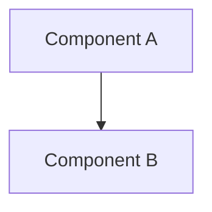
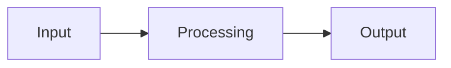

# {{TITLE}}

## Overview
Brief description of the component and its role in the system.

## Non-Goals
What this component deliberately does not do, and why. Name the responsibilities that belong to neighboring components, the generality this design declines to build, and any extension points intentionally left out. Bounding the component is part of designing it.

## Architecture

Use Mermaid diagrams to illustrate structure and flow — prefer over ASCII art or prose-only descriptions.

### Components
Describe the major components and their responsibilities.

### Data Flow
How data moves through the system.

### Interfaces
Public APIs, events, or contracts.

## Design Decisions

<!-- Number each decision `DD-N` and never renumber it: plans, phases, and
     other designs cite these ids, and `sdd validate` resolves them against
     this section (SDD122). Cite another component's decision in qualified
     form — `ComponentName:DD-3` — so it resolves to that design, not this
     one. -->

### DD-1 — [Title]
**Context:**
**Options Considered:**
1.
2.
**Decision:**
**Rationale:**

## Error Handling
How errors are detected, reported, and recovered from.

## Testing Strategy
How the design will be validated.

### Structural Verification
Language-specific checks beyond tests (see `shared/language-verification.md`).

## Migration / Rollout
How to transition from current state to the new design.
