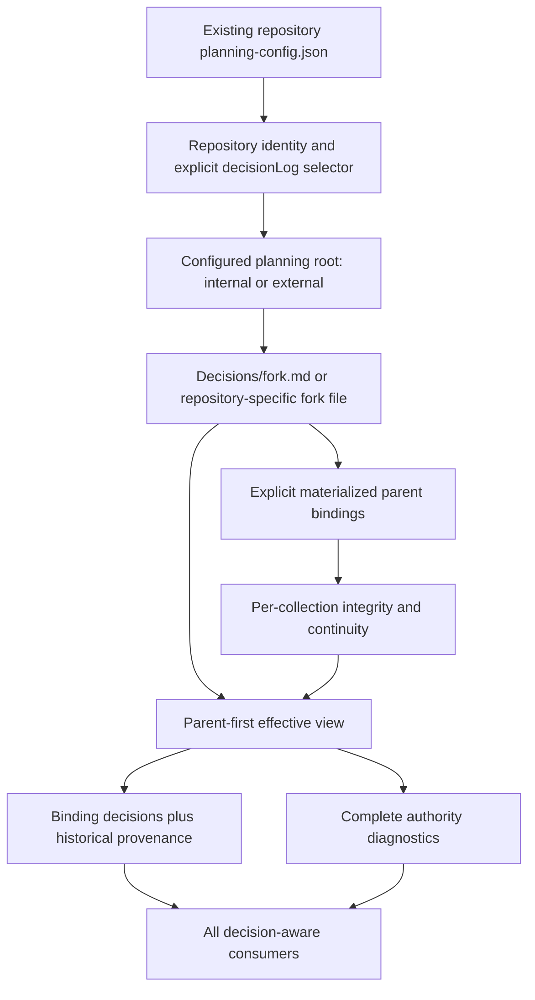

# Fork-Aware Decision Ledgers

## Overview
Repository configuration selects decision authority; the configured planning root stores the selected ledger. This replaces the earlier separate repo-root selector and immutable-generation-tree proposal. The user aligned on a sibling fork file for in-repository planning and explicit selection through the existing `planning-config.json` for external planning as well.

All 18 spec requirements remain in scope. Inherited records are read-only, local decisions/bases/events live together in the fork file, and one resolver supplies effective authority and diagnostics to every consumer. External planning history is versioned independently; a source-repository config commit does not prove the external ledger was committed. This prerequisite is independent of the later TestSuiteReliability implementation.

**Ledger reconciliation resolved:** ForkAwareDecisionLedgers:pd-764da52e now records the user's exact-text-approved config-selection/planning-root-storage rule. The former repo-root-selector proposal is withdrawn. Implementation may follow the approved rule; real adoption and every later authority-changing ledger/config operation still require their own exact-text approval under SDD-Toolchain:pd-eed0dbed. No fork is activated by this design.

Non-functional traceability: NFR-01 is realized by DD-3's bounded traversal, DD-4's versioned canonical encoding and DD-7's deterministic composition; NFR-02 by side-effect-free snapshot reads and DD-10's explicit publication/recovery protocol; NFR-03 by DD-1/DD-3's named-root containment and planning-root-only support storage; NFR-04 by provenance-bearing resolver interfaces and the complete CLI/hook diagnostic contract; NFR-05 by the Testing Strategy and Structural Verification gates, including frozen legacy verdicts and generated portable agreement.

## Non-Goals
- No new persistent repo-root ledger, selector, `.sdd/` directory, generation tree, lock or journal. Extend only the existing planning configuration there. Short-lived atomic replacement staging is not authority and is cleaned at success/rollback or explicit crash recovery.
- No inherited-file writes, remote fetch/clone/authentication, live sibling checkout, implicit precedence, semantic merge, scope remapping or multi-parent inheritance.
- No claim that external ledger bytes are versioned with source code, or that independently versioned source/planning histories form one SCM commit.
- No plan-graph state/closure changes, expanded intent-isolated reviewer access, automatic approval, publishing or motivating repository/module migration.
- No universal transaction isolation against arbitrary non-cooperating editors/SCM operations; define observable races and fail closed rather than pretend a local lock controls them.

## Architecture

### Components
| Component | Responsibility |
|---|---|
| Proposed `internal/decisionview` | Config selection, owner/collection identity, safe source loading, canonical bases, parent-first composition, citation context, scope and diagnostics |
| Existing config/path layer | Resolve represented repository and its own config, then configured planning root; never select using a shared planning repository's unrelated config |
| Existing `internal/dlg` | Parse/validate each canonical ledger and its explicitly assigned archives independently; preserve original records and history semantics |
| Fork mutation module within `internal/decisionview` | Exact preview, digest checks, single-file atomic update, and journaled multi-file recovery where needed |
| CLI/root validator/hooks/intent-aware workflows | Shared resolver adapters, complete failure propagation and no fork-aware one-file bypasses |



### Data Flow
1. Resolve the represented repository from the invocation/target mapping and read its existing config. Ambiguous target selection refuses. Never infer ownership from Git remote names or the planning directory's basename.
2. A valid explicit `decisionLog` selects a planning-root-relative canonical fork file and expected identity. Validate owner/ledger identity against its metadata. No declaration means legacy behavior unless retained adoption evidence shows authority was removed; malformed declaration never means absent.
3. Read any pending transaction marker for the selected collection before trusting its files, pin config/fork/archive/source bytes, and validate a bounded stable inventory. Reads do not create locks, journals or recovery files.
4. Validate each collection and approved source continuity, then compose immediate-parent effective decisions with local accepted entries and explicit current overrides. Preserve original status and compute applicability separately.
5. Return complete records, source/basis provenance and diagnostics. Every filter preserves authority failures. Action-bearing consumers refresh before relying on the snapshot; a completed read is not a lease against future external edits.

### Interfaces
Proposed config shape (placeholders are not machine paths or existing IDs):

```json
{
  "planningRoot": "../planning",
  "repositoryId": "<stable-represented-repository-uuid>",
  "decisionLog": {
    "version": 1,
    "mode": "fork",
    "path": "Decisions/my-repository/fork.md",
    "ledgerId": "<stable-ledger-uuid>"
  }
}
```

`repositoryId` is a logical owner, not a Git remote or authenticated repository identity. `ledgerId` identifies the collection. Fork metadata repeats both and must match. Distinct declared owners cannot select the same local collection; copies representing the same logical owner are not automatically classified as unrelated repositories, and concurrent writers to a shared ledger still serialize. Adoption previews identity allocation explicitly.

For in-repository planning, `path` normally is `Decisions/fork.md`, beside unchanged `decisions.md` and `archive-*.md`. For shared external planning, use a repository-specific directory or filename, with identity validation independent of that name. Local archives use explicitly declared names such as `fork-archive-*.md`, never the inherited `archive-*.md` pattern. No separate permanent metadata file is needed: `fork` frontmatter in the selected file carries schema version, owner/ledger identity, parent bindings/baselines, override events, citation contexts and operation IDs alongside ordinary `decisions[]`.

Operational locks/journals, when required, live under `<planning-root>/Decisions/.fork-state/<ledgerId>/`, not in the repo root. They are recovery/support state, not another canonical ledger or permanent generation history. Reads ignore completed journal residue for authority and never repair it; pending/unknown transactions block reliance. Journal backups may contain config bytes and stay local/private, outside committed planning artifacts. Final approved decision/event history stays in the canonical file and its declared archives.

Atomic replacement of the existing config may need a transient sibling file on its filesystem when external planning storage is on another volume. Such staging is named in the approved operation, never a selector or lock, and removed on normal completion/rollback; crash residue is handled only by explicit recovery. Root-footprint tests assert no additional retained root files after those outcomes. Journal backup filenames do not use artifact Markdown suffixes, and reserved operational support is excluded from canonical-ledger discovery; this exclusion never applies to undeclared user ledgers elsewhere.

Proposed resolver output: version, config/collection/source snapshot digests, ordered records, complete diagnostics and `resolution: complete|reconciliation-required|invalid|recovery-required`. Records include qualified identity, logical owner, source root/locator, original entry/status, applicability, replacement lineage and basis comparison. No synthetic source status is persisted. Preview returns exact final bytes plus any intermediate transaction/config bytes, affected paths expressed against named roots, expected digests and authority delta. Apply accepts the unchanged envelope and its approval digest; that digest proves content identity, not human approval.

## Design Decisions
- **DD-1**: Existing config selects authority; planning root stores it.
  Context: FR-01, FR-02, FR-15, FR-17; AC-01, AC-02, AC-12; ForkAwareDecisionLedgers:pd-764da52e. Options: extra repo-root selector, filename inference, or explicit `decisionLog` in existing config. Choose explicit config selection with path relative to the already configured planning root and matching owner/ledger identities. Extend config schema/templates rather than invent a parallel configuration system. No new persistent root support files. Unconfigured repositories retain legacy behavior; opted-in external storage follows the approved logical-ownership rule, not a claim that external history is physically versioned with source code.

- **DD-2**: One local fork file, not immutable whole-ledger generations.
  Context: FR-02, FR-09, FR-16; AC-02, AC-06, AC-13. Options: separate live metadata and ledger files, complete-generation snapshots, or co-located metadata/decisions. Choose one `fork.md` with `fork` metadata and `decisions[]`. Ordinary add/accept/supersede/reconcile/restore changes are one digest-checked atomic file replacement, with append-only semantic history and immutable accepted content/bases. Local archive rotation, adoption and selector changes use the multi-file protocol below. Archives remain optional until explicitly created; no permanent generation directory or unrelated source copy. Preserve and show all exact affected bytes before approval, including optional body context and config keys not owned by the operation.

- **DD-3**: UUID collection identity, logical owner and explicit source roots.
  Context: FR-03 through FR-05; AC-03, AC-10, AC-12, AC-16. Qualified syntax is `ledger:<uuid>:D-<zero-padded-number>` using the existing local ID grammar. Bind a legacy parent's UUID locally without editing it. Each source locator has `root: planning|repository` plus a safe relative canonical path and explicit own-archive membership. Planning-root storage is the default; repository-root anchoring exists only to read already materialized inherited sources at their original paths, not to create new root files. Reject escaping links, duplicate canonical aliases/identities, cycles, multiple parents and depth above 32 collections. IDs survive archive/checkout/remote moves. Ownership metadata is an approved local binding, not authenticated hosting provenance.

- **DD-4**: Versioned typed canonical basis, not YAML text hash.
  Context: FR-10, FR-18; AC-07, AC-08, AC-16. `entry-v1` canonicalizes the schema's typed parsed entry, including every supported decision-bearing field and extension. Reject duplicate YAML keys, unsupported types/extensions and cyclic aliases. Keep parsed Unicode strings unchanged; object keys sort by unsigned UTF-8 bytes, arrays retain order, and absent fields differ from explicit values unless schema defaults equate them. Exclude ledger-level metadata, comments, location and archive filename. Typed byte encoding: null `n`, false/true `f`/`t`, integer `i` plus minimal signed decimal plus `;`, string `s` plus UTF-8 byte length plus `:` plus bytes, array `a` plus count plus `:` plus encoded elements, object `o` plus count plus `:` plus encoded string-key/value pairs. Counts have no redundant leading zeros. Floats/non-finite scalars and non-string keys are unsupported in v1. Hash ASCII `sdd-decision-entry-v1`, zero byte and the encoding with SHA-256; retain canonical content alongside digest and verify the pair. Golden vectors cover all field/type/layout cases; unsupported versions fail.

- **DD-5**: Binding baseline and override basis are separate immutable records.
  Context: FR-04, FR-10, FR-11, FR-18; AC-07 through AC-10, AC-16. Initial binding records identity, explicit root/locator, canonical collection records and local lifecycle relationships. Compatible additions/lifecycle/archive movement require no baseline rewrite. Available history is obtained from the repository actually containing the source, including the external planning repository—not blindly from the represented source repo. Baseline/history coverage is reported honestly when history is unavailable. Override basis stores only target canonical content and the binding/override lineage making it effective in the immediate parent; unrelated entries/config timestamps are not freshness inputs. Rebinding appends a new binding ID and invalidates dependent bases even when the UUID stays equal. Equivalent substitution is not remote authentication.

- **DD-6**: Whole local replacements plus append-only authority events.
  Context: FR-06 through FR-09, FR-11; AC-04 through AC-09. A replacement is a complete local decision with explicit target, immutable basis, statement/rationale/full scope and required confirmation. Proposed/rejected/superseded entries never suppress. Accepted changes append local successors with reciprocal local supersession and explicit fresh override relations. Restoration appends an authority event to the same fork file, retaining the original accepted statement/basis/status with `inactive-override` applicability; it must not reappear as an unlinked binding local decision. Restoring a stale relation previews the currently valid parent and successor lineage, never reinstates old stored target text silently. Duplicate current targets remain errors, not recency resolution.

- **DD-7**: Parent-first resolution with conservative unresolved scopes.
  Context: FR-06, FR-07, FR-11, FR-12, FR-15; AC-05, AC-08, AC-10, AC-12. Validate sources and ancestors before suppression. Invalid source integrity invalidates the whole view. Stale relationships show old/current context but cannot authorize affected work or silently transfer/fall back. Global or unresolvable scope is conservatively affected. A descendant cannot hide ancestor staleness. Interpret inherited applicability against the consuming repository, preserving source scopes for provenance; missing scopes require reconciliation, not assumed irrelevance. New unrelated conflicts still receive candidate/judgment treatment. External planning-root co-location never makes scopes global across different owners.

- **DD-8**: Explicit legacy citation context without rewriting history.
  Context: FR-05, FR-13, FR-14; AC-03, AC-11. Collection-internal bare IDs bind to their own namespace. Adoption captures inherited-artifact default namespace and a legacy citation inventory under explicit repository/planning anchors. Existing occurrences retain context; newly introduced cross-collection/artifact citations must be qualified. Writers compare introduced citations with the prior artifact/inventory; raw ambiguous new references fail validation. Historic lookup returns original identity and separate effective replacement. Graph intent/justification consumers use that interpretation without editing graphs or old evidence. Moving a historical artifact requires explicit context-preserving migration or qualification, not filename inference.

- **DD-9**: Content-bound preview/apply through one mutation surface.
  Context: FR-08, FR-13, FR-16, FR-17; AC-02, AC-06, AC-09, AC-13, AC-14. Proposed reads: `sdd decide capabilities --json`, `effective`, `history`, `lookup <qualified-id>`; fork-mode list/search default to effective view, with explicit non-effective history mode. Proposed writes: `sdd decide fork preview --operation <adopt|override|reconcile|restore|rebind|detach|archive> --file <proposal>` and `fork apply --file <envelope> --approval-digest <digest>`. Preview includes all IDs, timestamps, exact config/fork/archive bytes, named-root locators, preconditions and transaction steps; apply never regenerates approved values. Existing fork-mode add/accept/supersede/hygiene operations route here or refuse until migrated. Recheck collision/basis/owner selection at acceptance. No writer can use the inherited default file just because it lacks fork support.

- **DD-10**: Atomic single-file updates; explicit journal barrier for multi-file work.
  Context: FR-16; AC-06, AC-09, AC-13. A single-file update uses bounded writer serialization and digest CAS, then validated same-directory replacement. A multi-file operation uses the journal/barrier protocol below, allowing config and planning storage on different filesystems. The guarantee is old/new complete authority or recovery-required—not nonexistent cross-volume rename atomicity. Reads are side-effect-free. Report clean rollback, committed and outcome-unknown distinctly; never report a committed mutation as rolled back because stdout or cleanup failed. Arbitrary external writers remain outside cooperative locks; source changes cannot change the approved basis silently.

- **DD-11**: Capability discovery and full-consumer migration precede reliance.
  Context: FR-14, FR-17; AC-01, AC-11, AC-14, AC-15. Capability JSON advertises `decision_forks: {schema: 1, canonicalization: ["entry-v1"], transactions: 1}`. Updated setup/lifecycle/decision workflows check it before fork reliance; unknown/old capabilities stop with user-install guidance, not auto-install or legacy fallback. Pin the supporting binary/plugin floor at implementation release, not an invented present version. Older binaries/plugins cannot be made safe retroactively. Every required consumer below must migrate before claiming release completeness.

- **DD-12**: Explicit detachment retains configured local identity and history.
  Context: FR-09, FR-16, FR-17; AC-01, AC-06, AC-13. `restore` ends one override; `detach` ends inheritance through a separate exact-approved migration, keeping `decisionLog` with `mode: detached`, selected local file, owner identity and auditable history. Refuse active/stale overrides until reconciled/restored; preview every inherited constraint ceasing to bind and every retained local constraint. No automatic import/renumbering. Removing `decisionLog` while the config's stable `repositoryId`, selected fork metadata or available config history proves adoption yields authority-missing, not implicit legacy mode. Read-only discovery of matching retained metadata is for diagnosing removal, never selecting authority by filename. Erasure of all identity/history in a history-free copy is unobservable; do not claim tamper-proof detection. Unrelated owners' external fork files do not opt in a legacy repository.

### Publication and recovery protocol
**Single-file path:** acquire the collection writer lock stored under the planning root, verify selected config/fork/source/archive inventory, prepare exact approved fork bytes beside the target, flush, recheck relevant inputs and replace once. Every accepted statement/basis remains immutable except permitted lifecycle fields; changes are append-equivalent. No config write or permanent journal is needed for this path. Lost replies resolve by the operation ID retained in fork history. Do not use read helpers that create sidecar locks when fulfilling read-only commands.

**Multi-file path:** required for initial selection/adoption, retargeting, detachment changing config, and archive rotation. It is not a filesystem transaction across source and planning repositories:

1. Preview complete before/after bytes for every affected config/ledger/archive and the intermediate pending config; include operation ID, source/local expected digests and exact authority deltas. A separate user approval binds that complete envelope.
2. Acquire involved collection locks in stable identity order under the planning root, plus a writer serialization key for the represented configuration stored there, not a root sidecar. Recheck original config/local/source snapshots and path containment. SDD writers sharing a ledger must share the same lock, even when invoked from different checkouts of its logical owner.
3. Durably write an operation journal with before/after digests, backups and publication steps under the planning-root support area. Publish a pending barrier for every involved ledger identity before altering any local authoritative file. Existing selected readers check their ledger barrier; related child/ancestor readers propagate it. Journals remain private local support, not committed decision artifacts.
4. For first adoption or selector change, publish an intermediate `decisionLog` containing an explicit `transaction` reference before publishing the newly selected fork files. It identifies the journal via a planning-root-relative path. Updated readers seeing it return recovery-required, never fall back. Before this intermediate config is published, no new fork file is placed where legacy discovery could mistake it for authority. On initial adoption with no prior local identity, the configuration marker is the barrier visible to the represented repository.
5. Stage and individually publish each exact approved local file using same-filesystem file operations beside that file. Config and ledger may be on different volumes; never request a cross-volume atomic rename. Journal/barrier-aware readers see incomplete transaction state rather than a mixed authority. Recheck source/local/config preconditions at their relevant publication boundaries; operation-owned intermediate values are expected, external changes are not overwritten.
6. Verify the complete desired file set, publish final config without its intermediate transaction field, then record the journal as committed and release pending barriers. The logical commit point is completion of all required file publications plus the durable committed journal state; final config alone is not sufficient while a ledger barrier remains pending. Readers may resume only after every relevant barrier is committed/cleared and the selected files validate. A release interrupted between barriers remains recovery-required, not partial success.
7. A precommit error attempts rollback using recorded before bytes only when actual files still match operation-owned states. Report a clean rollback only after restoring every affected file and removing operation-owned pending authority. Rollback failure or external divergence yields outcome-unknown/recovery-required. Do not delete or overwrite unrelated work.
8. `fork inspect --operation <id>` reads outcome and exact needed action. `fork recover --operation <id> --action <finish|rollback|discard-staging> --approval-digest <digest>` requires a separately previewed approved recovery. Known committed changes are never rolled back by erasing accepted history: reversal is an ordinary approved compensating event. Unknown outcomes remain blocked until verified; readers/hooks never repair.

Barriers are not optional for another checkout selecting the same external ledger: it must check the planning-store barrier even when its own config has no intermediate transaction field. Retargeting includes barriers/locks for both old and new collections. Changing the planning-root storage anchor is an explicit migration whose envelope identifies old/new anchors; intermediate config continues to locate the recovery journal until final publication, and markers are installed at every newly reachable store before selection changes. Failure to reach either store is an operational/recovery blocker, never permission to use an incomplete one.

| Failure/interruption | Observable result |
|---|---|
| Before pending marker/barrier | Old complete authority; operation-owned staging may be inspected but never activated |
| Pending marker or some files published | Recovery-required; no partial binding list, including first adoption and shared external readers |
| All final files present but commit/barrier release incomplete | Recovery-required until explicit inspection/finish establishes committed outcome |
| Commit completed, reply lost | New complete authority; operation lookup prevents duplicate append/allocation |
| Rollback cannot restore one volume or meets external edits | Outcome-unknown/recovery-required, not a clean failed-write claim |
| Source edited before final comparison | Refusal/rollback or recovery-required if rollback fails |
| Source edited in final-check/publication window or afterward | Never refreshed basis; fresh resolution becomes stale/invalid, even if the local transaction committed |

**External-writer limit:** cooperative locks serialize SDD writers, not arbitrary Git merges/editors. Readers use bounded stable-inventory capture/recheck. The operation binds an approved source snapshot; no hashing scheme prevents a later source edit. An interleaved late source change can make a committed override immediately stale, never authoritative over an unapproved basis. Action-bearing consumers refresh before reliance. A stronger universal isolation contract would require a separately approved source-publication protocol.

**Platform publication:** For ledger/publication files other than the represented repository's `planning-config.json`, POSIX uses same-filesystem `renameat` with retained directory descriptors and required flushes. Windows uses same-volume `ReplaceFileW` with operation-owned backup for replacement and no-overwrite `MoveFileExW` for new-file publication; no copy-across-volume or delayed-reboot modes. Respect documented partial-failure outcomes and explicitly inspect resulting names/digests. `REPLACEFILE_WRITE_THROUGH` is unsupported and is not a durability argument. Native failpoint/process-crash tests do not alone prove power-loss durability; unreadable journal/config/state fails closed. Unsupported storage/publication capabilities refuse before authority publication.

**User-approved rare-config exception (2026-09-10):** For the represented repository's `planning-config.json` only, write and flush/close the complete replacement to a sibling temp file, remove the old config, then rename the temp into place. The user accepts the temporary missing-path and crash/failure window because this config is rarely changed; continuous-path atomic replacement is not required for it. A failed post-removal rename must return an error and retain the staged bytes for manual repair, not claim success. Keep existing locking/approval checks and ordinary ledger protections. Do not add more recovery machinery solely to eliminate this accepted window.

External filesystem pins, retrieved 2026-09-08: [POSIX rename/renameat, Issue 8 / IEEE 1003.1-2024](https://pubs.opengroup.org/onlinepubs/9799919799/functions/rename.html), [Win32 ReplaceFileW](https://learn.microsoft.com/en-us/windows/win32/api/winbase/nf-winbase-replacefilew), [Win32 MoveFileExW](https://learn.microsoft.com/en-us/windows/win32/api/winbase/nf-winbase-movefileexw). Microsoft source revision `fa53641576e3603fa7b66d3a4ad969d3ce49d6f3`, updated 2025-07-01. These describe file operations, not remote authentication or cross-filesystem transactions.

### Consumer migration inventory
| Consumer | Required adaptation |
|---|---|
| Existing planning-config schema, config/root/target resolution and setup-generated guidance | Versioned explicit selector plus owner ID, planning-root-relative local path, no extra root files, capability check |
| `cmd/sdd/decide.go` list/search/add and command registration | Shared effective/history view, local-only allocator, exact approved write path; legacy output unchanged |
| Focused `decide validate`, `internal/dlg`, own archives | Per-collection integrity and composed authority; explicit non-effective raw inspection, never union bare namespaces |
| Root decision validation in `internal/rules` | Shared resolution, qualified citations, scoped owner context, declared archive/source membership and pending-transaction failures |
| `/decide`, especially `/decide check` | Collision, scope/citation/assumption hygiene, proposals, duplicate repair and rotation use effective/history semantics and local approved writes |
| Ad-hoc decision skill and all lifecycle capture/consultation | Capability, source/current basis, exact approval and no direct-file bypass |
| Researcher, spec/plan reviewers, implementation prompts, onboarding/post-compaction | Effective constraints plus diagnostics/provenance, not competing hidden parent originals |
| `internal/hook/sessionstart.go` | Shared view; warning/truncation notices prioritized, nonfatal configured errors, existing missing-binary/unconfigured-missing-ledger no-op |
| Graph decision/intent/exemption and artifact citation readers/writers | Qualified/current interpretation while preserving historical reference identity and graph completion protocol |
| Shared decision/frontmatter/path/orchestration/review conventions, templates, agents/skills, portable variants and generated trees | One declared contract and source/capability inventory; preserve ledger-intent exclusion from isolated lanes |
| Any additional direct ledger read/write found by source inventory | Migrate or explicitly refuse fork mode; no claim of full feature completion with required consumers unsupported |

Search inventory includes default ledger path strings, bare-ID parsing, accepted-entry filtering, archive discovery and direct config/ledger I/O. Root/ledger filters retain all relevant authority diagnostics even when no accepted record matches. SessionStart reserves warning/full-read guidance before its bounded entry budget; CLI structured output remains complete. Distinguish symbolic structural/stale/identity/transaction findings from actual inability to check; allocate numeric codes from the live registry.

## Error Handling
- Structural invalidity/stale authority uses exit 1; malformed invocation or inability to read/flush/check uses exit 2; candidate-only results retain exit 0 with required judgment guidance. Pending/unknown authority never produces a clean view, regardless of filter or hook truncation.
- Canonical/binding/owner mismatch, unsupported version, missing declared source and known removed selector are explicit failures, not alternative-ledger discovery. Permission/I/O failure is not proof of absence.
- Safe opens and containment checks apply against the declared root both at read and write boundaries. Store no credential-bearing locators or private absolute paths in durable artifacts; operational backup bytes remain private support and are not published.
- Single-file outcomes and multi-file commit/rollback/unknown states remain distinct. Read-side recovery and automatic basis acknowledgment are forbidden.
- Inherited confirmations are data for explicit verification, not instructions executed while reading untrusted source material.

## Testing Strategy
Use generic hermetic fixture repositories/planning roots, including two logical owners sharing one external planning root and two checkouts sharing one owner. Do not mutate this repository's real config or ledger to test fork behavior. Keep old regression verdicts frozen; add fork Good/Bad examples. Graph hazard tests must fail for the intended behavior, not simply for a missing future package.

The config-only sequence is tested for complete staging, successful final bytes and truthful errors, not uninterrupted path presence; all ledger/source/integrity checks remain.

| Spec coverage | Required fixture/test families |
|---|---|
| AC-01, AC-02 | Legacy compatibility, explicit config versus filename inference, sibling-file adoption, external-root/cross-volume adoption, zero new repo-root artifacts, preserved inherited hashes |
| AC-03, AC-12 | Independent allocators/archives, qualified and legacy citation context, owner/ledger mismatch, distinct external owners, scope/related isolation and honest history attribution |
| AC-04, AC-05 | Complete generic provisioning override, explicit confirmation, inactive/proposed/rejected/unlinked and duplicate-target negatives, conflict with another effective decision |
| AC-06, AC-09 | Exact preview approval, stale preconditions, explicit successor, restoration, no authority inheritance, no rollback erasing committed history |
| AC-07, AC-08, AC-16 | Canonicalization field matrix/golden vectors, compatible/unrelated updates, archive moves, source continuity/rebinding, unavailable history and no authentication claim |
| AC-10 | Three-level chain, ancestor failure propagation, cycles/depth/multiple parents/versions, both source anchors, symlink/junction/traversal and alias containment |
| AC-11, AC-14 | Complete consumer agreement including `/decide check` and graph intent, filtered diagnostics, hook budget/nonfatal behavior, isolated lane exclusions, capability/exit contracts |
| AC-13 | Read-only no-sidecar snapshots, concurrent same/shared-owner writers, source publication-window edits, failures/crashes after each journal/config/file/barrier step, cross-volume rollback failure, external divergence, lost reply, read-only inspect and approved recovery |
| AC-15 | Full gate, schema/templates/config agreement, native publication/path tests, portable regeneration/leak/drift and non-private fixtures |

### Structural Verification
- `go vet ./...`; race-enabled focused tests for resolver, transaction, store and changed callers on supported native runners; `staticcheck ./...` when available. Missing evidence is reported, not called passing.
- `make test` remains authoritative. After canonical prompt/schema/template edits, `make plugins` and `make plugins-check` verify generated agreement; frozen expectations are not regenerated to hide drift.
- `make build-all` preserves existing supported tuples as compile checks only. Execute native Windows junction/publication/recovery tests and native POSIX symlink/publication/recovery tests, including external volumes where supported; cross-compilation is not runtime proof.
- Prospective focused command after package creation: `go test -count=1 -race ./internal/decisionview ./internal/dlg ./internal/store ./internal/hook ./cmd/sdd`; expand to every changed consumer from the inventory.
- Named failpoints before/after pending journal, intermediate config, each file publication, final config, commit marker, barrier release and reply. Assert authority status, exact source/unrelated bytes, versioning repository and no extra root artifacts at each point. Separate process interruption evidence from power-loss durability claims.

## Migration / Rollout
1. Honor accepted ForkAwareDecisionLedgers:pd-764da52e: explicit config selection, planning-root storage and logical ownership without false physical-versioning claims. Its exact-text ledger reconciliation is complete; the prior root-selector proposal is withdrawn. Each real adoption or later ledger mutation remains independently approval-gated.
2. Add/test config/ledger metadata, owner/collection identity, source anchors, canonicalization/baselines/events and read-only resolution while preserving never-adopted behavior.
3. Implement single-file write safety and multi-file cross-store journal/barrier/recovery before exposing adoption or archival writes. Never expose a temporary non-transactional multi-file writer.
4. Migrate CLI, both validation layers, citation/history/scope consumers, `/decide check`, graph decision reads and hooks; then canonical/portable guidance and capability admission. Required unsupported consumers block release completeness.
5. Record implementation and source-config changes in their actual repository, and externally stored approved ledger/planning artifacts in the planning store's own history. If either native-SCM record is required but unavailable, report that boundary as unrecorded; never invent one combined commit or publish automatically.
6. Validate full compatibility/native recovery evidence before real adoption. The motivating downstream migration is a separately approved operation. This feature precedes TestSuiteReliability and does not depend on it.

If executed through the existing graph workflow, nodes cite the spec/design, hazard tests are observed red before green, sync consumes actual reports, and frozen four-lane review gates derived closure under SddGraph:pd-b9031144. SddGraph:pd-2c12dec8 governs boundary bookkeeping. No graph, config change, commit or publishing action is performed by authoring these documents.

### Approval gates
- **Resolved — exact-text ledger successor:** ForkAwareDecisionLedgers:pd-764da52e was approved and recorded. It authorizes the architecture, not unreviewed local records or real fork adoption; SDD-Toolchain:pd-eed0dbed remains the write gate for those operations.
- **Implementation gate — cross-store recovery:** prove the chosen barrier protocol and native publication primitives before adoption; unsupported storage fails rather than silently weakening authority semantics.
- **Non-blocking — diagnostic allocation:** allocate unused numeric codes without changing defined error classes or exits.
