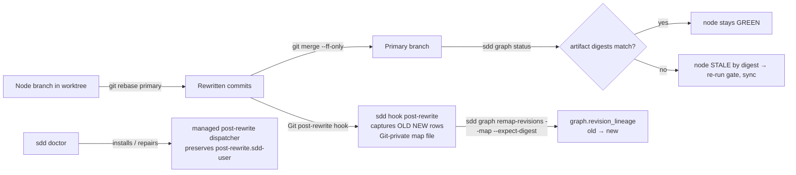

# GitRevisionLineage — Linear Integration Without Re-Verification

## Overview
Graph work happens on node branches in isolated worktrees. Bringing that work
back into the development branch is a rebase followed by a fast-forward, never
a merge commit, because the owner wants a linear history that reads as one
commit per node. A rebase rewrites every commit id on the branch, including
the ids recorded as provenance on the nodes' passing observations.

This design states two things that were previously implicit and one thing
that was previously wrong in the guidance:

1. **Proof is keyed on artifact digests, not commit ids.** A rebase that
   leaves a node's files byte-identical costs no re-verification; the node
   stays GREEN. Only a node whose files changed in the rebase, conflict
   resolution being the usual cause, derives STALE by digest and re-runs its
   gate. Bringing complete work back in never doubles the verification.
2. **Lineage is identity, never proof.** The rewritten commit ids are
   recorded on the graph as old-to-new lineage so provenance stays followable
   after the old commits leave every branch. Recording lineage neither grants
   nor withdraws GREEN.
3. The earlier guidance that said "rerun verification after every rebase and
   do not reuse pre-rebase evidence" contradicted the model and is withdrawn.

The mechanism already shipped on this branch; this document is the design
record for it: a `post-rewrite` Git hook that captures Git's native old/new
map, `sdd doctor` installing and repairing that hook without displacing a
user's own hook, a `revision_lineage` field on the graph, and a fenced
`sdd graph remap-revisions` verb that records the map.

## Non-Goals
- **No verification from lineage.** Remapping never sets an observation, a
  contract revision, a sequence number, or GREEN. A changed-bytes node
  re-verifies through `sync` regardless of what the map says.
- **No inference of dropped or squashed commits.** Many-to-one rows are
  captured but refused by the remapper; a node whose commit was squashed away
  is a judgment for the operator.
- **No Git configuration changes.** Doctor writes the hook file; it never
  edits `core.hooksPath` or any other setting.
- **No SHA-256 remapping yet.** Capture keeps SHA-256 rows; the remapper
  follows the Git adapter's 40-hex SHA-1 contract.
- **No force-push of shared history** without explicit approval; the primary
  branch is never rebased.
- **No change to v1 markdown plans.**

## Architecture

### Components

- **Digest anchoring** (`SddGraph:DD-6`, unchanged): `Verification.ArtifactDigests`
  is the proof anchor; `Provenance.Revision` is supplementary.
- **Capture** (`internal/hook/postrewrite.go`): `sdd hook post-rewrite
  <rebase|amend>` validates Git's two-column stream, bounds it, and writes it
  under the worktree's Git-private `sdd/rewrite-maps` directory. It never
  touches a graph.
- **Dispatcher** (`internal/provision/git_post_rewrite.go`): a managed
  `post-rewrite` shell hook that spools stdin, runs a preserved user hook
  (`post-rewrite.sdd-user`) with the same input and arguments, then calls
  the PATH `sdd` to capture. A partial spool is never captured. The user
  hook's exit status is the hook's exit status.
- **Doctor** (`cmd/sdd/doctor.go`): installs or repairs the dispatcher,
  honors `core.hooksPath` and linked worktrees, restores executable mode,
  refuses unsafe symlinks and backup collisions, and warns when the PATH
  binary predates the capture subcommand. `--check` never writes.
- **Lineage** (`model.Graph.RevisionLineage`, tool-owned): old commit id to
  new commit id. Preserved by every mutation (compile, amend, split, remap).
- **Remap** (`internal/graph/ops/remap.go`): reads a map file, keeps only
  rows whose old id is referenced by an observation, refuses many-to-one,
  cycles, changed bindings, unknown commits, and non-Git targets; writes once
  under `--expect-digest`. `--dry-run` previews.
- **Display**: `graph show` prints recorded and rewritten revisions.

### Data Flow
1. `sdd doctor` once per target worktree.
2. Finish the node, sync the pass in the worktree (provenance names the
   worktree commit).
3. `git rebase <primary>` on the node branch; the hook captures the map.
4. `git merge --ff-only <node-branch>` on primary.
5. `sdd graph status`: digests match, node GREEN; otherwise re-run and sync.
6. `sdd graph remap-revisions --plan P --map <file> --dry-run`, then apply
   with the printed `--expect-digest`, before worktree release removes the
   Git-private map.

### Interfaces
| Command | Purpose |
|---|---|
| `sdd hook post-rewrite <rebase\|amend>` | capture Git's old/new stream; prints the map path; no graph write |
| `sdd doctor [--check]` | install / repair / diagnose the managed hook |
| `sdd graph remap-revisions --plan P --map FILE [--dry-run] --expect-digest D` | record lineage under a graph digest fence |
| `sdd graph show <node>` | shows recorded revision and, when remapped, the rewritten one |

Guard classification: `hook post-rewrite`, `doctor` (install), and
`remap-revisions` are mutations; `doctor --check` is read-only.

## Design Decisions

- **DD-1**: Integration is rebase then fast-forward, never a merge commit.
  Context: the owner wants a linear development branch where each node lands
  as its own commit. Options considered: (a) merge commits; (b) rebase each
  node branch onto the updated primary, then `--ff-only`. Decision: (b).
  Rationale: one commit per node, bisectable, no merge bubbles; the cost is
  rewritten ids, which DD-2 and DD-3 absorb.

- **DD-2**: A rebase costs verification only where it changed bytes.
  Context: rewritten commit ids looked like they invalidated every
  observation, and the first guidance said to re-verify after every rebase.
  Options considered: (a) re-verify every rebased node; (b) rely on digest
  anchoring: a byte-identical node stays GREEN, a changed node derives STALE
  by digest and re-runs. Decision: (b). Rationale: the model already anchors
  proof to artifact digests (`SddGraph:DD-6`); re-verifying on the commit id
  alone doubles the work for no evidence gain. Guidance in the implement
  skill and `shared/vcs-detection.md` states this explicitly.

- **DD-3**: Lineage is identity, never proof.
  Context: after a rebase the recorded provenance names commits no branch
  reaches, and garbage collection can remove them. Options considered:
  (a) rewrite observations to the new ids; (b) record old-to-new lineage
  beside the observations and leave them untouched. Decision: (b).
  Rationale: observations are append-only history (`SddGraph:DD-3`);
  rewriting them would be a claim that the new commit was tested. Lineage
  answers "where did this commit go" and nothing else.

- **DD-4**: Capture is a managed Git hook that preserves the user's hook.
  Context: the map must be captured at rewrite time or it is lost. Options
  considered: (a) ask the operator to save `git rebase` output by hand;
  (b) a managed `post-rewrite` dispatcher installed by doctor, running a
  preserved user hook with identical stdin, arguments, and exit status.
  Decision: (b). Rationale: mechanical capture is the only reliable kind;
  displacing a user's hook would be a silent behavior change, so it is
  preserved and its status is the hook's status.

- **DD-5**: A partial capture is no capture.
  Context: the dispatcher spools stdin before fanning it out; a failed spool
  yields a truncated map. Options considered: (a) capture what was spooled
  and warn; (b) skip capture, warn loudly, still run the user hook.
  Decision: (b). Rationale: a partial map under-records lineage silently; a
  missing map is visible and can be reconstructed from reflog.

- **DD-6**: Remapping is fenced and refuses ambiguity.
  Context: a map can carry squash rows, cycles, or ids the target repository
  does not have. Options considered: (a) best-effort apply; (b) refuse
  many-to-one, cycles, changed bindings, unknown commits, and non-Git
  targets, and write once under the previewed graph digest. Decision: (b).
  Rationale: the same fence discipline as `graph amend`
  (`ReviewDrivenAmendment:DD-8`); a rejected row names its reason and the
  operator decides.

## Error Handling
| Condition | Detection | Response |
|---|---|---|
| Spool of hook stdin fails | `cat` exit status in the dispatcher | no capture; warning names the manual command; user hook still runs |
| `sdd` on PATH predates capture | doctor probes the binary's hook catalog | doctor warns; installs nothing over the user's binary |
| Existing user hook is a symlink or backup collides | doctor inspection | refuse; never overwrite |
| Interrupted install | advisory lock, resumable backup by inode | resumes or rolls back; no half-installed hook |
| Map row is many-to-one, cyclic, or changes an existing binding | remap validation | refuse, naming the rows |
| Old or new commit not in the target repository | `git cat-file` probe | refuse; recovery is the operator's |
| Graph changed since preview | `--expect-digest` mismatch | refuse; re-preview |
| Node's files changed in the rebase | digest staleness in `Derive` | STALE; re-run the gate and sync (not a lineage concern) |

## Testing Strategy
Existing permanent tests cover: real Git rebase capturing the exact native
map with a test-built binary on PATH; doctor install, check, repair, linked
worktrees, `core.hooksPath` forms, no-Git and bare cases, user-hook
preservation, lock release after process exit, resumed interrupted backup;
remap refusals for many-to-one, cycles, changed bindings, stale fence with
refused-mutation exit code, idempotent duplicates; guard classification of
the mutating verbs. Windows runtime execution is not claimed.

Add one scenario that pins DD-2 end to end: a node GREEN in its worktree,
rebased onto an advanced primary with no conflicts, fast-forwarded, then
`Derive` reports GREEN with no digest staleness and no sync was needed;
the negative control changes one artifact during the rebase and expects
STALE for that node only.

### Structural Verification
Per `shared/language-verification.md` for Go: `go build`, `go vet`,
`go test -race` on `internal/hook`, `internal/provision`, `internal/graph/ops`,
`cmd/sdd`; `staticcheck` when installed. The dispatcher is POSIX `sh`; its
tests run it under a real Git rebase.

## Migration / Rollout
Already on branch `sdd-design` (commits `c3d864d`, `cf43a47`, `1afe559`,
`d7c7670`). Nothing is installed in this checkout; doctor installs per
worktree on first run. The PATH binary must be rebuilt from this source
before the hook can capture. No version bump on this branch.

## Open Questions
- **Should remapping learn SHA-256 ids?** **non-blocking** — the Git adapter
  is SHA-1 today; capture already retains SHA-256 rows for a later remapper.
- **Should doctor prune stale map files?** **non-blocking** — maps are small
  and Git-private; worktree release already removes them.
