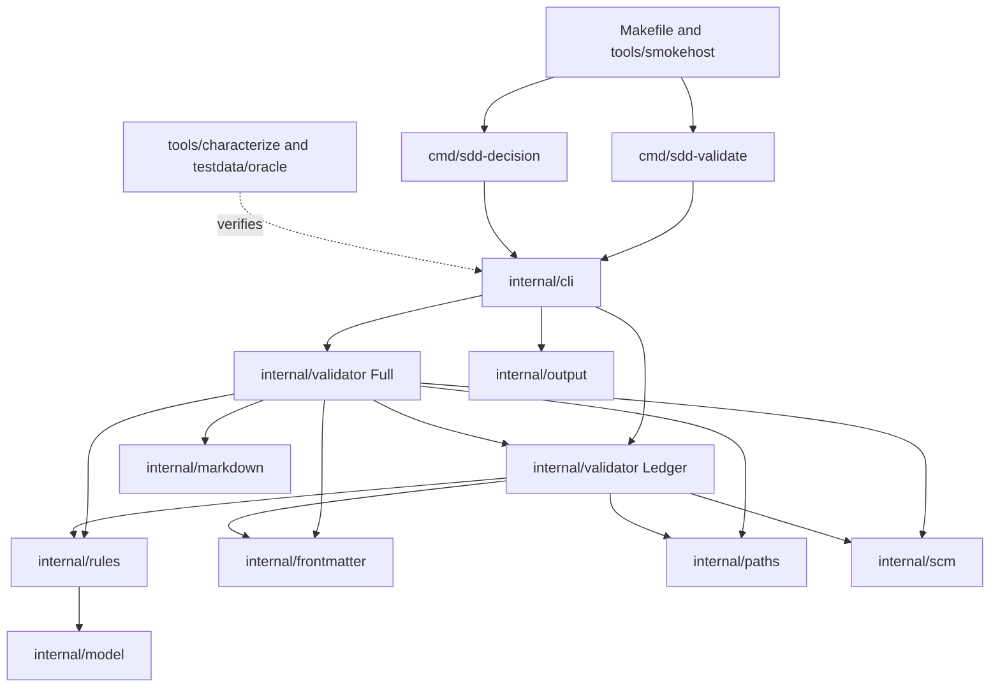
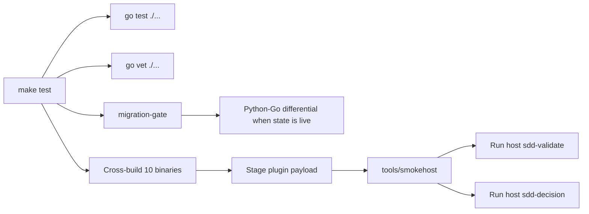

# Go SDD Validator Architecture

> **Superseded along with its spec; see [`Specs/SDD-Toolchain`](../../Specs/SDD-Toolchain/README.md).**
> The package decomposition (`internal/{cli,frontmatter,markdown,model,output,paths,rules,scm,validator}`),
> the YAML compatibility-value-model approach, and the oracle/characterization
> tooling remain the intended starting point for the superseding design. What
> must change: two `cmd/` entry points collapse to one `cmd/sdd` with a
> subcommand tree; packaging drops from ten binaries to five; and new packages
> are required for the schema, the compiler/normalizer, and the hooks. Do not
> implement from this document — a new design is owed against the superseding spec.

## Overview
The validator becomes two native commands, `sdd-validate` and `sdd-decision`,
over one shared Go implementation. The architecture keeps artifact parsing,
diagnostic rules, path handling, SCM inspection, and rendering independently
testable while avoiding a framework-sized abstraction layer. It preserves the
Python validators through a frozen differential corpus before any Go rule is
ported, then removes Python and PyYAML after parity gates pass (FR-01, FR-19,
FR-20, FR-21, FR-23).

The implementation uses `go.yaml.in/yaml/v3` v3.0.5 behind a compatibility
value model. The authoritative package documentation was reviewed at
<https://pkg.go.dev/go.yaml.in/yaml/v3@v3.0.5> on 2026-08-02. Its `Node` API
provides kind, tag, style, aliases, line, and column, but its mostly-YAML-1.2
scalar behavior is not treated as PyYAML compatibility by itself (FR-08).

## Non-Goals
- Build a general Markdown, YAML, Git, or filesystem framework; packages expose only operations required by current validator behavior.
- Parse SDD artifacts into strongly typed schema structs before validation; malformed and partially valid values must remain inspectable.
- Add rule concurrency. Deterministic serial execution is simpler and avoids ordering and race risks.
- Execute commands recorded in completion evidence or mutate any artifact, repository, index, worktree, or configuration (NFR-05).
- Make arbitrary malformed-YAML exception prose byte-identical to PyYAML. Stable diagnostic identity and validation criteria are retained per FR-08.
- Add a new SCM completion adapter, semantic model checks, network installation, or runtime compilation.
- Run foreign-platform binaries during local testing; non-host targets are compile checks only (NFR-02, NFR-03).

## Architecture

### Components



The source tree is:

```text
cmd/
  sdd-validate/main.go
  sdd-decision/main.go
internal/
  cli/          command-specific argument parsing and stream routing
  frontmatter/  YAML node adapter and PyYAML-compatible value model
  markdown/     visibility, section, evidence, and normalization scanners
  model/        artifacts, values, diagnostics, results, and options
  output/       Python-compatible JSON and exact text rendering
  paths/        roots, references, scope, containment, and file identity
  rules/        all full and focused diagnostic rule implementations
  scm/          process runner, VCS detection, and Git operations
  validator/    full and focused-ledger orchestration
tools/
  characterize/ migration-only Python source/test inventory tooling
  smokehost/    host binary selection and native smoke execution
testdata/oracle/ frozen sources, manifests, fixtures, and outputs
```

`cmd/*/main.go` only passes `os.Args`, working directory, and standard streams
to `internal/cli`, then exits with its returned code. Full validation calls the
focused-ledger validator as a Go function, never by spawning `sdd-decision`.
Rule families remain files inside one `internal/rules` package. This single
package is also the mechanical migration boundary: command and parser
foundations can exist before rules, while the first revision touching
`internal/rules/*.go` is unambiguously the first Go validation-logic revision.

### Core Model

```go
type Diagnostic struct {
    Severity   Severity
    Code       string
    Path       string
    Line       int
    Message    string
    Correction string
    Implicated []string
}

type FullOptions struct {
    Start, ExplicitRoot, Scope string
    IdentityMode IdentityMode
}

type LedgerOptions struct {
    Primary string
    History bool
}

func ValidateFull(context.Context, FullOptions, Dependencies) FullResult
func ValidateLedger(context.Context, LedgerOptions, Dependencies) LedgerResult
```

`Dependencies` contains only a process `Runner` and clock if characterization
proves time injection necessary. Filesystem access uses `os` directly; broad
virtual-filesystem dependency injection is declined because temporary trees
exercise the real behavior with fewer indirections.

### Frontmatter Model

Frontmatter is first decoded to `yaml.Node`, then converted without
`Node.Decode` into a private ordered value tree:

```go
type Value struct {
    Kind   Kind
    Text   string
    Bool   bool
    Int    *big.Int
    Float  float64
    Date   Date
    Time   time.Time
    Items  []Value
    Pairs  []Pair
    Node   *yaml.Node
}
```

The converter owns YAML 1.1 implicit scalar resolution used by PyYAML,
quoted/plain distinctions, null/bool/number/date/datetime classification,
aliases, merge keys, alias-cycle detection, and Python-compatible key equality.
Full mode retains the final duplicate mapping value; focused-ledger mode emits
the duplicate-key parse diagnostic. Unhashable mapping keys remain parse
errors. This preserves the two parser contracts without forcing malformed
data into Go structs (FR-07, FR-08).

Rules use a semantic API rather than inspecting node tags directly:

```go
func (v Value) LookupLast(key string) (Value, bool)
func (v Value) Sequence() ([]Value, bool)
func (v Value) Mapping() ([]Pair, bool)
func (v Value) String() (string, bool)
func (v Value) DateOnly() (Date, bool)
func EqualMappingKey(left, right Value) (bool, error)
```

The compatibility table is frozen before implementation: plain YAML 1.1
null/bool/integer/float/date/datetime scalars, quoted strings, explicit core
tags, aliases, merge precedence, duplicate keys before and after merges,
boolean/integer key collisions such as `true` and `1`, and unhashable keys.
Mappings retain source order and all pairs even when full-mode lookup returns
the last duplicate value. Traversal is iterative with active-alias cycle
detection; this design adds no corpus-derived depth or node-count rejection.

`yaml.Node` provides start line/column but no end byte. Lifecycle normalization
derives only the required block-style `status` and `updated` spans from a
line-offset index and lexical scan. Flow or multiline lifecycle values remain
unsupported as in the Python validator. Malformed-YAML errors pass through a
small category formatter: code, severity, path, line, criterion, and correction
are stable, while library-specific prose is normalized (FR-08).

### Markdown And Matcher Layer

The existing custom Markdown visibility behavior is ported as line scanners,
not replaced by a Markdown renderer. It removes HTML comments, fenced blocks,
and indented code from the visible view while retaining source-line mapping.
Heading, section, checkbox, evidence table, citation, and lifecycle
normalization operations consume that view (FR-09).

Go's standard `regexp` handles patterns that require no lookaround. The few
Python lookaround patterns become explicit scanners with boundary predicates:
failure tokens, justification placeholders, and completion-evidence section
ends. Unicode word/space behavior uses `unicode` predicates; IDs remain ASCII.
Every scanner is table-tested at start/end, punctuation, Unicode adjacency,
multiline, and CRLF boundaries.

### Path Model

The implementation carries two path forms:

- Native absolute paths for `os` and subprocess operations.
- Forward-slash planning-root-relative strings for artifact identity,
  references, diagnostics, Git pathspecs, and JSON (FR-12).

Safe references reject empty, absolute, volume-qualified, UNC,
backslash-containing, `.` and `..` values before conversion. After joining to
the resolved planning root, `filepath.Rel` proves lexical containment and
`EvalSymlinks` proves physical containment for existing targets.

Related existence and artifact resolution are separate operations. Any
contained existing file or directory satisfies `related`; only parsed SDD
artifacts enter `byPath`, transitive scope expansion, citation resolution, or
`artifacts_in_scope`. This directly fixes the four `Resources/...` false
positives without treating resources as artifacts (FR-16, AC-05).

Ledger discovery reads directory entries to recover real spelling, uses
`os.Stat` plus `os.SameFile` to collapse physical aliases, and uses `os.Lstat`
separately for symlink diagnostics. It never lowercases identity, so distinct
case variants survive where the filesystem supports them (FR-13).

Diagnostic display paths are resolved by longest containing known root:

1. Planning-root files use their planning-root-relative slash path.
2. Configured repository files use `@repo:<key>/<repo-relative-path>`.
3. Files in an owning but unconfigured repository use `@repo:root/<relative>`.
4. A standalone focused ledger uses `@ledger/<relative-to-primary-parent>`.

The selected symbolic path is independent of `planning-config.local.json`
machine paths. Archive siblings use the same alias root as the primary ledger.
POSIX and Windows golden fixtures freeze these intentional FR-12 deltas.

### Root And Repository Resolution

`internal/paths` returns one complete resolution object:

```go
type Resolution struct {
    Start, ConfigDir, PlanningRoot, OwningRepository string
    ConfiguredRepositories map[string]string
    PlanRepositories map[string]string
}
```

It implements `shared/path-resolution.md` once:

1. Detect the owning Git worktree or Perforce workspace; an unversioned path uses the filesystem root as its search boundary.
2. Search upward from the invocation start for `planning-config.json` until the VCS/workspace boundary or filesystem root.
3. Without configuration, use the owning repository or start directory as planning root.
4. With configuration, resolve `planningRoot` against the config directory unless absolute.
5. `--root` overrides only the planning root; config directory, owning repository, and repository mappings remain anchored to the discovered configuration/invocation repository.
6. Load repository keys and plan mappings from committed configuration.
7. Overlay local target paths from sibling `planning-config.local.json`.
8. Resolve each plan mapping through its repository key and verify the target directory.

This intentionally differs from the Python `_configure_repositories`, which
looks for machine paths in committed configuration (FR-14).

Malformed committed config, malformed local config, non-object mappings,
unknown repository keys, absent local paths, and mapped non-directories become
`SDD000` with stable symbolic config paths. An explicit nonexistent `--root`
remains the full validator's root operational failure. Focused mode searches
upward from the primary ledger first, bounded by its owning VCS/workspace root
or filesystem root. Only when that finds no configuration does it search from
the current working directory. Canonically identical results collapse; the
ledger-nearest config otherwise wins, so unrelated caller configuration cannot
relabel a ledger. If neither yields config, the `@repo:root` or `@ledger`
fallback still provides stable diagnostic paths.

### SCM And Process Layer

```go
type Runner interface {
    Run(ctx context.Context, dir, executable string, args ...string) ProcessResult
}
```

The production runner uses `exec.CommandContext`, `Cmd.Dir`, and one argument
per operand. It never invokes a shell (FR-10, NFR-06). `ProcessResult` keeps raw
stdout/stderr bytes, exit code, and process-start error separate. Git helpers
remain small operations such as root lookup, object existence, ancestry,
parent lookup, object loading, diff/status, and worktree checks. Raw bytes are
retained for NUL-separated and committed-byte comparisons.

Each validator callsite decides whether unavailable history is ignored,
diagnostic, or operational; the SCM layer does not flatten all failures into
one policy. Perforce detection is retained, but no completion adapter is added.

### Data Flow

```mermaid
flowchart LR
    Args --> ParseCLI
    ParseCLI --> ResolveRoots
    ResolveRoots --> Discover
    Discover --> ReadBytes
    ReadBytes --> ParseFrontmatter
    ParseFrontmatter --> Index
    Index --> LocalRules
    LocalRules --> GraphRules
    GraphRules --> SCMRules
    SCMRules --> Scope
    Scope --> Sort
    Sort --> Render
    Render --> StreamsAndExit
```



Full validation discovers in deterministic lexical order, indexes all parsed
artifacts, executes rules serially in the Python pipeline order, resolves scope
and transitive artifact links, filters findings, and sorts by `(path, line,
code, message)` (FR-04, FR-06, FR-11). Focused validation discovers the primary
ledger and archives, validates individual documents, then collection,
supersession, collision, and history rules (FR-07).

Task IDs are strings throughout indexing, dependencies, headings, citations,
evidence, history, and sorting. One anchored matcher validates
`<phase>.<digits>[a-z]?`; no parser decomposes a suffix into hierarchy, so
`3.1`, `3.1a`, and `3.1b` can coexist as exact independent IDs (FR-17).

### Interfaces

The public process contracts remain:

```text
sdd-validate [--root PATH] [--scope SCOPE]
             [--format text|json]
             [--identity-mode auto|current|historical]

sdd-decision LEDGER [--format text|json] [--no-history]
```

Each command has a small explicit parser rather than Go `flag`, whose generated
usage text is not the compatibility contract. Parse errors write
command-specific usage to stderr and exit `2` (FR-02, FR-03). Usage and
operational prefixes name `sdd-validate` and `sdd-decision`; obsolete Python
script names are not preserved. Golden cases cover repeated options,
`--option=value`, `--`, and option-looking values as well as ordinary errors.

`internal/output` renders from ordered primitive maps. Its JSON writer sorts
keys recursively, indents by two spaces, uses Python-compatible ASCII and
surrogate-pair escaping, does not HTML-escape, and writes one final newline.
This avoids differences in ordinary `encoding/json` output (FR-05). Text and
stream routing are centralized and golden-tested. Approved output deltas are
limited to FR-02 command names, FR-12 symbolic paths, FR-08 malformed-YAML
prose, FR-14 configuration resolution, FR-16 resources, and FR-17 task IDs.

Bundled commands live at:

```text
bin/<goos>-<goarch>/sdd-validate[.exe]
bin/<goos>-<goarch>/sdd-decision[.exe]
```

Lifecycle skills map the actual host OS/architecture to this table and fail
operationally for an unsupported pair; they do not build or download at
runtime (FR-24).

## Design Decisions

### Decision 1: Two Commands Over One Internal Library
**Context:** Users need separate full and focused command contracts, while full validation embeds focused ledger checks (FR-01, FR-07).

**Options Considered:**
1. Two thin commands over shared packages.
2. One command with subcommands.
3. Two independent implementations.

**Decision:** Use two thin commands over one internal library.

**Rationale:** It preserves command names and usage while preventing rule drift. A subprocess boundary would complicate diagnostics, tests, and stream behavior.

### Decision 2: YAML Node Adapter With Private Compatibility Values
**Context:** PyYAML and Go YAML defaults differ in scalar resolution, duplicate keys, dates, aliases, and source information (FR-08).

**Options Considered:**
1. `go.yaml.in/yaml/v3` v3.0.5 nodes plus a compatibility converter.
2. Direct unmarshal into structs or `map[string]any`.
3. Use `github.com/goccy/go-yaml` for byte offsets.
4. Maintain two parser trees.

**Decision:** Pin `go.yaml.in/yaml/v3` v3.0.5 and build a private compatibility value tree from nodes.

**Rationale:** The maintained YAML organization package shares libyaml lineage, exposes the node metadata needed by validation, and is redistributable. Direct decode loses required semantics; a second parser adds reconciliation risk larger than the narrow span scanner it would replace. The module is vendored with its licenses and `vendor/modules.txt`; authoritative commands force `-mod=vendor` so clean offline tests never depend on a warm module cache.

### Decision 3: Characterized Malformed-YAML Criteria, Not PyYAML Prose
**Context:** Go parser exception strings cannot generally match PyYAML wording, and the output is interpreted by models rather than parsed as a stable error API.

**Options Considered:**
1. Preserve diagnostic identity, location, criterion, and correction while normalizing parser prose.
2. Port PyYAML scanner/parser exception formatting for arbitrary malformed input.

**Decision:** Use option 1 (FR-08).

**Rationale:** It retains actionable validation semantics without making a Python exception formatter part of the Go validator.

### Decision 4: Explicit Scanners Instead Of Backtracking Regex
**Context:** Go RE2 omits Python lookaround and differs in Unicode character classes (FR-09).

**Options Considered:**
1. Small boundary-aware scanners plus standard `regexp`.
2. Add a backtracking regular-expression dependency.
3. Loosen the matchers.

**Decision:** Use option 1.

**Rationale:** Only a few patterns need lookaround. Explicit predicates are easier to characterize, remain linear-time, and avoid another runtime engine.

### Decision 5: Native Paths At Boundaries, Slash Paths Internally
**Context:** Filesystem calls require host-native paths, but artifacts and diagnostics require stable cross-platform names (FR-11, FR-12, FR-13, FR-16).

**Options Considered:**
1. Deliberate dual representation with safe conversion.
2. Use `filepath` strings everywhere.
3. Normalize everything to lowercase slash paths.

**Decision:** Use option 1 and `os.SameFile` for physical identity.

**Rationale:** It prevents Windows separators from leaking into contracts and avoids hiding real files on case-sensitive systems.

### Decision 6: Custom CLI And JSON Rendering
**Context:** Existing consumers depend on precise argument, stream, JSON ordering, escaping, and newline behavior (FR-02 through FR-05).

**Options Considered:**
1. Small command parsers and a Python-compatible JSON writer.
2. Go `flag` and ordinary `encoding/json`.
3. Change consumers to accept new output.

**Decision:** Use option 1.

**Rationale:** The output value domain is small, while default Go usage and JSON escaping differ in observable ways.

### Decision 7: Characterization Is A Separate Revision Gate
**Context:** Most diagnostics have no direct current test; candidate code and expected outputs must not be authored together (FR-19 through FR-21, AC-14).

**Options Considered:**
1. Freeze sources, test inventory, branch manifest, fixtures, and Python outputs in one complete revision before Go rule logic.
2. Characterize each rule while porting it.
3. Rely on the existing 74 tests.

**Decision:** Use option 1 and verify the first Go-rule revision's parent through a migration-only history check.

**Rationale:** Independent expectations make the differential suite an oracle rather than a restatement of candidate behavior.

### Decision 8: `make test` Builds All Targets And Runs The Host
**Context:** The local test contract must prove cross-compilation without attempting to execute foreign binaries (NFR-02, NFR-03, AC-08, AC-09).

**Options Considered:**
1. Explicit cross-build targets plus a Go host-smoke selector.
2. Shell loops and `uname` branching.
3. Run only `go test ./...`.

**Decision:** Use explicit Make targets for both commands on all five target pairs. `tools/smokehost` reads `runtime.GOOS`/`runtime.GOARCH`, selects only the matching bundled pair, and runs full and focused JSON fixtures.

**Rationale:** Explicit targets produce clear failures; Go runtime identity avoids an overridden cross-compilation environment or shell portability issue.

## Error Handling
- Invocation errors write usage to stderr, leave stdout empty, and exit `2`.
- Operational root/config/scope failures retain their current text or JSON envelope and exit `2`.
- Operational diagnostics in a normal result force exit `2`; validation errors without operational findings exit `1`; candidate-only findings exit `0` (FR-03).
- UTF-8, CRLF, frontmatter, artifact, and ledger errors remain owned by their specific `SDD` or `DLG` rule rather than becoming generic failures.
- Process start errors, nonzero exits, and empty output remain distinct so each Git callsite can preserve its current policy.
- Symlink containment failures and unsafe references are rejected before artifact graph lookup.
- Alias cycles produce the mode's parse diagnostic. Traversal is iterative and adds no corpus-derived depth or node-count rejection; native allocation failures remain process failures rather than being misreported as artifact invalidity.
- Panics are implementation defects and fail loudly; they are not recovered as ordinary invalid results.
- No recovery path mutates input. Users or lifecycle skills correct artifacts and rerun validation.

## Testing Strategy

### Frozen Oracle
The characterization revision creates:

```text
testdata/oracle/
  python-src/{scripts,tests}/
  source-sha256.csv
  current-test-inventory.json
  current-test-coverage.csv
  diagnostic-branches.csv
  branch-exemptions.csv
  fixtures/<case>/{input,invocation.json,python.exit,python.stdout,python.stderr}
```

Python AST tooling inventories all 74 methods and every generated/literal
subtest, fingerprints validator diagnostic callsites, and freezes source hashes
and outputs. Branch IDs use
`<script>::<qualified-function>::<code>::<ordinal>` plus named variants.
Approved deltas name only FR-02, FR-12, FR-14, FR-16, FR-17, or FR-08 malformed-YAML prose;
there is no generic ignore list (FR-19 through FR-22).

While Python exists, black-box tests run both commands over copied fixtures and
compare exit code, raw streams, parsed JSON, diagnostic order, multiplicity,
and fields. After removal, Go tests replay frozen outputs and approved deltas.

### Test Layers
- Unit tables cover value conversion, YAML 1.1 scalar resolution, scanner boundaries, path safety, task IDs, output encoding, and CLI parsing.
- Artifact fixtures cover every `SDD` and `DLG` branch, message variant, positive case, negative case, and predicate boundary.
- Filesystem tests cover real spelling, case-sensitive skips, symlinks, resources, directories, spaces, and non-ASCII names.
- Git integration tests cover no repository/HEAD, linked worktrees, staged/worktree divergence, merges, ancestry, detached history, lifecycle normalization, and raw-byte comparisons.
- Read-only guards snapshot planning-root bytes, mapped repository bytes, external ledgers/archives, symlink targets, committed/local configuration, every Git index/worktree, and Perforce opened state where available before and after execution (AC-13).
- Process tests assert only fixed local `git`/`p4` executables are invoked, every argument is separate, no shell starts, and no network-shaped executable is called.
- Packaging tests stage the plugin payload, verify all ten binaries and vendored licenses, check Unix executable bits and Windows suffixes, simulate lifecycle lookup for every supported pair, and execute both commands from the staged host package without source or Go toolchain paths.
- Static workflow tests parse `commands/plan/SKILL.md` and prove scoped validation occurs after task-ID authoring/revision and before reviewer dispatch, while schema, template, and reviewer guidance all carry the same task-ID grammar (FR-18, AC-07).
- The frozen-state cutover check scans runtime and user-facing surfaces (`commands/`, `agents/`, `shared/`, `hooks/`, `Makefile`, root `README.md`/`CLAUDE.md`, dependency/build manifests) while excluding `.plans/`, `testdata/oracle/`, and the checker implementation. It rejects executable `python* ... scripts/sdd_validate.py`/`sdd_decision_validate.py` forms, imports of either Python module, PyYAML requirements, virtualenv test bootstrap, and instructions directing users to removed scripts; historical prose elsewhere is not a runtime failure (FR-15, AC-15).

### `make test`



Five explicit target pairs build both commands with `CGO_ENABLED=0` and
`-trimpath`: `windows/amd64`, `darwin/amd64`, `darwin/arm64`, `linux/amd64`,
and `linux/arm64`. The smoke tool fails clearly if the local pair is not in the
matrix and never executes a foreign binary (NFR-02, NFR-03).

The Make contract is explicit:

```text
.PHONY: all test test-precutover test-postcutover assert-live assert-frozen test-go verify migration-gate test-migration build-all stage smoke-host package-check package clean
all: build-all
test: test-go verify build-all stage package-check smoke-host migration-gate
test-precutover: assert-live
	$(MAKE) test
test-postcutover: assert-frozen
	$(MAKE) test
test-go: GOFLAGS=-mod=vendor go test ./...
verify: gofmt check + GOFLAGS=-mod=vendor go vet ./...
test-migration: frozen-source/branch/history checks + Python-Go differential
build-all: ten explicit CGO_ENABLED=0 -trimpath builds
stage: build-all + deterministic staged plugin payload
package-check: stage + contents/mode/lookup/toolchain-independence checks
smoke-host: stage + tools/smokehost executes only the matching staged pair
package: package-check + smoke-host + deterministic release archives
clean: remove generated bin/ and staging output only
```

`testdata/oracle/migration-state.json` is checked in as `live` before cutover
and changes once to `frozen` in the cutover revision. `migration-gate` runs
`test-migration` in `live` state; in `frozen` state it verifies live Python and
PyYAML are absent and frozen replay remains registered under `test-go`. The
explicit aliases use recursive Make only after their state assertion succeeds,
so parallel Make cannot reorder the assertion behind `test`; they then run the same
authoritative graph. Thus `make test` cannot silently omit differential tests
while the oracle is live, and staged package checks/smoke always have a staging
prerequisite. `package` is tested from a clean tree, and all Go commands run
with vendoring forced. An offline fixture sets an empty
`GOMODCACHE` and disables module proxy/sumdb access to prove no download occurs.

### Structural Verification
- `gofmt` is checked for every Go source file.
- `go vet ./...` runs on every implementation phase and through `make test`.
- `staticcheck ./...` runs when already installed; `make test` never downloads it.
- `go test -race ./...` is required only if goroutines or shared mutable state are introduced; this design intentionally uses serial rule execution.
- Cross-builds use `CGO_ENABLED=0` to prove the commands remain self-contained.
- Dependency review confirms only pinned, redistributable Go modules are linked into release binaries.

## Migration / Rollout

### 0. Characterization Revision
Freeze the two Python scripts, six tests, exact dependency versions, 74-test
inventory, branch manifest/exemptions, compatibility corpora, and Python
outputs. Add checksums, manifest consistency tests, the characterization lock,
and FR-08/14/16/17 expected deltas. No Go package in this revision evaluates an
SDD rule. It writes a characterization lock containing all expected hashes.

### 1. Go Foundation
Add `go.mod`, `go.sum`, vendored modules/licenses, shared models, YAML compatibility tests, path/process primitives,
CLI parsers, output writer, command stubs, cross-build targets, and host smoke.
No file under `internal/rules/` exists yet.

### 2. Focused Ledger
Create `internal/rules/` and port focused parsing, discovery, schema, collection, sequencing,
supersession/collision, and Git immutability behavior. This exercises strict
duplicate keys, dates, archive naming, same-file identity, and exact output
before the larger full validator. A migration-only Git test finds the earliest
revision touching `internal/rules/*.go`, requires its immediate parent to
contain the exact characterization lock and corpus hashes, and rejects any
oracle-output or approved-delta change in that first rule revision. Missing or
shallow history fails `test-migration` loudly; ordinary post-cutover tests do
not require history.

### 3. Full Structural Rules
Port discovery, common schema, headings, artifact-specific rules, indexes,
references, scope, graphs, citations, traceability, and focused-ledger
integration. Land FR-02, FR-12, FR-14, FR-16, FR-17, and FR-08 parser-prose
differences only through their approved-delta fixtures.

### 4. Completion And Identity Rules
Port evidence parsing, lifecycle normalization, focused and phase reviews,
Git object/ancestry checks, clean-state checks, committed-byte comparisons,
and current/historical identity modes.

### 5. Workflow And Packaging Cutover
Bundle all ten binaries and update command lookup, `/validate`, `/plan`,
`/implement`, `/code-review`, decision-ledger guidance, task-ID grammar,
templates, reviewer instructions, README, CLAUDE files, Makefile, and release
maintenance references (FR-15, FR-18, FR-24). Stage the complete plugin and
run every lifecycle lookup against simulated host pairs plus both actual
host-native commands before release packaging is accepted. Add the static
`/plan` ordering and task-grammar test required by AC-07.

### 6. Python Removal
After `make test` passes every corpus, branch, output, path, Git, cross-build,
and host-smoke gate, remove live Python validators, Python imports, PyYAML,
virtualenv bootstrap, and `requirements.txt`. Retain frozen Python sources as
non-executable oracle material and make all ordinary tests independent of
Python, network access, and repository history (FR-23, NFR-01). Flip
`migration-state.json` from `live` to `frozen`; `migration-gate` then enforces
the AC-15 scoped pattern search and rejects any surviving runtime dependency,
import, executable invocation, or user instruction in the defined runtime and
documentation surfaces.

## Open Questions
- None. Malformed-YAML prose normalization, command split, packaging, task-ID coexistence, and local cross-build/host execution are resolved.
