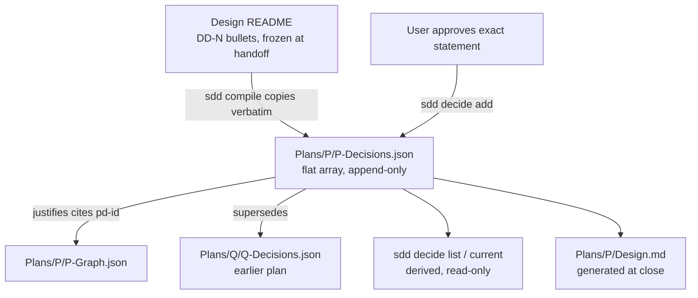
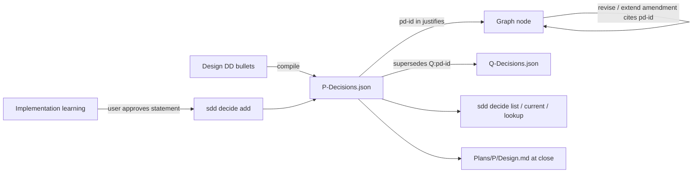

# PlanDecisions — Flat Per-Plan Decision Records Replacing the Global Ledger

## Overview
Decisions today live in one global ledger, `Decisions/decisions.md`, as
sequentially numbered `D-NNNN` entries with a dozen fields each, an admission
test, a collision procedure, fork and detached modes, and validator rules
SDD110 through SDD146 to keep it consistent. In practice every entry is a
design decision made either while planning or while implementing. The global
sequence does not survive concurrent branches: two branches each append the
next number, every pull request renumbers, and every inline citation breaks.

This design replaces the ledger with one flat JSON file per plan. A decision is
five fields. Its id is a digest of its statement, so branches cannot collide
and nothing ever renumbers. The file is written by exactly one verb, once per
decision, after the user approves the exact statement. Design `DD-N` bullets
are copied into it verbatim when the plan compiles, so the design document is
never edited after handoff and the plan folder becomes a self-contained record
of how the plan works. Later plans cite earlier plans' decisions read-only and
supersede them from their own file, which is what makes the set of plan folders
a knowledge base.

The handoff shape is the same one `SddGraph` already uses for work: authored
prose is the source until compile, and after compile the structured file in the
plan folder is the only mutable record (`SddGraph:DD-2`).

## Non-Goals
- **No decision structure beyond five fields.** No rejected options, rationale,
  scope, tags, kind, reversibility, status, or decided-by fields. If a
  rationale matters it is a sentence in the statement.
- **No admission test, collision procedure, or fork/detached modes.** These
  exist to keep a shared sequence consistent; a content-addressed per-plan file
  has no shared sequence.
- **No editing of existing entries.** A decision is immutable. Changing one is
  a new entry that supersedes it.
- **No decisions in the graph.** The graph is implementation and plan state
  (`SddGraph:DD-3`); nodes cite decisions, they do not contain them.
- **No decisions before a design exists.** Brainstorm and spec do not record
  decisions; the design's DD section is the only pre-plan home. Research and
  brainstorm remain narrative.
- **No cross-repository decisions.** A plan's file is scoped to its planning
  root. Sharing across repos is a future concern.
- **No automatic promotion at archive.** Nothing moves at plan close; the plan
  folder is the archive.

## Architecture

### Components



- **Decisions file.** `Plans/<Name>/<Name>-Decisions.json`. A JSON array of
  entries in append order. Strictly decoded: unknown fields refuse.
- **Entry.** Exactly these fields:

  | Field | Required | Meaning |
  |---|---|---|
  | `id` | yes, tool-set | `pd-` plus the first 8 hex characters of SHA-256 over the normalized statement. Never supplied by the caller. |
  | `date` | yes, tool-set | ISO date the entry was appended. |
  | `statement` | yes | The decision, in one or a few sentences. The only human-authored content. |
  | `supersedes` | no | One id, in this plan (`pd-…`) or another (`<Plan>:pd-…`). |
  | `source` | no | Provenance: `Designs/<X>:DD-N` for a compiled decision, `Reviews/<file>:F-NN` for one that came from a review finding, otherwise absent. |

  Normalization for the digest is trim, collapse internal whitespace, and
  NFC. Two branches that record the same sentence produce the same id, and a
  merge keeps one copy.
- **Compile conversion.** `sdd compile` reads every design in the plan's
  `related` frontmatter, takes each top-level `- **DD-N**:` bullet with its
  indented continuation lines as one statement, and appends an entry with
  `source: Designs/<X>:DD-N`. The copy is verbatim; no field extraction. A DD
  whose bullet body says `Supersedes DD-3` is not parsed; if the author wants
  supersession recorded, they record it with `sdd decide add` after compile.
  Re-running compile on an existing plan appends only DDs whose digest is not
  already present, so extending a design and recompiling adds the new
  decisions and touches nothing else.
- **Write verb.** `sdd decide add --plan P --statement S [--supersedes ID]
  [--source REF]`. Appends one entry under the same whole-file digest CAS the
  graph store uses (`gstore.Update` pattern, `SddGraph:DD-11`). Prints the
  entry it wrote as JSON. Checks, all mechanical: statement non-empty after
  normalization; id not already present in this file; `supersedes`, if given,
  resolves to an entry in this plan's file or another plan's file under the
  same planning root; `source`, if given, has one of the two accepted shapes.
  There is no other write path. `sdd compile` is the only other writer and it
  uses the same append routine.
- **Citation.** Node `justifies` may cite `pd-<hex>` (this plan) or
  `<Plan>:pd-<hex>` (another plan). The citation index
  (`internal/rules/graphapi.go`) gains plan decision files as sources alongside
  spec and design artifacts. The same extension admits frozen review artifacts
  for `ReviewDrivenAmendment:DD-6`; both land in one change. In
  `internal/graph/compile`, the `justifies` check collapses to one index lookup
  per citation: the `sources.fork` / `sources.decisions` branch tree
  (ambiguity suggestions, qualification, disposition and effective-status
  checks) and the `forkDecisionIntent` type in `fork_intent.go` are deleted
  with the ledger. `D-` leaves the identifier families; `pd-` joins them.
  The existing `DD` definition regex in `internal/rules/index.go` already
  matches both `- **DD-N**:` bullets and `## DD-N` headings, and compile's
  conversion uses it, so both forms are extracted; a heading-form DD's
  statement is the heading text plus the paragraphs up to the next heading.
- **Derived reads.** `sdd decide list --plan P [--json]` prints the file.
  `sdd decide current [--plan P] [--json]` walks every plan's file under the
  root, follows `supersedes` chains, and prints the entries not superseded by
  anything. Two plans that compile the same design DD hold entries with the
  same id; `current` collapses same-id entries across files into one line
  listing every plan that carries it, and a `supersedes` recorded in any one
  plan retires the id everywhere. `sdd decide lookup <id>` prints one entry and its chain in both
  directions. All three are read-only and computed on every call; nothing is
  cached or stored.
- **Generated design at close.** When a plan completes, the compiler renders
  `Plans/<Name>/Design.md` from the decisions file and the graph: every
  current decision, every superseded one struck with a pointer to its
  successor, and for each decision the node contracts that cite it. The file is
  a disposable view (`SddGraph:DD-2`); regenerating it is byte-identical for
  the same inputs. It is the "how this plan works" document a later reader
  opens first.

### Data Flow



A decision that changes work is two records, not one: the decision entry, then
a graph amendment (`ReviewDrivenAmendment`) whose `justifies` names the new
id. The decisions file records what was decided; the graph records that work
changed. Neither file contains the other's content.

### Interfaces

Example file after compile and two implementation-time decisions:

```json
[
  {
    "id": "pd-4c1e9a2b",
    "date": "2026-09-11",
    "statement": "DD-4: Manifest reads are scoped to the caller's accessible variants. Context: … Decision: (b). Rationale: …",
    "source": "Designs/CatalogPlane:DD-4"
  },
  {
    "id": "pd-8b02e7f0",
    "date": "2026-09-14",
    "statement": "Manifest reads refused for tenant mismatch emit an audit event; the event carries tenant ids but never the manifest body."
  },
  {
    "id": "pd-3f9a1c77",
    "date": "2026-09-16",
    "statement": "Manifest reads refused for tenant mismatch emit an audit event carrying only the caller tenant id; the target tenant id is withheld because it leaks tenancy existence.",
    "supersedes": "pd-8b02e7f0",
    "source": "Reviews/2026-09-16-catalog-read-path.md:F-02"
  }
]
```

Driver protocol for an implementation-time decision, in full:

1. The driver writes the statement it proposes to record and shows it to the
   user verbatim.
2. The user approves it, or edits it and approves the edited text.
3. The driver runs `sdd decide add` with that exact text. The tool prints the
   entry. Done.

There is no draft state, no proposed status, and no accept step. A statement
the user did not approve is never passed to the tool.

Citation forms accepted by the index:

| Form | Resolves against |
|---|---|
| `pd-3f9a1c77` | the citing plan's own decisions file |
| `CatalogPlane:pd-3f9a1c77` | `Plans/CatalogPlane/CatalogPlane-Decisions.json` |
| `Designs/X:DD-4` | the design, unchanged from today |

Plan decisions qualify by bare plan name and designs by directory prefix
because that is how the index's existing `SourceQualifier` spells each kind;
the mix is deliberate, not an inconsistency.

Citing a superseded decision from live work is a validator warning, not an
error: the earlier plan was correct when it closed, and the warning names the
successor.

## Design Decisions

- **DD-1**: Decisions are a flat per-plan JSON array, not a global ledger.
  Context: the global `D-NNNN` sequence collides on every concurrent branch and
  renumbers on every merge, breaking inline citations. Options considered:
  (a) keep the global ledger with fork/detached modes (the shipped
  `ForkAwareDecisionLedgers` approach); (b) content-addressed entries in one
  global file; (c) one file per plan, content-addressed. Decision: (c).
  Rationale: (a) keeps the sequence and adds machinery around it; (b) removes
  renumbering but keeps one file every branch touches, so every PR still
  conflicts on it. Per-plan files are touched only by branches working on that
  plan, and their ids never collide. This supersedes `ForkAwareDecisionLedgers`
  in full.

- **DD-2**: An entry has five fields and nothing else.
  Context: the ledger schema has twelve fields and the driver spends more
  effort filling them than deciding. Options considered: (a) keep the full
  schema; (b) `id`, `date`, `statement`, optional `supersedes`, optional
  `source`. Decision: (b). Rationale: the statement is the decision. Rejected
  options and rationale belong in the statement when they matter and are noise
  when they do not. Every field that exists for the validator to check is
  removed together with the check.

- **DD-3**: Ids are a digest of the normalized statement.
  Context: any allocated sequence collides across branches. Options
  considered: (a) per-plan sequence `PD-NN`; (b) UUID; (c) `pd-` plus 8 hex of
  SHA-256 over the normalized statement. Decision: (c). Rationale: immutable
  entries make content addressing sound, two branches recording the same
  sentence converge instead of conflicting, and the id is reproducible from the
  file alone. A UUID is collision-free but says nothing and needs the tool to
  mint it. Eight hex characters give a negligible collision chance within one
  plan; the tool refuses a genuine collision rather than silently merging.

- **DD-4**: `sdd compile` copies design DD bullets verbatim into the plan's
  file; the design is not edited afterward.
  Context: designs freeze at handoff, but decisions keep evolving during
  implementation. Options considered: (a) designs stay append-only and receive
  new DDs; (b) decisions become graph objects; (c) compile converts DDs into
  the plan's file and later decisions are appended there. Decision: (c).
  Rationale: (a) keeps the design as a live authority, which the accepted-graph
  lifecycle forbids; (b) puts non-work objects in the graph. Verbatim copy
  means no parsing logic and no drift between the design and its compiled form.
  "After handoff" means after the plan's first compile. Before that the
  design is the live authority and may change freely; compile is the one-way
  event. An edit to a DD after compile is not forbidden by the tool, but it
  does nothing to the plan except produce a new entry on recompile with no
  `supersedes`, which the validator reports, so it is pointless rather than
  dangerous.

- **DD-5**: One write verb, user-approved statement in, entry out.
  Context: the ledger write path has add, accept, supersede, fork preview,
  fork apply, and fork recover. Options considered: (a) keep a propose/accept
  lifecycle; (b) a single append after user approval. Decision: (b).
  Rationale: a decision the user has not approved is not recorded, so there is
  no proposed state to model. The approval happens in the conversation; the
  tool records the result.

- **DD-6**: Cross-plan citation and supersession are read-only references
  resolved at query time.
  Context: a decision made in one plan constrains later plans. Options
  considered: (a) promote durable decisions to a repo-level file at close;
  (b) later plans cite and supersede earlier plans' entries by qualified id,
  and `current` is derived by walking every plan. Decision: (b). Rationale: no
  promotion step, no second file to keep consistent, and the archive of plan
  folders is the knowledge base by construction.

- **DD-7**: The plan's closing design document is generated, never authored.
  Context: a reader later wants "how does this plan work". Options
  considered: (a) the debrief carries it as prose; (b) the compiler renders it
  from the decisions file and node contracts. Decision: (b). Rationale:
  generated output cannot drift from the records it is built from, and it can
  be regenerated when the reader's tool version changes the rendering.

## Error Handling
| Condition | Detection | Response |
|---|---|---|
| Empty statement after normalization | `decide add` | refuse |
| Id already present with a different statement | digest collision | refuse; report both statements; user rewords |
| Id already present with the same statement | digest match | no-op; print the existing entry (idempotent re-run) |
| `supersedes` does not resolve | lookup across plan files | refuse; name the id searched for and the files searched |
| `supersedes` names an entry already superseded | chain check | refuse; name the current successor |
| `source` malformed | shape check | refuse; print the two accepted shapes |
| Concurrent append | whole-file digest CAS | re-read and retry, as the graph store does |
| Node cites unknown `pd-` id | citation index at compile | refuse the compile (unchanged posture for unresolved citations) |
| Node cites a superseded id | citation index at validate | warning naming the successor |
| Decisions file has unknown fields or wrong types | strict decode | refuse every read and write; name the field |
| Design DD bullet unparseable as a top-level bold bullet at compile | compile | skip with a diagnostic naming the design and line; never emit an empty statement |
| Legacy `D-NNNN` citation in a live artifact after migration | validator | error; the migration table gives the replacement id |

## Testing Strategy
Scenario tests under `internal/decisions` (new package replacing
`internal/dlg`) and in `internal/graph/compile`, run by `make test`:

| Scenario | Positive control | Negative control |
|---|---|---|
| Add | approved statement → one appended entry with digest id and today's date | empty statement refused |
| Idempotent add | same statement twice → one entry, second call prints it | different statement with a forced digest collision refused |
| Supersede in plan | entry with `supersedes` resolves; `current` omits the old one | unknown id refused |
| Supersede across plans | `Q:pd-…` resolves and `current` omits it root-wide | superseding an already-superseded entry refused |
| Compile conversion | every top-level DD bullet of every related design becomes one entry with `source` | recompiling adds nothing when nothing changed |
| Compile extension | new DD in the design → exactly one new entry on recompile | edited DD text after compile → new entry with no `supersedes`, old entry untouched, validator warns that two entries share a `source` |
| Citation | node `justifies: [pd-…]` compiles | unknown `pd-` id refused |
| Cross-plan citation | `Q:pd-…` compiles | superseded id yields a warning naming the successor |
| Branch convergence | two files with the same appended entry merge to one copy | two different entries both survive |
| Strict decode | canonical file round-trips byte-identical | extra field refuses |
| Generated design | regeneration is byte-identical | hand edit is overwritten |
| Legacy citation | migrated artifact cites `pd-` ids | a leftover `D-00NN` is an error with its mapping |

### Structural Verification
Per `shared/language-verification.md` for Go:

- `go build ./...` and `go vet ./...` clean.
- `go test -race ./internal/decisions/... ./internal/graph/compile/...`
  because the append path shares the store's retrying CAS.
- `staticcheck ./...` when installed; absence is reported, not remedied.
- Strict JSON decoding on the entry type; `sdd template decisions` emits the
  schema so there is one source (`SddGraph:DD-12`).
- Portable drift and leak gates after the skill and shared-doc edits, since
  `commands/decide/SKILL.md`, `skills/decision-log`, and `shared/decision-log.md`
  change or disappear and all have portable projections.

## Migration / Rollout
1. **Build outside the graph flow.** Same as `ReviewDrivenAmendment`: ordinary
   commits on the `sdd-design` branch, tests as the gate.
2. **Add before removing.** Land `internal/decisions`, the new `sdd decide`
   verbs, the compile conversion, and the citation-index extension while the
   old ledger code still exists, so both validate during the cutover.
3. **Migrate this repo's ledger once, by tool.** A one-shot `sdd decide
   migrate` reads `Decisions/decisions.md`, and for each accepted entry appends
   a `pd-` entry to the plan that established it (from the entry's `scope`, or
   the plan named in its rationale, or a `--map` file for the rest) with
   `statement` set to the ledger statement verbatim and `source` set to
   `Decisions/decisions.md:D-NNNN`. Superseded entries are appended too, with
   `supersedes` wired from the ledger's `supersedes` field, so history is kept.
   The command prints an old-id to new-id table. It is run once, its output
   committed, and it is then deleted.
4. **Rewrite citations.** Every `D-NNNN` in live artifacts under `.plans/` is
   replaced by the mapped id. The count is small enough to do in one commit.
5. **Remove the ledger.** Delete `internal/dlg`, `internal/decisionview`, the
   fork verbs, validator rules SDD110 through SDD118 and SDD140 through SDD146,
   `shared/decision-log.md`, `skills/decision-log`, and
   `Decisions/decisions.md`. Rewrite `commands/decide/SKILL.md` to the
   three-step driver protocol. Mark `Designs/ForkAwareDecisionLedgers`
   superseded by this design with `sdd design supersede`.
6. **Sweep every reference.** The ledger is named in more places than the
   code. Confirmed inventory: `shared/frontmatter-schema.md` (decision-log
   artifact type, the `D-NNNN` id family, fork-id syntax);
   `shared/review-artifacts.md` (Resolution Log `D-NNNN` convention);
   `shared/autonomy.md` (two ledger-write rows); `shared/templates/
   plan-readme.md` and `plan-phase.md`; `commands/plan`, `commands/design`,
   and `commands/implement` SKILL.md files, which all drive the current
   decision-log flow; `skills/sdd-cli`; and the portable projections of each
   under `.codex-plugin/` and `.opencode-plugin/`, which `make plugins`
   regenerates. Anything the sweep misses fails the portable leak gate or a
   `grep -rn 'D-0\|decisions.md\|decide fork'` across the tree, both of which
   are run before the branch merges.
7. **Regenerate.** `make gen-fixtures` for the new refusals, `make plugins`,
   and update README, CLAUDE.md, AGENTS.md, and the four setup templates.
8. **Version.** Schema and skill-interface change; the bump level is the
   user's call at release time.

## Open Questions
- **Should compile also convert spec-level decisions?** Specs have no DD
  section today. Current answer: no. **non-blocking** — adding a source kind later
  is one line in the converter.
- **Should `current` be limited to plans with status `active` or
  `complete`?** Current answer: all plans, with `draft` plans' entries flagged.
  **non-blocking** — a filter flag does not change the model.
- **Digest length.** Eight hex characters is a proposal. **non-blocking** — the
  tool refuses collisions, so a longer id only reduces how often a user rewords.
