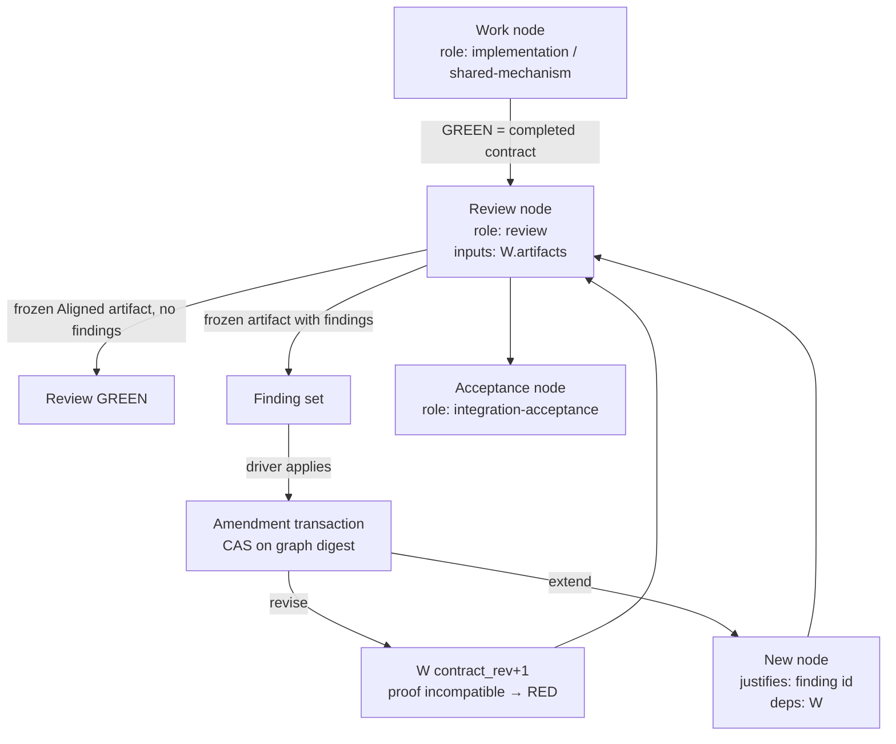

# ReviewDrivenAmendment — Review Nodes and Finding-Sourced Graph Amendments

## Overview
This design changes what the plan graph does when a review comes back with
findings. Today a review is a gate on an existing node, and a finding can do
exactly one thing: name nodes inside the gate's scope and demote them to RED by
stamping a failing observation (`SddGraph:DD-9`). That treats every
finding as "your gate lied". It has no way to express the more common case,
"your gate told the truth and there is more work", and it leaves a demoted node
whose gate still passes, which the graph cannot get out of without someone
editing the gate anyway.

After this design:

- **A GREEN work node is a completed contract.** Nothing new is needed to
  represent it. Its contract and its produced artifacts are what scrutiny reads.
- **A review is a node, not a gate on someone else's node.** A `review`-role
  node depends on the contract nodes it scrutinizes, declares their artifacts as
  inputs, and goes GREEN only from a frozen `Aligned` review artifact, exactly as
  review gates do today. Because its inputs are the reviewed artifacts, any later
  change to them makes the review node STALE without special casing.
- **A finding is a sourced amendment, not a demotion.** Every finding the driver
  accepts becomes one fenced amendment of the graph, in one of two forms:
  - **Revise**: the contract node's promise was wrong or unproven. Its contract
    or gate changes, its contract revision advances, its existing proof becomes
    incompatible, and it goes red then green again.
  - **Extend**: the contract node's promise held but something is missing. A new
    node is added, sourced by the finding id, depending on the contract node.
  The review node gains the revised or added nodes as deps, so it cannot re-green
  until they are GREEN and its inputs have been re-observed.
- **Acceptance depends on review, not on raw work.** Feature-acceptance nodes
  depend on review nodes, so closure requires scrutiny to have passed on the
  bytes that ship.

The direction follows the accepted-graph lifecycle the user settled in the
Ark `GraphExecutionLifecycle` design: the graph is the sole mutable execution
authority after the plan is accepted, the authored spec, design, and plan freeze
as provenance, and post-acceptance change arrives only as explicit amendments.
This design is the review-facing half of that model, scoped to the `sdd` binary
in this repository.

## Non-Goals
- **No handoff or archive mechanism.** Freezing spec/design/plan as provenance,
  pinning source captures, and archive bundles belong to a separate design. This
  design assumes the graph is authoritative and says nothing about how it became
  so.
- **No change to the review artifact lifecycle.** `sdd review scaffold`,
  `evidence set`, and `resolve` and the freeze-at-resolution contract are
  unchanged. The four stable lane identifiers are unchanged. This
  design changes what the graph does when it consumes a resolved artifact, and
  adds fields to the finding shape that artifact carries.
- **No automatic finding classification.** The reviewer states whether a finding
  revises or extends; the driver reviews and applies. The binary refuses an
  unclassified finding rather than guessing.
- **No per-node leases or control generations.** Fencing stays on the graph
  store's whole-file digest CAS (`gstore.Update`). A per-node contract revision
  is introduced for compatibility, not as a second concurrency primitive.
- **No change to v1 markdown plans.** They keep `shared/completion-evidence.md`
  until converted.
- **No change to the four review lanes' prompts or isolation.** Lanes still see
  only their bundles; the review node's brief adds the contract text and the
  artifact list, which the lanes already receive.
- **No dogfooding constraint.** The build is not itself run as a graph plan;
  see Migration / Rollout.

## Architecture

### Components



- **Work nodes** are the existing `implementation` and `shared-mechanism`
  nodes. A `role` field is added to `Node`; nodes without one are
  `implementation`.
- **Review node** is a node with `role: review`. Its `gate.type` is `review`
  and its `gate.lanes` selects the lanes (nil is all four). Its `deps` are the
  contract nodes it reviews. Its evidence binds to the **reviewed set**: for
  every node in its scope, that node's id, `contract_rev`, and artifact
  digests at the moment the review was recorded. A contract or gate can change
  while the implementation bytes stay identical, so artifact digests alone
  would not make an old review ineligible; the reviewed set does. Staleness
  is observed on read, never asserted (`SddGraph:DD-3`). Review scope
  is the node's `deps` closure minus the closure of inner GREEN review nodes,
  which is the existing `Scope()` rule with the gate moved onto its own node.
- **Contract revision** is a new tool-owned integer `contract_rev` on every
  node, starting at 1 at compile. It advances only when the node's owned
  normative content changes: `contract`, `gate`, `justifies`, or `inputs`.
  `phase`, `estimate`, `history`, and `deps` do not advance it.
- **Observation compatibility** is the existing `Verification` record plus the
  `contract_rev` it observed. `states.Derive` treats an observation whose
  `contract_rev` differs from the node's current one as absent for GREEN
  purposes, the same way it already treats stale artifact digests and intent
  hashes.
- **Finding** is the review-artifact object, extended with an `action` and,
  for `extend`, a proposed node fragment. The artifact stays the only record of
  why an amendment happened; the graph carries the result plus a provenance
  pointer.
- **Amendment transaction** is one `gstore.Update` closure that applies every
  accepted finding of one artifact, or refuses and writes nothing. It is the
  imperative, atomic mutation class `SddGraph:DD-11` already prescribes.

### Data Flow

```mermaid
flowchart LR
    S[sdd graph sync → work node GREEN] --> B[sdd graph show --node R --brief<br/>contract text + artifact list + lanes]
    B --> L[Driver runs lanes<br/>sdd review scaffold / evidence set / resolve]
    L --> ART[Frozen review artifact<br/>findings[] with action]
    ART --> REC[sdd graph review --node R --artifact ART]
    REC -->|no findings| GREEN[R Verification pass]
    REC -->|findings| PRE[Preview: per finding<br/>revise: node, diff of contract/gate<br/>extend: proposed node]
    PRE --> APPLY[sdd graph amend --from-review ART --expect-digest D]
    APPLY --> CAS{graph digest == D?}
    CAS -->|no| REFUSE[refuse, nothing written]
    CAS -->|yes| TX[one Update closure:<br/>revise: contract_rev+1, deps of R unchanged<br/>extend: add node, R.deps += node, R.inputs += node.artifacts<br/>R gets no Verification]
    TX --> FRONT[states.Derive: revised nodes RED-eligible,<br/>new nodes READY/BLOCKED, R BLOCKED]
```

Sequence for one review with findings:

1. The driver claims the review node when every dep is GREEN (it is on the
   frontier like any node). `sdd graph show --brief` renders the self-contained
   brief: reviewed contracts, artifact list with digests, required lanes.
2. The driver runs the lanes and resolves the artifact. Findings carry
   `action: revise | extend`, plus `nodes` for revise or `node` for extend.
3. `sdd graph review` consumes the frozen artifact. With zero open findings it
   records a passing `Verification` on the review node with the aggregate
   artifact digest, as today. With open findings it records nothing on the node
   and instead prints the amendment preview and the graph digest to expect.
4. `sdd graph amend --from-review` re-reads the artifact, rebuilds the preview,
   and applies it under CAS. The review node's `Verification` stays absent, so
   it is BLOCKED behind the amended nodes.
5. The revised and added nodes go red then green through ordinary
   `sdd graph sync`. Their observations change the review node's inputs, so
   even if a prior GREEN existed on the review node it would be STALE. The
   driver re-runs the review when it returns to the frontier.

### Interfaces

**Node schema additions** (proposal payload accepts `role`; the rest are
tool-owned and refused in payloads, matching the existing posture on
`intent_hashes` and `claim`):

```json
{
  "id": "review-catalog-read-path",
  "role": "review",
  "contract": "Four-lane review of the catalog read path at the artifacts below.",
  "justifies": ["AC-04"],
  "deps": ["pipeline-query", "manifest-query"],
  "gate": { "type": "review", "lanes": null },
  "contract_rev": 1,
  "inputs": [ "…derived from deps' artifacts…" ]
}
```

Roles: `implementation` (default), `shared-mechanism`, `review`,
`integration-acceptance`. The compiler refuses a `review` node whose gate type
is not `review`, a `review` gate on a node whose role is not `review`, a
review node with no deps, and an `integration-acceptance` node that depends
on a work node directly rather than on review nodes. A node created by `extend` carries `origin: { review: <artifact
path>, finding: <id> }` as provenance; it is not a normative reference.

**Finding schema additions** in the review artifact frontmatter. Existing fields
(`id`, `severity`, `title`, `status`) are unchanged; `nodes` keeps its meaning
for `revise`.

```yaml
findings:
  - id: F-03
    severity: major
    title: "Manifest query ignores archived variants"
    status: open
    action: revise
    nodes: [manifest-query]
    revise:
      gate: { type: tests, tests: [TestManifestQuery_SelectedPipelineVariant, TestManifestQuery_ExcludesArchived] }
  - id: F-04
    severity: minor
    title: "No audit event on cross-tenant read refusal"
    status: open
    action: extend
    node:
      id: manifest-query-audit-refusal
      contract: "Emit an audit event when a manifest read is refused for tenant mismatch."
      deps: [manifest-query]
      gate: { type: tests, tests: [TestManifestQuery_AuditOnRefusal] }
      artifacts: [internal/catalog/manifest_audit.go]
```

Rules enforced when the artifact is consumed:

- `action` is required on every finding with `status: open`. Missing or unknown
  action refuses the whole artifact.
- `revise` must name at least one node in the review node's scope and must
  change at least one of `contract`, `gate`, or `inputs`. A revise that changes
  nothing is refused: a finding with no graph consequence is a comment, and
  belongs in the artifact body with `status: answered` or `rejected`.
- `extend.node` is a proposal-payload node fragment with the same strict
  decoding as `sdd graph propose`. `justifies` is filled by the binary with the
  qualified finding citation `<plan-relative artifact path>:<finding id>`
  (for example `Reviews/2026-09-11-catalog-read-path.md:F-04`), which the
  citation index resolves because frozen review artifacts become citation
  sources (DD-6). Its `deps` must include at least one node in the review
  scope. It may not name an id that is retired or in use. It passes the same
  compile gate as `split` children, including hazard coverage: a hazard the
  fragment declares must be discharged by a test it names.
- Findings with `status: fixed | deferred | rejected | answered` produce no
  amendment. `deferred` is recorded in the review node's `history` so the
  deferral is visible in the rendered view.

**Commands** (additions and changes; spellings follow the existing verb style):

| Command | Change |
|---|---|
| `sdd graph review --plan P --node R --artifact A` | Existing. Targets a review node. With open findings it records nothing, prints the amendment preview and the graph digest to expect, and exits 1. Never demotes. |
| `sdd graph amend --plan P --node R --from-review A --expect-digest D [--by W] [--dry-run]` | New. Plans every open finding of `A`, runs the compile gate on the result (dry run included), then writes once fenced on `D`. Refuses on digest mismatch, on any rule above, if a revised node is claimed by someone other than `--by`, or if `A` was already applied (the graph's `amendments` register). |
| `sdd graph show <node> --plan P --brief` | New flag. Renders the self-contained brief; for a review node: lanes, the reviewed set with each node's contract, contract revision, and artifacts, the last review, and any REVIEW-STALE entries. |
| `sdd graph status --json` | Unchanged shape; `role` and `contract_rev` appear per node. |
| `sdd graph split` | Unchanged; children start at `contract_rev: 1` with no proof, which `SddGraph` already mandates. |

`sdd graph review` keeps one artifact greening one node (report-digest
uniqueness) and keeps all three freeze signals.

**Scope with nested review nodes (worked example).** `Scope()` keeps its
subtraction rule; only the anchor moves from a gate to a review node. Scope is
the review node's `deps` closure minus the closure of every inner review node
that is currently GREEN.

```
A ← B        (B depends on A)
R1: role review, deps [A, B]
C ← B        (C depends on B)
R2: role review, deps [C]
ACC: role integration-acceptance, deps [R1, R2]
```

- R1 scope: closure(A, B) = {A, B}.
- R2 scope when R1 is GREEN: closure(C) = {C, B, A} minus closure(R1) = {A, B}
  → {C}. R2 reviews only the increment.
- R2 scope when R1 is not GREEN, or is STALE because A was revised after R1
  passed: no subtraction → {C, B, A}. Unreviewed or re-opened work is
  reviewed by whoever reaches it first, which is the same rule today.
- A revise of B raises `contract_rev` on B. R1's recorded reviewed set says
  B was at the previous revision, so R1 goes STALE even if B's files are
  byte-identical; ACC is then BLOCKED until R1 re-greens. R2's prior GREEN is
  unaffected unless B was in R2's scope when R2 was recorded.

Disjointness therefore holds by the same subtraction as today. What changes is
`Closed()`: coverage is now an explicit `deps` edge from the acceptance node,
so the derived closed predicate is "ACC is GREEN", and the compiler, not
`Closed()`, checks that every work node lies in some review node's scope.

**Compatibility rule in `states.Derive`.** A work node is GREEN only if its
latest `Verification` has `result: pass`, its recorded `contract_rev` equals
the node's current `contract_rev`, its artifact digests match, its intent
hashes match, and its input hashes match. A review node is GREEN only if, in
addition, every node in its recorded reviewed set still has the recorded
`contract_rev` and artifact digests.

**Proof compatibility boundary.** A revise resets the node's red bookkeeping
(`red_seqs`) as part of the same transaction, so the node carries exactly the
red-before-green obligation a fresh node carries: every hazard-discharging
test must be observed failing again at the new `contract_rev` before a pass
records, whether or not the test kept its name. A retained runner name can
carry new assertions or protect a materially revised contract, so the name is
not evidence that the proof obligation is unchanged. Historical observations
are kept and stamped with the revision they were taken against; `Derive`
ignores them as proof (`SddGraph:DD-5`).

## Design Decisions

> **Supersession note.** The demote-to-RED behavior is `SddGraph:DD-9` and
> was also recorded in the global ledger as SddGraph:pd-b9031144. Under `PlanDecisions` the
> ledger is removed; DD-2 below supersedes `SddGraph:DD-9`, and the record of
> that supersession is the `pd-` entry compile creates from DD-2.

- **DD-1**: Review is a node with `role: review`, not a gate attached to a work
  node.
  Context: today a review gate sits on a feature node and its scope is that
  node's dependency closure. Findings demote nodes inside that closure. The
  reviewed node and the reviewing node are the same object, so "the review is
  stale" and "the work is stale" cannot be told apart. Options considered:
  (a) keep review as a gate type and add finding actions to it; (b) make review
  its own node whose deps are the reviewed contracts and whose inputs are their
  artifacts. Decision: (b). Rationale: a review node's staleness is then an
  ordinary input-digest observation, the review appears on the frontier and is
  claimed like any work, and acceptance nodes can depend on it explicitly. Scope
  computation is unchanged, only relocated.

- **DD-2**: A finding is resolved as exactly one of two amendments, `revise` or
  `extend`, and demotion-by-failing-observation is removed.
  Context: a finding either contradicts what a node promised or shows the
  promise was incomplete. Stamping a failing `Verification` collapses both into
  "red", leaves a passing gate on a red node, and records nothing about why.
  Options considered: (a) keep demotion and add `extend`; (b) replace demotion
  with `revise`, which changes the contract or gate and lets compatibility do
  the invalidation; (c) findings never touch the graph, only the driver decides.
  Decision: (b). Rationale: a demoted node whose gate still passes cannot
  produce a new RED, so every real demotion already required a gate edit; making
  that edit the amendment removes the contradictory state and records the
  reason. Option (c) reintroduces narrated status. Supersedes SddGraph:DD-9
  (its demotion clause).

- **DD-3**: A per-node `contract_rev` is the compatibility key for observations;
  the whole-file digest stays the only write fence.
  Context: revise must invalidate a node's proof without deleting history.
  Options considered: (a) delete or rewrite the old `Verification`; (b) stamp a
  failing observation (today); (c) advance a per-node revision and have
  `Derive` ignore observations from other revisions; (d) a global graph
  revision compared for equality. Decision: (c). Rationale: history is
  append-only (`SddGraph:DD-3`, `DD-6`), the old GREEN remains a true statement
  about the old contract, and a global revision would invalidate unrelated nodes
  on every amendment. Concurrency control does not need a second primitive:
  `gstore.Update` already retries on digest mismatch, and `amend` adds an
  `--expect-digest` so a driver working from a stale preview is refused instead
  of re-applied.

- **DD-4**: `contract_rev` advances only on owned normative content.
  Context: which edits should invalidate proof. Options considered: (a) any
  field; (b) `contract`, `gate`, `justifies`, `inputs` only. Decision: (b).
  Rationale: `deps` is scheduling, `phase` and `estimate` are planning
  metadata, `history` is narrative. Invalidating proof for those would destroy
  useful evidence for no behavioral change. `artifacts` is deliberately excluded
  from the revision because artifact change is already observed by digest.

- **DD-5**: The reviewer classifies; the driver applies; the binary refuses
  unclassified or no-op findings.
  Context: someone has to decide revise versus extend. Options considered:
  (a) the binary infers from whether `nodes` is present; (b) the driver decides
  at apply time; (c) the reviewer states `action` in the artifact and the binary
  validates it. Decision: (c). Rationale: the reviewer has the evidence and the
  artifact is frozen, so the classification is auditable. Inference would turn
  a forgotten field into a silent extend. Driver-time decisions are narration.

- **DD-6**: Extend nodes are sourced by a frozen-review finding id, which the
  citation index learns to resolve; the artifact path is provenance.
  Context: sourced necessity requires every node to name its demand. The graph
  compiler resolves `justifies` through `rules.CitationIndex`, which today is
  built only from `AC-`/`FR-`/`NFR-`/`DD-`/`D-` ids reachable from the plan, so
  a finding id would be refused at compile. Options considered: (a) a new
  `origin` kind exempt from `justifies`; (b) require `extend.node.justifies` to
  cite an underlying AC/FR/DD and carry the finding only in `origin`; (c) add
  frozen review artifacts under the plan as citation sources, so `justifies:
  [Plans/P/reviews/01-x:F-04]` (the artifact's path qualifier, like
  `Specs/M1:AC-01`) resolves through the same index, and carry the artifact
  path in `origin` as well. Decision: (c). Rationale: (a) exempts
  a class of nodes from the counterweight; (b) is often a lie, since the whole
  point of a finding is that no requirement named the gap. Option (c) is a
  **new citation source, not a new rule**: `CitationIndex` gains frozen review
  artifacts (status `resolved`, `frozen: true`) whose `findings[].id` become
  citable ids, qualified by the artifact's plan-relative path. Unfrozen
  artifacts are never sources, so a citation cannot point at text that can
  still change. `PlanDecisions:DD-6` adds plan decision files to the same
  index in the same change. `SDD076`/`SDD077` semantics (placeholder, title-echo) apply to
  the node's `justifies` text unchanged. Feasibility is confirmed by a compile
  fixture in the test plan, not by this paragraph.

- **DD-7**: A review node never carries a `Verification` while its artifact has
  open findings.
  Context: whether a review with findings is "half green". Options considered:
  (a) record a failing observation on the review node; (b) record nothing and
  let BLOCKED-behind-amended-deps carry the state. Decision: (b). Rationale: a
  failing observation on the review node would need its own red-before-green
  bookkeeping and adds nothing the deps do not already express. The artifact's
  `report_digest` is still reserved so it cannot green a different node later.

- **DD-8**: Acceptance nodes depend on review nodes.
  Context: what closure means once review is a node. Options considered:
  (a) keep the "GREEN and covered by a GREEN full review gate" predicate from
  `SddGraph:DD-9`; (b) integration-acceptance nodes list the review nodes in `deps`, and
  closure is the ordinary derived closed predicate. Decision: (b). Rationale:
  the coverage predicate becomes a dependency edge the compiler can check, so
  `Closed()` reduces to "the acceptance node is GREEN"; `Scope()` keeps its
  inner-review subtraction (see the worked example under Interfaces). The
  compiler refuses an accepted graph whose acceptance node does not depend,
  transitively, on a review node covering every work node.

- **DD-9**: Review evidence binds to the reviewed nodes' contract revisions
  and artifact digests, and a revise restarts red-before-green.
  Context: a review recorded against artifact bytes alone stays valid when a
  contract changes without touching the files, and an old RED under a kept
  test name says nothing about a revised obligation. Options considered:
  (a) bind reviews to artifact digests and trust test names; (b) bind reviews
  to `(node id, contract_rev, artifact digests)` for every node in scope, and
  clear `red_seqs` on revise. Decision: (b). Rationale: the compatibility
  boundary is then explicit and mechanical. Historical evidence is preserved;
  only eligibility to count as current proof is withdrawn.

- **DD-10**: A review pass binds to the exact current scope, and a legacy
  pass without a reviewed set is history once its scope is amended.
  Context: the first implementation compared only the recorded reviewed
  entries, so a scope that grew (extend) or a member that was revised under a
  reviewed-set-less legacy pass left the review GREEN. Options considered:
  (a) stale every legacy pass immediately; (b) compare the recorded set
  against the current scope in both directions, and treat a legacy pass as
  current only while no node in its scope is above revision 1; amendments
  and splits materialize the pre-change set (`states.LegacyReviewedSet`)
  so exact comparison applies afterward. Decision: (b). Rationale:
  completed graphs keep their meaning until something in scope actually
  changes; the moment it does, the old proof cannot say what it covered.

- **DD-11**: Proof publication is fenced on the evaluated obligation.
  Context: `sync` evaluated a report against one contract and could publish
  it after a concurrent amendment changed the contract. Options considered:
  (a) last write wins; (b) inside the store's CAS, compare a snapshot of the
  node's owned normative content (role, contract, revision, justifies, deps,
  gate, hazards, artifacts, inputs, embedded hashes) and workspace against
  the evaluated one, and refuse on any difference. Decision: (b).
  Rationale: a report is evidence for the obligation it was folded against;
  relabeling it with a fresh revision manufactures proof. Unrelated
  concurrent writes still merge through the CAS retry.

- **DD-12**: Changing a gate is a revise, whichever verb does it.
  Context: `set-tests` replaced a test list without touching the contract
  revision, so a GREEN node's gate could be swapped and its pass kept.
  Options considered: (a) refuse `set-tests` on verified nodes; (b) advance
  `contract_rev` and clear red bookkeeping when the list changes under an
  observation; an unchanged list is a no-op. Decision: (b). Rationale: DD-4
  names the gate as owned normative content; there is no side door.

- **DD-13**: Completion-grade closure requires current full-review coverage.
  Supersedes DD-8.
  Context: DD-8 only required acceptance nodes to depend on review nodes; a
  subset review satisfied it and a GREEN acceptance closed its whole closure.
  Options considered: (a) keep the structural rule; (b) compile refuses an
  acceptance node without a full review upstream, and `Closed()` closes an
  acceptance node only after every upstream member is already covered by a
  current GREEN full review (or an earlier qualifying acceptance), iterating
  to a fixed point. Decision: (b). Rationale: only full reviews carry
  completion-grade closure (`SddGraph:DD-9`); an acceptance that skips one
  is a completion bypass, not a coverage omission.

- **DD-14**: Amend admits an artifact exactly as Record does, under two
  independent fences.
  Context: the direct amend path checked only resolved and frozen, so a
  foreign plan's review could revise this graph, and the preview fence
  covered the graph bytes but not the artifact. Options considered: (a) one
  composite digest; (b) shared admission (plan binding, verdict, lanes,
  freeze signals) plus `--expect-digest` for the graph and
  `--expect-report-digest` for the artifact, re-read before publication.
  Decision: (b). Rationale: the two inputs change independently and the
  refusal should name which one moved.

## Error Handling
| Condition | Detection | Response |
|---|---|---|
| Finding missing `action` or unknown value | artifact decode in `review` / `amend` | refuse the whole artifact; name the finding id |
| `revise` changes nothing normative | diff of contract/gate/inputs is empty | refuse; suggest `status: answered` with body text |
| `revise` names a node outside review scope | `Scope()` membership | refuse (unchanged from today) |
| `extend.node` id retired or in use | retired register + node index | refuse; ids are never reused (`SddGraph` retirement rule) |
| `extend.node` deps outside review scope | scope check on each dep | refuse; an extension must hang off what was reviewed |
| `extend.node` fails compile gate | same `introducedFindings` gate as `split` | refuse; report diagnostics |
| `revise` gate drops a hazard-discharging test | hazard coverage check from compile, re-run on the revised node | refuse; a revise may add tests or replace them, never leave a declared hazard undischarged |
| Affected node claimed by another holder | `Claim.By` check per affected node | refuse; report holder and lease |
| Graph digest differs from `--expect-digest` | `WriteAtomicExpecting` | refuse, nothing written; driver re-previews |
| Review node deps not all GREEN at claim | frontier rule | not claimable; unchanged |
| Artifact `report_digest` already recorded | uniqueness scan | refuse (unchanged) |
| Old `Verification` with prior `contract_rev` | `Derive` compatibility rule | treated as absent for GREEN; kept in history; the node is `READY` until a RED at the new revision is observed |
| Review node's reviewed set drifted | any reviewed node's `contract_rev` or artifact digests differ from the recorded set | review node is STALE; re-review required even when implementation bytes are unchanged |
| Graph decoded with nodes or observations lacking `contract_rev` | strict decode | absent means 1, on both the node and the observation, so a pre-revision graph derives exactly as before; no upgrade step |

Every refusal names the finding id, the node id, and the rule. Partial
application is never observed: one artifact is one `Update` closure.

## Testing Strategy
Scenario tests in `internal/graph/review` and `internal/graph/ops`, each with a
positive and a negative control, run under `go test ./...` as part of
`make test`:

| Scenario | Positive control | Negative control |
|---|---|---|
| Review node greens | frozen Aligned artifact, zero open findings → `Verification` pass with aggregate digest | one open finding → no `Verification`, preview printed |
| Revise invalidates | after `amend`, node `contract_rev` is 2, `Derive` reports not GREEN, history keeps the rev-1 pass | revise with empty diff is refused |
| Revise requires new red | after revise, `red_seqs` is empty; a passing sync is refused until a fail is observed at the new revision | a revise that keeps every test name still requires a fresh RED |
| Contract-only revise stales the review | B's contract changes with byte-identical artifacts → R1 not GREEN | metadata-only change on B leaves R1 GREEN |
| Extend adds sourced node | new node has `justifies` = artifact#finding, deps include reviewed node, review node deps grew | extend with dep outside scope refused |
| Review re-runs after rework | new GREEN on revised node changes review node inputs; prior review pass (if any) is STALE | metadata-only change on a work node leaves review GREEN |
| CAS fence | two `amend` calls with the same `--expect-digest`: one applies, one is refused with nothing written | `amend` without `--expect-digest` is refused |
| Claimed node fence | affected node claimed by another holder → refuse | claimed by the caller → proceed |
| Acceptance depends on review | compile refuses an acceptance node with an uncovered work node | full coverage compiles |
| One artifact, one node | artifact digest recorded once; second consumption refused | different artifact greens a second review node |
| Upgrade | v2 graph without `contract_rev` upgrades to rev 1 everywhere with observations stamped | operating on un-upgraded graph refused |
| Role validation | `review` role with `review` gate compiles | `review` gate on `implementation` role refused; `review` role with `tests` gate refused |
| Deferred finding | recorded in review node `history`, no amendment | `open` without action refused |
| Revise keeps hazards | revise that swaps a test for one still discharging the hazard compiles | revise that removes the only hazard test is refused |
| Finding citation resolves | `justifies: [Plans/P/reviews/01-x:F-04]` on an extend node compiles against a frozen artifact | same citation against an unfrozen artifact is refused |

Frozen regression corpus: add fixtures for each new refusal through
`make gen-fixtures` so `tools/parity` covers the new rules. Do not touch
`tools/parity/frozen-expectations.json`.

### Structural Verification
Per `shared/language-verification.md` for Go:

- `go build ./...` and `go vet ./...` clean.
- `go test -race ./internal/graph/...` because `amend` and `review` both go
  through `gstore.Update`'s retry loop and the CAS scenario is concurrent by
  construction.
- `staticcheck ./...` when installed; absence is reported, not remedied.
- Strict JSON decoding on the new `role`, `contract_rev`, `origin` fields and
  the new finding fields; `sdd template` emits the updated schema so there is one
  schema source (`SddGraph:DD-12`).
- Portable drift and leak gates (`make test`) after the skill and shared-doc
  edits below, since `commands/implement/SKILL.md` and
  `shared/review-artifacts.md` change and both have portable projections.

## Migration / Rollout
1. **Land with `PlanDecisions`.** The citation-index extension is shared, and
   the global ledger that recorded the demotion behavior is removed by that
   design, so the two ship on the same branch.
2. **Build outside the graph flow.** This change alters the review and
   amendment machinery. It is implemented as ordinary hand-driven commits on a
   branch, not as a graph plan executed through `/implement`, so the tooling
   under change is never the tooling gating the change. Tests are the gate.
3. **Schema upgrade is a verb, not a migration project** (`SddGraph:DD-15`).
   `sdd graph convert` learns to stamp `contract_rev: 1` on every node and every
   existing `Verification`, and to set `role: implementation` where absent. No
   retroactive observations are created.
4. **Existing review gates.** A node with a `review` gate and no `role` is a
   review node: the pre-role feature gate already sat on its own node with the
   reviewed work as its deps, which is exactly the review-node shape. Nothing
   is rewritten and no split is forced; a recorded GREEN keeps its meaning.
5. **Docs and skills in the same change.** `shared/review-artifacts.md` gains
   the finding `action` fields; `commands/implement/SKILL.md` replaces the
   "findings demote to RED" paragraphs with the amend flow; `shared/
   frontmatter-schema.md` records the new node fields; `make plugins` regenerates
   the portable trees; CLAUDE.md, README.md, and AGENTS.md update their
   descriptions of review gates.
6. **Version.** This is a schema and skill-interface change. The bump level is
   the user's call at release time.

## Open Questions
- **Should `extend` nodes be allowed to depend on nodes outside the review
  scope?** Current rule: no. A finding about the reviewed code should hang off
  that code. If a reviewer finds a gap elsewhere, the right tool is a fresh
  `propose`, not a finding. **non-blocking** — relaxing this later is additive.
- **Does a review node need its own `justifies`?** Current answer: yes, the
  same as any node, typically the acceptance criterion the review protects.
  **non-blocking** — the validator rule is unchanged either way.
- **Should `amend` also accept ad-hoc amendments not sourced by a finding?**
  Out of scope here. Learnings that arise during implementation without a
  review still need a path, and the same transaction shape would serve it, but
  the source-of-demand rule for such amendments is a separate decision.
  **non-blocking** — this design's mechanism does not change if that path is added.
