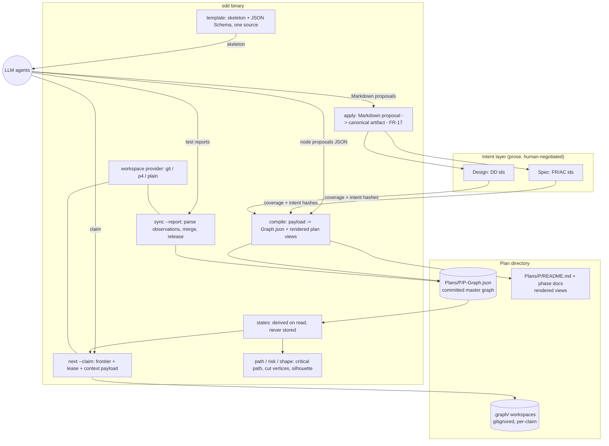
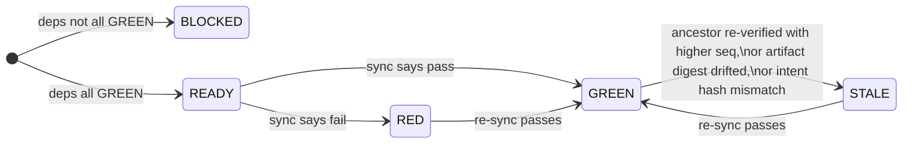
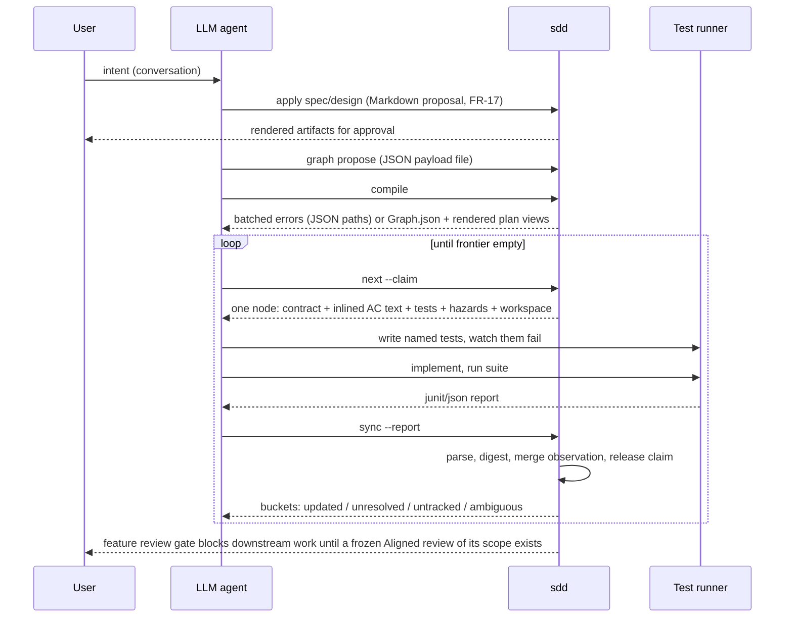

# SddGraph — Graph-Compiled, Observation-Gated Execution for SDD

## Overview

SddGraph evolves the SDD toolchain's execution model from *LLM-narrated plan
walking* to *tool-derived graph walking*: the plan compiles into a dependency
graph of test-gated nodes, a scheduler in the `sdd` binary decides what is
workable, and node state is derived from recorded test observations rather
than asserted by an agent. SDD's intent layer — specs, designs, decision
ledger, citation graph, four-lane review — remains the thing the graph is
compiled **from** and held accountable **to**.

Two systemic problems drive this design:

1. **Token waste in artifact authoring.** Today an LLM drafts plan markdown
   free-form and iterates 3–4 passes until `sdd apply` / `sdd validate`
   accept the shape. The validator audits prose the LLM should never have
   been shaping by hand.
2. **Trust misplacement in execution.** Today a task becomes `complete` when
   the LLM writes conforming completion evidence — the load-bearing fact
   ("tests passed") enters the record through the LLM's narration. The tool
   audits the narrative instead of deriving the fact.

The design inverts both:

- **Authorship inversion** — the LLM supplies semantic content and `sdd`
  renders canonical artifacts, valid by construction: prose artifacts through
  the existing `sdd apply` Markdown-proposal compiler (FR-17; already
  specified and partially shipped — DD-1), graph construction through JSON
  payloads (DD-11/DD-12). Plan and phase markdown become generated *views*
  of the graph, never sources.
- **Observation-gated state** — node state (BLOCKED / READY / RED / GREEN /
  STALE) is derived on every read from structure plus recorded observations;
  the only path to GREEN is a parsed test report (or equivalent mechanical
  artifact). There is no stored status field and no "mark it done" verb.

The result is a system where the LLM does exactly three jobs — negotiate
intent with the user, decompose intent into node contracts, and make red
tests green — and the tool owns everything else: formatting, id allocation,
scheduling, coverage checking, staleness propagation, and completion.

## Non-Goals

- **Not a source-control system.** Observations record digests, revision
  anchors, and file lists — never diffs. Reconstructing per-node history in
  Perforce mode is bounded by what the observation record captures; anything
  richer is the SCM's job (or out of scope).
- **Not parallel verification for Perforce in v1.** The p4 provider is
  serial (capacity 1), single pending changelist. Per-node changelists,
  shelve-windows, and narrow per-agent clients were considered (see DD-8)
  and deliberately deferred; nothing in the schema forecloses them.
- **Not a replacement for specs and designs.** The prose intent layer stays
  human-negotiated and validator-checked. This design mechanizes execution
  truth, not intent negotiation. The joint between the layers is the
  `justifies` citation plus intent-hash (DD-4).
- **Not a general workflow engine.** The gate-type vocabulary is closed
  (`tests`, `command`, `review` — DD-9). Arbitrary user-defined gate
  plugins, webhooks, and external schedulers are out of scope.
- **Not an autonomous approval surface.** Frontier dispatch, replan
  acceptance, and review resolution remain user-context decisions per
  `shared/autonomy.md`. The graph schedules; it does not approve.
- **Not this design's job: artifact directory re-layout.** The proposed
  per-plan grouping (the graph living beside the rendered plan view) is
  adopted, but renaming spec/design READMEs is left to a follow-up decision
  (see Open Questions).

## Architecture

### Components



Component responsibilities:

| Component | Responsibility |
|---|---|
| `store` | The **only** code path that touches graph state on disk. Atomic write (temp + fsync + rename), advisory lock beside the file, pinned UTF-8/LF encoding. |
| `model` | Graph/Node/Observation shapes and (de)serialization. Strict decoding: unknown keys are errors with did-you-mean. |
| `states` | Derived state — the single place state rules live. Nothing here persists. |
| `algorithms` | Pure graph theory: topo sort, critical path, cut vertices, silhouette. Knows nothing of state or disk. |
| `sync` | Reconcile the graph against real test-runner output. |
| `hazards` | Closed hazard vocabulary and the test shape each hazard requires. |
| `compile` | Payload validation (parse → schema → semantic, all errors batched with JSON paths), coverage enforcement, intent-hash embedding, view rendering. |
| `provider` | Per-VCS workspace + provenance: capacity, isolation, revision anchors. Extends `shared/vcs-detection.md`. |
| `claims` | Claim/lease records inside the master graph; expiry returns nodes to the frontier. |

### Data model

The master graph (`Plans/<Plan>/<Plan>-Graph.json`, committed) persists
**only structure and observations** — never states, never conclusions:

```json
{
  "version": 1,
  "seq_counter": 17,
  "nodes": [{
    "id": "watch-config-file",
    "contract": "watcher emits a change event within 500ms of an mtime change",
    "justifies": ["AC-04", "FR-02"],
    "intent_hashes": {"AC-04": "sha256:…", "FR-02": "sha256:…"},
    "deps": ["config-schema"],
    "gate": {
      "type": "tests",
      "tests": [{"id": "test_watch_emits", "file": "tests/test_watch.py",
                 "satisfies": ["frame-coupled"]}]
    },
    "hazards": ["frame-coupled"],
    "artifacts": ["src/watch.py"],
    "estimate": 2,
    "phase": "01-core",
    "claim": {"by": "agent-uuid7", "lease_expires": "2026-08-28T21:00:00Z",
              "workspace": "0192f3ab-…"},
    "verification": {
      "result": "pass",
      "seq": 17,
      "artifact_digests": {"src/watch.py": "sha256:…"},
      "report_digest": "sha256:…",
      "isolation": "clean",
      "provenance": {"kind": "git", "revision": "a1b2c3d", "worktree": null}
    }
  }]
}
```

Field notes:

- `hazards` is a validated list or the literal string `"untriaged"` — a
  sentinel chosen to be unmistakable in a diff. A graph does not compile
  while any node is untriaged; an empty list is a legitimate claim but must
  be explicit.
- `verification` is an **observation**, not a status. `result` ∈
  {`pass`, `fail`}; everything else is provenance for that observation.
- `estimate` is a **unitless positive-integer relative cost weight**
  (default 1) — not a time promise. It is consumed by exactly two things:
  `graph path` (critical-path length and speedup ceiling are sums of
  estimates) and `next`'s critical-path-first ordering. Nothing else reads
  it, and no lifecycle rule depends on it.
- `gate.tests[].satisfies` names the hazard a test discharges. Compile
  requires every declared hazard on a node to be satisfied by at least one
  of that node's tests whose shape matches the hazard's required form; a
  hazard no test claims, or a `satisfies` naming an undeclared hazard, is a
  compile error.
- Sync additionally records, per declared test id, the seq of its first
  observed failure (`red_seq`) alongside the node's latest verification.
  This is what the merge gate's red-before-green check (DD-5) reads; it is
  an observation like any other — persisted because it was seen in a
  report, never asserted.
- `claim` is transient bookkeeping; it is cleared on merge or lease expiry
  and is the only mutable non-observation field.
- `phase` is a **presentation grouping** consumed only by rendered views;
  no scheduling or review obligation reads it. Review weight attaches to
  feature-scoped `review` gate nodes (DD-9), wherever they sit.

The **hazard vocabulary** is a closed set of failure classes, each
dischargeable only by a test of a specific shape (e.g. *order-sensitive*
requires input whose natural sort order is the reverse of its semantic
order; *persists-state* requires a construct→save→load round-trip through
the public API; *concurrent-access* requires a test proven to fail against a
no-op guard; *user-entrypoint* requires exercising the real entry point as a
subprocess). The premise: every one of these defect classes has shipped past
"passing tests" — the requirement is never merely *a* test, but a test built
to fail in a particular way. The initial vocabulary is seeded from this
project's own shipped-defect history and extended only by evidence.

Per-claim workspace files (`Plans/<Plan>/.graph/<uuid7>.json`, gitignored)
hold in-flight scratch state for exactly one node — working notes, partial
test results, the provider handle. They are single-writer by ownership and
are deleted on merge. The master graph is the only committed truth.

### Node states



State rules, each of which encodes a known failure mode of stored-status
systems:

- **Derived on every read.** `effective[n]` = highest verification seq among
  n and its ancestors, computed in one topological pass. A stored state
  field would drift the moment anyone edits code outside the tool.
- **RED outranks BLOCKED.** A recorded failure is never hidden by an
  unrelated upstream change: a node whose last verification failed reports
  RED even when a dependency is not GREEN.
- **Workable ≠ frontier.** READY, RED, and STALE are all workable, but
  `sdd next` surfaces only workable nodes whose deps are all GREEN — a RED
  node with a non-GREEN dep stays off the frontier.
- **Staleness propagates three ways:**
  - *seq staleness* — an ancestor re-verified more recently than this node's
    own verification;
  - *digest staleness* — a GREEN node whose declared artifact's current
    digest differs from `artifact_digests`, catching silent edits by humans
    or by other nodes, uniformly across git, p4, and plain trees;
  - *intent staleness (INTENT-STALE)* — a node whose cited AC/DD text no
    longer hashes to `intent_hashes[id]`: the spec moved under it. Surfaced
    distinctly because the remedy differs (re-hash / rework / replan — a
    judgment call, scoped to the diff of one requirement).

**Closure is a second derived axis on top of verification state (DD-9).**
GREEN answers "did this node's own gate pass?" — it unblocks dependants,
who may *assume the node closed* and proceed. *Closed* answers "has the
feature this node belongs to survived a full validation cycle?" — derived
as GREEN **and** inside the scope of a GREEN frozen `full` review gate
whose aggregate diff digest still matches. Neither is stored; both are
recomputed on read. A review finding against an assumed-closed node
demotes it to RED through the ordinary observation path, and everything
that built on the assumption goes STALE by seq once the rework re-verifies
— an assumption is always revocable, and its revocation is always
mechanical.

### The execution loop



Sync semantics: the graph is never told what happened; it is shown the test
runner's output and derives the rest. Reconciliation reports four honest
buckets — `updated`, `unresolved` (declared but absent from the report),
`untracked` (in the report, claimed by no node), and `ambiguous` (the same
test id both passed and failed — never guessed at). Parametrized tests fold
onto the declared id: a node may declare the bare id or one exact case; the
fold passes only if every case passed, one failing case fails it, and any
skipped/xfailed case withholds the fold entirely (the bare id stays
unresolved). Belief-assertion (recording a pass without a report) exists
only as an explicitly rare escape hatch, is recorded as
`isolation: "asserted"`, and is refused by the default merge gate.

Stopping rules: a node failing 2 consecutive attempts → propose a split;
3 consecutive attempts → stop and escalate to the user.

### Interfaces

```
sdd template graph-proposal [--schema]     skeleton exemplar / JSON Schema (one source)
sdd apply <artifact-path>                  prose artifacts: Markdown proposal on stdin (existing, FR-17)
sdd graph propose --plan P --file F        stage a subgraph proposal (fragment)
sdd graph assemble --plan P                merge parallel-authored fragments
sdd compile --plan P                       validate whole, embed hashes, write graph + views
sdd next [--claim] [--json]                frontier, critical-path first; claim = lease + workspace
sdd graph sync --node N --report R.xml     the only path to GREEN
sdd graph release|split|set-tests …        atomic single-node mutations, under the store lock
sdd graph status|path|risk|shape|show      derived views; --json throughout
sdd graph export --format mermaid|dot|plan rendered exports
```

Every command takes `--json`; every mutation runs under the store lock;
construction is declarative and batched, mutation is imperative and atomic
(DD-11).

## Design Decisions

- **DD-1**: Authorship inversion — realized through the existing compiler for prose artifacts, extended by graph compilation for plans.
  Context: the related spec already decides authorship inversion for prose
  artifacts and has partially shipped it — `sdd apply` reads a Markdown
  proposal from stdin, parses, schema-matches, allocates identifiers
  (FR-17, FR-20, FR-45), and writes atomically; the rollout is staged per
  artifact type (FR-36). The 3–4 shaping passes this design targets persist
  today mainly for **plan/phase** artifacts, whose compiler rollout has not
  landed. Options considered: (a) complete FR-36 as specified — a Markdown
  plan/phase compiler; (b) a parallel JSON authoring verb (`sdd author`) for
  all types, competing with `apply`; (c) keep `apply` as the sole authorship
  surface for prose artifacts (spec, design, research, debrief) exactly per
  FR-14–FR-26, and retire plan/phase *authoring* entirely: plans are proposed
  as JSON graph payloads and their markdown becomes **rendered views** of the
  graph — regenerated by `compile`, never hand-edited, never parsed back.
  Decision: (c). This design therefore **proposes superseding FR-36's
  plan/phase compiler rollout** (there is no plan/phase payload to compile
  once views are rendered) while leaving FR-17's Markdown-proposal contract
  and every other FR-14–FR-26 obligation in force for the types `apply`
  serves. Rationale: (b) would create two competing authorship surfaces for
  the same artifacts — the exact dual-source drift DD-2 forbids; (a) spends
  the compiler on documents this design demotes to views; (c) makes shape
  errors structurally impossible for the layer that generates the most
  authoring waste, at the cost of one explicit, named spec supersession.

- **DD-2**: The graph is the execution source of truth; markdown is presentation.
  Context: something must be authoritative when the plan document and the graph
  disagree. Options considered: (a) markdown as source of truth with a derived
  graph index rebuilt on read; (b) dual-write with reconciliation checks; (c)
  `<Plan>-Graph.json` authoritative for structure, scheduling, and completion,
  with rendered markdown carrying no information not derivable from graph +
  specs. Decision: (c). Rationale: (a) re-parses prose as machine input, which
  is the failure mode this design exists to remove; (b) guarantees drift —
  two writable sources of the same truth always diverge; under (c) a rendered
  view can be regenerated, so it can never be the constraint.
  **Ledger note (D-0010):** D-0010's letter says plan/phase/task frontmatter
  is the only work-tracking layer; it rejected an *external issue tracker*.
  The graph is not external — it is a committed SDD artifact inside the plan
  directory, versioned with the plan it schedules — but it is also plainly a
  second tracking layer, so this design **proposes narrowing/superseding
  D-0010** to "planning-root artifacts are the only work-tracking layer; no
  external tracker" rather than claiming compatibility it does not have.
  Resolved at approval: recorded as D-0023, superseding D-0010. (D-0023)
  **Frozen-view invariant (FR-46/FR-47):** regeneration respects the frozen
  layer. A rendered view all of whose nodes are *closed* (covered by a GREEN
  frozen `full` review gate, DD-9) is byte-stable: `compile` refuses to
  rewrite it, naming the freezing record — the same refusal contract FR-46
  imposes on `apply`/`section set`. Changing the graph inside a frozen
  gate's scope is a material change that first requires the fresh-review
  procedure already governing material post-review changes; only the
  re-resolved review unlocks regeneration of that view.

- **DD-3**: Storage discipline — only structure and observations persist; state is derived on read.
  Context: SDD today stores `status:` in frontmatter, moved by transition verbs.
  Options: (a) keep stored statuses, add a graph index; (b) persist structure +
  observations only and derive BLOCKED/READY/RED/GREEN/STALE on every read.
  Decision: (b), including atomic temp+fsync+rename writes, an advisory lock
  beside the graph file, pinned UTF-8/LF encoding (the graph is committed and
  shared between machines), and a `.gitignore` written at init covering `*.lock`
  and `.graph/`. The lock/atomic-write primitive is not new: `internal/store`
  (`lock.go`, `lock_unix.go` flock, `lock_windows.go` LockFileEx with
  whole-file semantics) already implements and tests exactly this pairing for
  the artifact compiler; the graph store **reuses that package** rather than
  growing a second implementation. Rationale: a stored state drifts the
  moment code is edited outside the tool; deriving state makes the graph
  impossible to lie to. Task-level statuses in rendered plan views become
  projections of derived state.
  **Ledger note (D-0008):** D-0008 requires evidence-gated completion with a
  populated evidence record before any status flips complete, and a frozen
  four-lane `Aligned` review for phase completion. This design keeps both
  *obligations* while changing their *mechanism*: the observation record
  `{gate, seq, digests, isolation, provenance}` is the completion evidence —
  commands are the gate's named tests/command, revision identity is the
  provenance anchor, observable evidence is the parsed report — and the
  frozen `Aligned` review obligation is preserved as the `full` review gate
  that *truly closes* a node (DD-9). Three parts of D-0008's letter are
  genuinely modified and are **proposed for supersession**, not glossed:
  (1) "status flips" — there is no stored status to flip; a node's GREEN is
  *assumed closure* (sufficient to build on), and completion-grade closure
  is the derived predicate "GREEN and covered by a GREEN frozen `full`
  review gate"; (2) "each plan task is one clean bisectable native-SCM
  revision" — preserved in git (the merge gate requires the node's clean
  revision anchor), restated per-VCS in p4 (phase = one CL; per-node history
  lives in the observation record, DD-6); (3) the review that gates
  heavyweight completion is scoped to **feature gates** rather than phases —
  phase completion evidence becomes "every node in the phase is closed",
  where the closing reviews are the feature gates covering those nodes.
  Resolved at approval: recorded as D-0022, superseding D-0008. (D-0022)

- **DD-4**: `compile` enforces intent coverage and embeds intent hashes.
  Context: a graph-only execution model has a known weakness — if node
  contracts are uncited one-liners, a faithfully executed wrong decomposition
  goes fully GREEN. Decision: every node carries
  `justifies: [AC-NN|FR-NN|DD-N]`; compile **fails** if any AC in the related
  spec lacks a covering node or any citation dangles; a fingerprint of each
  cited requirement is embedded per node and rechecked on read — mismatch
  surfaces as INTENT-STALE on exactly the citing nodes. **Hash input, defined:**
  the fingerprint is SHA-256 over the *normalized* text of the identified item
  — the span from its identifier token (`FR-NN`/`AC-NN`/`DD-N` bullet or
  heading) to the next same-depth item or heading, normalized
  formatting-insensitively (whitespace runs collapsed, line-wrap joined, list
  markers and emphasis stripped) so that rewrapping a paragraph or fixing
  punctuation-adjacent formatting does not fire the trigger, while any wording
  or literal-value change does. The normalizer is one shared function used by
  both embed and recheck; a cosmetic-vs-semantic distinction beyond
  formatting-insensitivity is explicitly not attempted — a reworded
  requirement fires INTENT-STALE even if the reword is arguably synonymous,
  because judging synonymy is the LLM's job at resolution time, not the
  hasher's. Rationale: requirement
  coverage becomes an exit code instead of a review judgment, and a spec edit
  ripples through the graph the way a re-verified ancestor does. This is the
  capability SDD's citation graph uniquely enables; it is the reason the intent
  layer survives this design.

- **DD-5**: Completion is sync-only — a parsed mechanical artifact is the only path to GREEN.
  Context: today the LLM narrates completion evidence and the validator audits
  the narrative. Options: (a) keep narrated evidence, tighten validation rules;
  (b) reconcile exclusively from real test-runner output. Decision: (b). The
  observation records `{result, seq, artifact_digests, report_digest,
  isolation, provenance}`; agent narration gates nothing and appears only as
  rendered human context derived *from* the observation. Belief-assertions
  record `isolation: "asserted"` and are refused by the default merge gate.
  The observation record is this design's successor to the
  `shared/completion-evidence.md` evidence table — same obligations, machine
  mechanism (see DD-3's ledger note on D-0008). **Red-before-green:** for
  every test discharging a declared hazard (and encouraged for all tests),
  the merge gate additionally requires a recorded *failing* observation of
  that test id from an earlier report (`red_seq < green_seq`) — a test that
  was never seen to fail proves nothing about the code that makes it pass.
  The red run arrives through the same `sync --report` path (the walk
  protocol runs the named tests before implementing); the gate check is
  mechanical, the discipline of *how* the failure was produced (unimplemented
  feature, reverted guard) remains a walk-protocol step (DD-13).
  Rationale: there must be no write path by which an LLM concludes; the honesty
  property is structural, not behavioral. (D-0022)

- **DD-6**: Observations anchor to content digests + a monotonic seq; VCS revisions are supplementary provenance.
  Context: git can anchor a verification to a per-node commit; Perforce
  workflows almost always run in **one pending changelist** for the whole plan
  or phase, so no per-node revision exists; plain trees have nothing. Options:
  (a) require per-node revisions (git-only); (b) per-node p4 changelists
  (rejected — contradicts real p4 practice); (c) anchor every observation to
  SHA-256 digests of the node's declared artifacts plus the global seq, and
  attach whatever provenance the VCS natively produces. Decision: (c). Git
  records the node's commit and worktree; p4 records the plan/phase CL number
  and opened-file list; plain records digests only. Rationale: digests are
  strictly more useful than revisions for staleness (they catch silent edits no
  sync observed) and work identically everywhere; revisions remain valuable
  provenance where the workflow produces them.

- **DD-7**: Isolation is part of the observation; "clean" means *no unverified foreign edits*.
  Context: declared artifacts are write-sets, but test suites have undeclared
  read-sets — a green report from a tree containing another node's in-progress
  edits is tainted even with zero file overlap. Decision: every observation
  carries `isolation: clean | shared-dirty | asserted`. `clean` = the tree
  contained merged/verified state plus this node's edits only — which serial
  execution in one p4 CL satisfies **by construction**, and a git worktree
  satisfies trivially. The merge gate requires `clean` by default;
  `shared-dirty` greens may be accepted provisionally with a mandatory clean
  re-verify (they go STALE, not GREEN). Rationale: completed ancestor work in
  the tree is not contamination — it is exactly what a worktree branched from
  merged state would contain; only concurrent unverified edits taint a report.

- **DD-8**: Parallelism is workspace-provider capacity, never a correctness assumption.
  Context: git worktrees give cheap N-way isolation; Perforce practice is one
  client, one CL; plain trees have nothing. Options: (a) require worktrees
  (git-only design); (b) per-node p4 changelists with shelve-windows or narrow
  per-agent clients; (c) a provider abstraction answering "how many isolated
  workspaces can you give for this artifact set?" — git: N via worktrees; p4:
  1 (single shared client, single pending CL); plain: 1. Decision: (c), with
  effective parallelism = min(artifact-disjoint frontier, provider capacity).
  The provider handle stored on a claim is opaque to the graph. Rationale: the
  graph's correctness must hold at parallelism 1; worktrees become a throughput
  optimization, not a mechanism other VCSes must apologize for lacking. (b) is
  deferred, not foreclosed — the schema's provenance field already carries CL
  numbers.

- **DD-9**: A closed gate-type vocabulary: `tests`, `command`, `review`; review weight attaches to feature gates, whose close evidence satisfies their whole dependency closure.
  Context: not all truth is test-shaped (docs, migrations, builds); SDD
  requires a frozen four-lane `Aligned` review before heavyweight completion;
  and under DD-13's granularity a "phase" contains far more, far smaller
  nodes than today's tasks — a full multi-lane review per node, or even per
  phase cut, would be ruinously heavy at exactly the granularity this design
  introduces. Options considered: (a) full four-lane review at every phase
  cut (the direct transplant of today's rule); (b) full review per node
  (uniform weight — prohibitive); (c) **tiered, feature-scoped reviews with
  two-axis closure**: full review gates sit at feature integrator nodes, and
  a node's GREEN is *assumed closure* — sufficient to build on, never final.
  For `A -> [B, C]`: when B and C go GREEN, dependants (including A) may
  **assume them closed** and proceed; but B and C are not **truly closed**
  until A runs its full validation cycle — A's own gate passing with every
  scope node still GREEN and non-stale, plus the frozen `Aligned` review of
  the scope's aggregate diff. Closure is a second derived predicate on top
  of verification state: *provisionally closed* = own gate GREEN; *closed* =
  GREEN **and** inside the scope of a GREEN frozen `full` review gate whose
  diff digest still matches. Only *closed* carries heavyweight completion
  weight; rendered views project the distinction rather than flattening it.
  Decision: (c), with three gate types, each producing a mechanically parseable
  observation — `tests` (named test ids, synced from a runner report; the
  default and strongly preferred), `command` (an arbitrary check command
  whose exit code is the observation's result — builds, linters,
  `sdd validate`; full output is teed to an ignored per-node log
  `Plans/<Plan>/.graph/logs/<node>.log`, and the observation stores only the
  output digest and exit code), and `review` (the observation is a
  persisted, frozen, `Aligned` review artifact).
  **Review-gate mechanics:**
  - A `review` gate declares `lanes: "full"` (all four lanes) or a named
    subset (e.g. `["quality"]`) for lighter intermediate checkpoints.
    Only `full` gates carry heavyweight close evidence.
  - **Scope is derived, never stored:** scope(A) = A's dependency closure
    minus every node already inside the scope of an earlier frozen `full`
    review gate. Nested feature gates therefore review *incrementally* —
    the same diff is never re-reviewed by two gates.
  - The reviewed diff is the union of the scope nodes' artifact changes,
    and the observation binds to the **digest of that aggregate diff** —
    the same content-anchoring rule as DD-6 — with the VCS's native
    reference (git commit range, p4 CL number and opened-file list) as
    provenance. Any scope node re-verified or drifted after the review
    carries a higher seq, so the gate goes STALE by the ordinary rules; no
    special invalidation machinery is needed.
  - **Review feedback reopens scope nodes mechanically.** Closing A may
    produce findings that send B or C back into development. A review
    resolution whose findings name scope nodes is recorded — through the
    same sync path as any observation — as a *failing observation* against
    each named node: the node goes RED (RED outranks BLOCKED, so it shows
    honestly), re-enters the workable set, and its rework follows the
    normal red→green cycle. Anything that proceeded on the node's assumed
    closure goes STALE by ordinary seq/digest staleness once the rework
    re-verifies, and the gate can only green against the scope's *new*
    aggregate diff digest. Between the finding and the fix the graph never
    reads GREEN on a node a frozen review has faulted — the demotion is
    part of recording the review, not a courtesy the agent remembers to
    perform. This is what makes assumed closure safe: a wrong assumption
    costs a mechanical stale-ripple, never silent drift.
  - **Coverage invariant:** compile fails if any node is not in the
    dependency closure of at least one `full` review gate — compile never
    inserts a gate on the proposer's behalf (the same no-silent-defaults
    rule as DD-15). The `graph-proposal` template skeleton always carries a
    terminal `full` gate depending on every sink node, so the default
    payload satisfies coverage and removing that backstop is a visible,
    deliberate act that compile then refuses if it leaves nodes uncovered.
    Decomposing finely can therefore never create work that ships reviewed
    by nobody. Feature-gate
    *placement* is a decomposition judgment (the skill proposes gates at
    feature integrators; DD-14's cut-vertex analysis names candidates), but
    coverage is mechanical.
  - **Phases are demoted to presentation groupings** (`phase` labels
    rendered views); the review obligation lives entirely on feature gates.
    A phase's heavyweight completion evidence is that every one of its
    nodes is covered by a frozen `Aligned` `full` gate that is GREEN.
  The `review` gate does not introduce a new review mechanism: its
  observation is populated by the existing `sdd review scaffold` →
  `sdd review resolve` flow, and inherits D-0020's freeze discipline
  unchanged — the artifact freezes only at `resolve` time, atomically with
  `status: resolved`, gated on the SDD167 check; the gate node reads GREEN
  only from a review that is both `resolved` and `frozen: true` with verdict
  `Aligned`.
  Rationale: keeps sync-only honesty (DD-5) while admitting non-test truths;
  makes review weight proportional to integration risk instead of uniform
  per cut; makes the review a scheduled edge in the same graph rather than
  ceremony beside it; and the closure rule means evidence propagates the way
  dependencies already do — nothing downstream closes on top of unreviewed
  work. (D-0022)

- **DD-10**: Claims and leases, not file locks, are the agent-concurrency mechanism.
  Context: per-node workspace files are single-writer by ownership; the real
  race is two agents claiming one node. Decision: `sdd next --claim` atomically
  (under the store lock) selects a frontier node, records
  `{by, lease_expires, workspace}` in the master graph, and allocates the
  provider workspace. Merge is one atomic sequence under the lock: verify
  observation → merge → delete workspace file → clear claim. Leases are
  fixed-TTL (default from `planning-config.json`), renewed implicitly by any
  store-touching verb from the claim holder (`sync`, `split`, an explicit
  `claim --renew`) — liveness is proven by observed activity against the
  store, never by the agent's self-report. Lease expiry or `sdd graph
  release` returns a node to the frontier; expiry preserves the workspace
  file for post-mortem. **Double-claim prevention is enforced by the store
  lock alone** — claim selection and claim recording happen in one
  read-modify-write cycle under the advisory lock — so its correctness is
  independent of `claim.by`'s granularity or uniqueness, which serve
  diagnostics and lease attribution only. Lease expiry compares wall-clock
  timestamps and therefore tolerates clock skew only up to a stated margin:
  TTLs are long relative to plausible skew (minutes-scale TTL, seconds-scale
  skew), and an expired-lease takeover never destroys the previous claimant's
  work (the workspace file survives; the store lock still serializes the
  takeover itself). Rationale: the lock protects the file; claims protect
  the work. Dispatch discipline alone is not structural — with autonomous
  multi-agent walking, double-claim prevention must live in the store.

- **DD-11**: Construction is declarative and batched; mutation is imperative and atomic.
  Context: a decomposition is one coherent proposal whose nodes cross-reference
  each other, not a sequence of independent facts. Options: (a) CLI-per-node
  construction; (b) batched JSON proposals. Decision: (b) for decomposition and
  replans — the LLM writes a payload file via file tools (never shell-quoted
  prose), `compile` validates parse → schema → semantics and reports **all**
  errors in one pass with JSON paths; repairs are edits to the file.
  Single-node lifecycle operations (claim, sync, release, split, set-tests)
  remain CLI verbs. Rationale: batch authoring wins on turn count,
  cross-reference consistency, error economics, intermediate validity (no
  moment where the graph must tolerate dangling deps), and cross-platform
  shell-quoting hazards; per-call construction makes every mistake cost a
  round trip and forces the LLM to topologically order its own emission.
  Parallel decomposition uses per-agent fragment files merged by `assemble`.

- **DD-12**: JSON payloads with strict decoding; `sdd template` emits skeleton and schema from one source.
  Context: YAML was considered for authoring ergonomics. Decision: JSON.
  Payloads carry `"version"`; unknown keys are errors with did-you-mean;
  errors cite JSON paths (`nodes[12].gate.tests[0]: missing "file"`).
  `sdd template graph-proposal` emits a placeholder-complete exemplar the LLM
  fills; `--schema` emits the JSON Schema; both are generated from one source
  and CI-gated against drift exactly as the existing markdown template gate.
  Rationale: YAML fails silently (type coercion, indentation reattachment,
  duplicate keys) — producing wrong graphs that validate — while JSON fails
  loudly at parse with a position; LLMs replicate exemplars far more reliably
  than they satisfy specifications; the payload is machine-facing, and the
  human-facing surface is the rendered markdown.

- **DD-13**: Node granularity is one red→green cycle; the planning skill becomes a decomposition protocol.
  Context: today's plan tasks are feature-sized prose ("make this feature,
  here's what it does") that an agent re-interprets at execution time.
  Decision: the `plan` skill is rewritten as a decomposition protocol — every
  node is sized to a single TDD cycle: a 1–2 sentence falsifiable contract,
  one or more named failing tests, a declared artifact set, triaged hazards,
  an integer estimate. Compile-time and skill-level checks enforce
  granularity: a node with no tests must justify its gate type; a contract
  that needs paragraphs is a split signal; hazard-carrying tests must be
  seen to fail before they may count as passing — mechanically enforced by
  the merge gate's red-before-green check (DD-5: `red_seq < green_seq`),
  while the *manner* of producing the failure (unimplemented feature,
  temporarily reverted guard, re-run and restore) is a walk-protocol step
  the skill prescribes, since the tool can verify that a failure was
  observed but not how it was induced; the silhouette report is read back
  after compile and a CHAIN classification is treated as a decomposition
  failure (nodes sequenced by order-of-thought, not by real dependency),
  triggering re-proposal. Rationale: cross-cutting "here's what it does"
  prose becomes cross-cutting *nodes*; the graph can only be as honest as
  the decomposition is granular.

- **DD-14**: Graph analytics are first-class review inputs.
  Context: a flat plan cannot answer which step's failure strands the most
  remaining work, which steps could run together, or where parallelism
  collapses. Decision: adopt critical path + speedup ceiling (`path`),
  cut-vertex risk (`risk`), and silhouette classification — FLAT / CHAIN /
  FUNNEL / HOURGLASS / MIXED (`shape`) — as `sdd graph` subcommands, and wire
  them into the lifecycle: the plan-review step reads the shape report; cut
  vertices are surfaced as candidates for extra `review` gates and as "where
  review attention belongs"; `next` marks critical-path nodes so a capacity-1
  provider works the node that keeps the wall-clock floor from rising.
  Rationale: these are cheap pure functions over structure already in the
  store, and they convert decomposition quality from an aesthetic judgment
  into a printed diagnosis.

- **DD-15**: v1→v2 conversion is a tool capability, not a migration project.
  Context: existing repositories hold v1 markdown plans; a shipped "migration
  phase" in an implementation plan would be one-shot work that dies with the
  plan, while conversions will be needed for as long as v1 artifacts exist
  anywhere. Options: (a) a migration phase in the rollout plan; (b) a
  standing `sdd graph convert` verb that performs the conversion
  collaboratively with an LLM. Decision: (b). `convert` reads a v1 plan and
  its related specs/designs, mechanically maps everything derivable — tasks
  → nodes, dependency ordering → `deps`, existing `justifies` citations,
  artifact lists from task text where declared — and **marks every gap with
  an explicit blocking sentinel rather than a default**: hazards are
  `"untriaged"`, gates without named tests are `"unspecified"`, nodes whose
  contracts could not be reduced to a falsifiable sentence carry a
  `needs-contract` marker. The converted graph does not compile until the
  LLM resolves each sentinel through the normal payload path and the user
  approves the result. Rationale: a converter that silently invents empty
  hazard lists, placeholder gates, or paraphrased contracts launders
  assertions nobody made into a store whose whole value is that it contains
  only claims someone stands behind; the sentinel-then-block pattern makes
  the tool do all mechanical work while leaving every judgment visibly
  unmade until an operator makes it.

- **DD-16**: Requirement elicitation before decomposition is a structured, resumable interview.
  Context: decomposition quality (DD-13) is bounded by requirements quality —
  an assumption that survives elicitation unexamined becomes a wrong contract
  executed faithfully, which no downstream mechanism in this design can
  catch (DD-4 catches *drift from* the spec, not a spec that was wrong on
  arrival). Options considered: (a) free-form clarifying questions at the
  planning skill's discretion (today's behavior); (b) a structured
  interview: a standalone scope gate (S/M/L/XL) sets the per-wave question
  budget, bounded multiple-choice waves continue adaptively until no
  material assumptions remain, every wave offers an early "ready to plan"
  exit, and answers persist to a resumable ledger under an ignored path.
  Decision: (b). Rationale: (a) produces unbounded, unresumable
  conversations whose conclusions live only in session context; (b) bounds
  token cost by declared scope, makes elicitation interruptible and
  resumable across sessions, and leaves a durable record of which
  assumptions were confirmed rather than guessed.

## Error Handling

- **Compile errors are batched and path-addressed.** One compile pass reports
  every parse, schema, and semantic finding together: JSON syntax with
  position; schema violations with JSON path and did-you-mean for unknown
  keys; semantic findings by node id (`AC-3 uncovered`, `node X deps on
  missing Y`, `cycle: a→b→a`, `node Z hazards untriaged`, `artifacts of
  claimed nodes overlap`, `node W covered by no full review gate` — the
  DD-9 coverage invariant). Exit codes follow the existing sdd contract: `1`
  authoritative findings, `2` malformed invocation.
- **Sync never guesses.** `ambiguous` (a test id both passed and failed) and
  `unresolved` (declared but absent from the report) leave the node
  unverified and are reported, never resolved by inference. `untracked`
  (tests no node claims) is surfaced as a decomposition warning.
- **Merge-gate refusals name the failing condition**: non-`clean` isolation,
  unresolved declared tests, digest mismatch between report time and merge
  time, or (git) a missing/dirty revision anchor. Refusal leaves the claim
  intact so the agent can remediate and re-sync.
- **Lease expiry is the crash story.** A dead agent's node returns to the
  frontier when its lease lapses; its workspace file is preserved (not
  merged) for post-mortem and reaped by `sdd graph gc`. Repeated
  claim-and-expire on one node counts toward the 2-fail split / 3-fail
  escalate stopping rule.
- **Concurrent store access** is serialized by the advisory lock with a
  bounded timeout; lock-timeout errors name the lock path and holder hint.
  The lock file is never committed (init-written `.gitignore`).
- **INTENT-STALE is a distinct diagnostic**, listing each affected node with
  the cited id and a diff of the requirement text, because its remediation
  (re-hash / rework / replan) is a judgment call routed to the LLM, unlike
  execution staleness whose remedy is mechanical re-verification.
- **Provider allocation failure refuses the claim, not the node.** When the
  workspace provider cannot allocate (worktree creation failure, p4 client
  or auth error, capacity exhausted by outstanding claims), `next --claim`
  refuses with a named provider error and the node remains unclaimed on the
  frontier; no claim record is written for a workspace that does not exist.
- **Guard coverage (D-0014 / FR-44).** Every new mutating verb this design
  introduces — `graph propose|assemble|compile|convert|sync|release|split|set-tests|gc`
  and `next --claim` — enters the `sdd hook pretooluse` deny-list for the
  read-only agents by default; the read-only surface
  (`graph status|path|risk|shape|show|export`, `next` without `--claim`) is
  allowlisted alongside the existing read verbs. Per FR-44, a mutating
  subcommand added without a corresponding guard entry fails the test
  suite; each rollout phase that introduces verbs lands its guard entries
  in the same revision. **The FR-28 Write/Edit guard extends to the graph's
  own artifacts:** `<Plan>-Graph.json` and the rendered plan/phase views
  become schema-recognized artifact paths whose direct `Write`/`Edit` is
  denied for every agent — not just the read-only seven — once their schema
  lands (phase 2), exactly as spec/design/plan paths are guarded today.
  Without this, hand-editing the graph or a view would silently reintroduce
  the dual-writable-source drift DD-2 exists to forbid; `compile` and `sync`
  under the store lock are the only write paths.

## Testing Strategy

- **Unit**: `states` (derived-state table tests: RED-outranks-BLOCKED,
  workable≠frontier, seq/digest/intent staleness precedence), `algorithms`
  (critical path, cut vertices, silhouette classification on fixture graphs),
  `sync` (bucket semantics, parametrized folding, skip/xfail withholding),
  `compile` (coverage failure cases, hash embedding, error batching with
  exact JSON paths), `claims` (lease expiry, atomic merge sequence),
  `provider` (capacity answers; digest anchoring identical across git/p4/plain
  fixtures).
- **Corpus**: golden payload → graph → rendered-view triples under `tools/`,
  extending the existing frozen-regression pattern. Rendered plan views are
  byte-compared; graphs are compared post-canonicalization.
- **Round-trip property**: for every template, `sdd template X` filled with
  exemplar values must compile clean — the skeleton/schema single-source gate,
  enforced in CI exactly as `sdd template --check` gates markdown templates
  today.
- **Concurrency**: multi-process claim/sync stress test on one store —
  N processes claiming from a shared frontier must produce zero double-claims
  and a torn-read-free graph (atomic-rename property), on Windows and POSIX.
- **Self-hosting as acceptance**: the first real plan executed under SddGraph
  is a phase of its own implementation plan; its committed graph becomes the
  living integration fixture.

### Structural Verification

Go (per `shared/language-verification.md`): `go vet` and `staticcheck` clean;
`-race` on the claims/store/sync concurrency tests; `GOOS` matrix builds for
the five release targets; fuzz targets for the payload decoder (strict-mode
unknown-key handling) and the junit/pytest report parsers, which consume
hostile external input by design.

## Migration / Rollout

There is **no shipped migration phase** (DD-15). Existing v1 artifacts are
handled by the standing `sdd graph convert` verb, invoked whenever a v1 plan
is encountered: the tool converts mechanically, blocks on explicit gap
sentinels, and the LLM resolves the sentinels through the normal payload
path with user approval. Conversion is therefore an operating capability of
the tool for the lifetime of v1 artifacts, not an event in this design's
rollout.

Feature rollout is phased, each phase independently shippable and useful:

1. **Payload schema and templates first** (DD-12): the graph-proposal JSON
   Schema and `sdd template graph-proposal` skeleton/schema pair, CI-gated
   against drift. Prose-artifact authorship needs no new work — it continues
   on the existing `sdd apply` rollout (DD-1); this design adds no authoring
   verb.
2. **Graph and compiler** (DD-2/3/4/11): `graph propose` / `assemble` /
   `compile`, rendered plan views, and `graph convert` (DD-15) so v1 plans
   can enter the graph world from day one of this phase. Guard entries
   (D-0014/FR-44) for the new mutating verbs land in the same revision as
   the verbs.
3. **Execution loop** (DD-5/6/7/8/10): `next --claim`, `sync`, providers
   (git + p4 + plain), claims/leases, and the full merge gate **including
   the red-before-green check** (DD-5) — the mechanism protecting sync-only
   completion from tautological tests ships with sync-only completion, not
   after it. Guard entries land with the verbs, as in phase 2. From this
   point new plans default to graph execution; markdown-driven implement
   remains only for v1 plans not yet converted.
4. **Gates and analytics** (DD-9, DD-14): feature review gates wired to the
   existing `sdd review scaffold`/`resolve` flow, including the
   finding-demotes-scope-nodes path; `path`/`risk`/`shape`; heavyweight
   completion evidence becomes the derived *closed* predicate — every node
   covered by a GREEN frozen `full` gate — with phase completion the
   projection "all of the phase's nodes are closed".
5. **Skill rewrite** (DD-13, DD-16): the plan skill becomes the
   decomposition protocol with the structured interview; the implement skill
   becomes the walk loop; both regenerate into the portable trees via the
   existing `make plugins` pipeline. (The walk-protocol *prose* lands here;
   the tool-side enforcement it narrates has been live since phase 3.)

Compatibility commitments: the frozen parity corpus is untouched (this
design adds surfaces, it does not re-validate old ones); `minSddVersion`
advances per the established version-floor discipline when skills begin to
require graph verbs; every phase lands behind the existing `make test` gate
including the template and portable-drift gates.

## Open Questions

- **OQ-1**: adopt per-plan file naming for specs/designs
  (`<Plan>-Spec.md`, `<Plan>-Design.md`), or retain `README.md` per
  directory? **non-blocking** — naming touches only `shared/path-resolution.md`
  and validator path rules and changes no mechanism in this design; either
  answer leaves every DD intact, so it is deferred to the implementation
  spec. The graph filename `<Plan>-Graph.json` is decided.
- **OQ-2**: the default lease TTL value and its `planning-config.json` key.
  **non-blocking** — the mechanism is decided (DD-10: fixed TTL, renewed
  implicitly by claim-holder store activity, expiry preserves the
  workspace); only the default duration constant is open, and any value
  satisfies the design's correctness argument.
- **OQ-3**: agent identity for `claim.by` — whether a session-scoped UUID
  suffices or a host-qualified identity is needed when claims may originate
  from multiple machines against one shared store (relevant to p4-hosted
  planning roots). **non-blocking** — double-claim prevention is enforced by
  the store lock alone (DD-10) and is unaffected by `claim.by`'s
  granularity; this question concerns diagnostics and lease attribution
  only. Single-machine identity is the v1 assumption.

Resolved since draft creation: lease mechanics (into DD-10), `command`-gate
output capture (digest + ignored per-node log, into DD-9), and review-artifact
binding (diff digest + VCS-native provenance, into DD-9 via DD-6's anchoring
rule).
