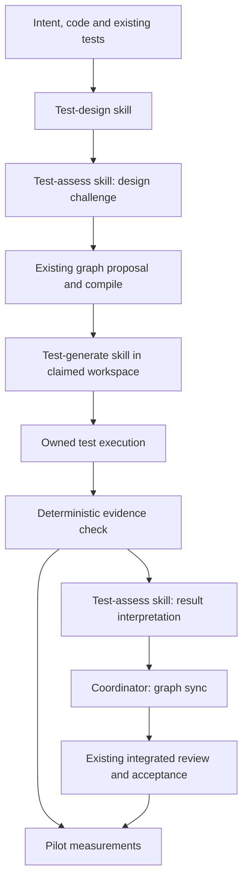

# Test Evidence Pipeline

## Overview
Improve test generation by composing small skills around a deterministic execution-and-evidence boundary. The sequence is **design useful tests, generate them, observe execution, assess what the results mean, admit valid evidence, then measure where optimization is justified**.

The quality standard is the repository's `docs/TDD-TEST-DESIGN.md`. This design addresses weak prospective test selection and disproportionate negative-test/proof work. It also closes the run-to-report binding needed to trust the pilot. It does not redesign branch integration merely because integration is expensive.

This is a proposed design, not implemented behavior or approval to execute a plan. The implementation baseline is commit `ed3ce8a`; the Windows-enabled full test gate passes there. The new guide remains a separate local document and must be included when this design is adopted. No comparison-source names, paths, or citations belong in shipped guidance, generated examples, or follow-up implementation artifacts.

### Preserved constraints
- The graph remains the execution source of truth; design cards are working context, not another plan.
- Hazard-discharging tests require observed red before green. A semantic assessment never grants completion: graph admission and frozen review closure remain separate.
- Dependency freshness remains content-based; a rewritten commit ID alone does not trigger a rerun.
- Build and transitive inputs remain declared and reviewed, not inferred by a supposedly universal dependency detector.
- Clean isolation remains necessary even when concurrent nodes write disjoint files.

These preserve the standing constraints queried through `sdd decide lookup`: `SddGraph:pd-9f012a46`, `SddGraph:pd-bdfd36b3`, `SddReframing:pd-bc49f26c`, and `SddReframing:pd-c096f644`. No decision entries or existing plans are changed by this design.

## Non-Goals
- A new authoritative prose plan, a new agent hierarchy, or an extra mandatory review lane.
- Semantic proof that arbitrary tests are correct, exhaustive mutation testing, or a coverage-percentage quota.
- Automatic broad-suite execution for every node, global SHA-based invalidation, or a verification cache.
- A universal test framework, remote execution service, sandbox against a malicious repository, or arbitrary build-system dependency discovery.
- Retrospective invalidation or rewriting of existing observations, red history, frozen reviews, or completed plans.
- Branch fan-in automation, graph-semantic input projections, or changing command/review gate semantics in the initial implementation.
- Broad framework support in the first pilot: its observed execution adapter supports ordinary packages in one Go module. Existing JUnit and legacy report-import workflows remain available under their current contracts, but do not receive the new evidence guarantee.

## Architecture

### Components


#### Composable skills

| Skill | Input | Output | Authority boundary |
|---|---|---|---|
| `test-design` | Cited intent, inspected code, existing coverage, proposed hazards and language conventions | Compact design card: behavior/source, risk/level, cases/oracle, real subject/seam, existing coverage, expected red and targeted execution | Does not approve requirements, invent missing interfaces, or mutate the graph |
| `test-generate` | Current node claim, design card, actual fixtures and runner conventions | Focused test/scaffolding edits with the declared identities; explicit discovery of missing engineering work | Does not implement production behavior to hide a bad test, write observations, or claim success |
| `test-assess` | Either a design card plus source, or that card plus raw output and deterministic execution facts | Specific defects, expected/unexpected failure classification, and a recommended next action | Does not turn setup failure into red, supply an exit code, or replace the completion review |

These are reusable instruction skills, not agent types. The same primary context may compose them; a fresh collaboration context is useful for challenging test design but is not mandatory for every stage. Existing `implement_task` dispatch remains unchanged. A single implementer can apply generation, implementation and refactoring instructions in sequence while the coordinator retains claim and sync ownership.

`test-design` runs after planning context collection and before node proposal. It designs cases now, not an entire future test suite. `test-generate` runs when a node becomes actionable and uses the actual current code. `test-assess` challenges the prospective card before dispatch and interprets real results before the coordinator attempts admission.

#### Deterministic execution and checking

Proposed CLI capabilities, not commands available at the baseline:

- **`sdd test run`** executes one selected node test suite through `internal/procexec`, captures raw output and execution facts, and writes a private immutable attempt bundle. It never changes graph state or auto-syncs.
- **`sdd test check`** is read-only. It validates an attempt's integrity, report completeness, selected-test identity, candidate binding and compatibility with the current node. It prints facts and refusals, not a semantic quality verdict.
- **`sdd graph sync --attempt <id>`** rechecks the bundle and current obligation, then records through the existing graph store and publication fence. It does not rerun the command. Existing `sync --report` remains the legacy path for gates that have not opted in.

New code belongs in a narrow `internal/testevidence` package plus CLI glue; report decoding/folding is shared with `internal/graph/sync`, not copied into three skills. Add `procexec.Capture(ctx, name, args, policy) (Result, error)`: a normal completed process returns its actual exit code and complete machine stdout, even when that exit code is nonzero; an operational failure returns an error and no complete result. Retain finite `MachineLimit` and cleanup bounds; never use an unbounded buffer. `procexec.Run` remains the compatibility wrapper that maps a nonzero exit to its existing typed error contract. Both reuse the same owned launch/capture implementation. Expected-red runs use Capture, not the bounded excerpt in a Run error. Timeout, overflow, cancellation, failed drain and capture failure never produce a complete attempt. Successful descendant cleanup is recorded but is not itself a failed run when output capture is demonstrably complete.

#### Current gaps motivating this boundary

Source inspection at the baseline shows:

- `internal/graph/sync/sync.go:150-189` folds declared tests but has no explicit empty-gate guard; `internal/graph/compile/compile.go:533-560,632-639` checks hazard correspondence and duplicate declarations, not nonempty tests for every tests gate.
- `internal/graph/sync/report.go:114-168` keys Go results by test name, drops package-level events and retains the latest terminal event. Package identity, repetition and run completion therefore need explicit treatment. An absent declared test is already unresolved; it must not be described as automatically green. Name collisions or a package failure after selected tests pass are separate risks.
- `internal/graph/sync/sync.go:220-284` already records own/dependency content and current intent/input hashes, but takes those snapshots at sync time, not at test execution. The publication fence checks the evaluated node obligation, not the provenance of supplied report bytes. A copied old report cannot authenticate its run context merely because it parses.
- Red carry-over compares test metadata rather than the test implementation. The new protocol must not infer test equivalence from an unchanged name or demand new red solely because a contract revision number advanced.

These are source-derived motivations. Their precise refusal scenarios become regression fixtures before implementation; no performance effect is asserted here.

### Data Flow
1. **Inspect and design.** Discover the subject, test infrastructure, existing coverage and execution level. A missing oracle or seam blocks readiness; the driver investigates or reconciles the scope before proposing work.
2. **Challenge.** Assessment asks which relevant defect each assertion detects, whether the real subject is exercised, and whether the new coverage adds value. It distinguishes new behavior from characterization and risk-specific sensitivity experiments.
3. **Propose.** Compile the existing normative node fields. All tests gates in the pilot, including every hazard-discharging test, must select `evidence: observed-v1`; fixture checks refuse an omitted election. Design-card prose stays supplementary. Outside the pilot, legacy and observed gates may coexist without pretending they offer identical provenance guarantees.
4. **Claim and generate.** Author the named tests in the claim workspace. Missing or changed test identities are reconciled through supported graph operations before execution, never silently substituted by the generator.
5. **Execute RED.** Author all currently declared selected tests before the first attempt. The binary snapshots the candidate, starts the runner, captures its completed result, and snapshots again. The checker reports executed failures versus unusable execution. The assessment identifies whether failures correspond to the intended absent behavior. A build error never becomes a synthetic failing test to arm hazard red.
6. **Admit RED.** The coordinator submits an eligible failing attempt through sync. Mechanical admission establishes observed test failure; the reason it demonstrates the intended defect remains reviewed engineering judgment.
7. **Implement and execute GREEN.** Make the smallest contract-complete implementation, preserving the tests' meaning. Execute again. Commit the complete slice before its passing sync under existing Git rules; committing byte-identical content does not invalidate the attempt. Provenance distinguishes the run context from the final clean revision containing those bytes.
8. **Admit GREEN.** Recheck candidate and test identity, red eligibility and clean workspace. Persist the observation summary and leave raw evidence in the private bundle. Neither assessment prose nor an exit code typed by a caller can satisfy an observed-v1 tests gate.
9. **Integrate, review, measure.** Use the current rebase/fast-forward and frozen-review flow. Record actions and stale reasons without automatically responding with broad reruns. Optimize only after the pilot shows the cause and cost.

### Interfaces
#### Design-card handoff

The card uses the guide's existing fields, with explicit expected test identities and failure reasons. It is not an additional authoring schema embedded into every graph node. The coordinator retains it in the task context and may checkpoint it beneath `Plans/<Plan>/.graph/test-evidence/<node>/design.md`. That ignored file carries no scheduling/completion authority. On resume, compare it to the current node and source; reconstruct it if missing or incompatible. Tests and their contracts must remain understandable without the scratch card.

No skill silently rewrites another stage's output: a changed expectation returns to design assessment; an unexpected execution result returns to diagnosis; newly discovered implementation work returns to the normal proposal/amendment path.

The serialized handoff is a fixed-heading Markdown record, usable inline or as the scratch card: `Context` (plan/node and inspected source identities), `Behavior and source`, `Risk and level`, `Existing coverage`, `Cases and oracle`, `Subject and seam`, `Red and sensitivity`, and `Execution`. Each case names its test ID/file and expected outcome; non-applicable fields say why rather than disappearing. This is a shared prompt/template contract, not a new artifact type or machine judgment of test quality.

Generation returns `Files changed`, `Test identities`, `Scaffolding introduced`, and `Unresolved findings`. Assessment returns `Assessment: ready | changes-required | blocked`, a list of located findings, and `Next action`. Run assessment additionally names the immutable attempt ID, references checker facts verbatim, and classifies failures as `expected-behavior`, `test-or-fixture-defect`, `implementation-defect`, or `unresolved`. These are model judgments, never fields that the graph trusts as observed outcomes. The coordinator owns routing: missing intent/seam returns to design; test/fixture defects to generation; implementation defects to implementation; unresolved causes stay blocked. A fresh context receives the same record and the referenced source/report material, not an implied inherited conversation.

#### Observed attempt bundle

The proposed invocation shape is `sdd test run --plan <plan> --node <id> --by <holder> --phase red|green|diagnostic`, followed by `sdd test check --plan <plan> --node <id> --attempt <attempt-id> --expect red|green`. RED additionally requires `--red-kind baseline|sensitivity`; a sensitivity attempt includes a concise fault description. The gate, not a caller-provided command string, supplies the execution profile. Declared purpose does not determine the observed result. Diagnostic attempts never arm red or green. Attempts are resolved inside the plan's owned evidence directory; arbitrary external receipt paths and symlink escapes refuse.

An observed-v1 tests gate adds this normative shape alongside its existing `tests` list (illustrative values):

```json
{
  "type": "tests",
  "evidence": "observed-v1",
  "execution": {
    "adapter": "go-test-v1",
    "args": [],
    "timeout_seconds": 120,
    "environment_keys": ["GOOS", "GOARCH", "CGO_ENABLED"],
    "test_support_inputs": [],
    "test_support_artifacts": []
  },
  "tests": [{"id": "TestRejectsDuplicateKey", "file": "codec/parse_test.go"}]
}
```

The initial `args` allowlist is `-race`, `-short`, and explicit `-tags` values, parsed as distinct argv entries; executable, package selection, `-json`, `-count`, `-run`, test timeout and report routing are adapter-owned. Reject `-list`, `-bench`, `-c`, `-exec`, `-args`, repeats and any unrecognized flag rather than trying to sanitize arbitrary shell syntax. The timeout must be positive and finite. The example's timeout is a proposed fixture budget, not a performance claim. Environment keys identify additional reviewed dependencies; the adapter always includes its required Go platform/build settings and resolved executable identity.

`test_support_inputs` contains existing `Node.Inputs` keys, not a second list of embedded input declarations. `test_support_artifacts` contains existing repository-relative `Node.Artifacts` paths. These subsets distinguish fixture/helper/configuration dependencies for red compatibility while the ordinary source/input resolvers and stale predicates still see their content. Every selected test file must itself appear in `Node.Artifacts` when this node writes it, or as a whole-file repository `Node.Inputs` entry when reused unchanged. Missing membership refuses compile; no silent metadata repair. Neither read set is inferred complete by the tool. Runtime environment is an explicitly recorded execution context, not proof that the same test passed on every host/profile; changing the normative profile requires amendment. This pilot adds no ambient-host freshness axis to ordinary graph status.

One tool-assigned attempt ID identifies a single execution and its immutable files under `Plans/<Plan>/.graph/test-evidence/<node>/<attempt>/`. Proposed contents:

| Record | Required information |
|---|---|
| Attempt header | Protocol version, attempt ID, plan/node identity, claim instance/holder, resolved workspace identity, declared phase and red kind/fault when applicable, timestamps |
| Candidate snapshots | Before/after content identities for node artifacts, dependency artifacts, declared inputs and selected test source files; current cited intent; normative node obligation |
| Execution profile | Resolved executable identity/version, argv array, root-relative working directory, explicit finite limits and declared environment/build settings |
| Execution facts | Whether the process started and completed; exit code; timeout/cancellation/overflow/drain flags; descendant cleanup and run/cleanup durations; captured output digests |
| Parsed report | Package-qualified test identities, concrete subcases, discovery/execution facts, terminal outcomes and package completion facts |
| Raw evidence | Complete Go JSON stream and bounded diagnostic stream, with completeness flags and digests |

The binary creates these facts; skills do not author receipt fields. Requested `red` or `green` intent never determines the observed outcome. A receipt is local execution bookkeeping, not a signature or defense against a malicious user rewriting their own repository. Keep raw potentially sensitive output ignored; publish only scrubbed summaries and root-relative identifiers. Do not persist environment secret values or reusable credentials. Record the declared environment profile's non-secret configuration and an opaque local identity for sensitive dependencies, not secrets in planning artifacts.

Bundles are never reused as observations solely because their report digest matches. Both `test check` and `graph sync --attempt` require identical before/after path sets and content digests, cited-intent hashes, and normative obligation fingerprints, and require those values to match the current candidate. The obligation key is the existing `Node.ProofSnapshot()` extended by the new normative gate fields; content snapshots are separate from that declaration fingerprint. Missing/deleted inputs and source-changing test runs refuse. Tests may mutate test-owned temporary outputs outside this declared source set; updating a golden source file is not a verification pass. Input completeness remains a design/review responsibility.

For attempt admission, populate the observation's `artifact_digests`, `dependency_digests`, `intent_hashes` and `input_hashes` from the captured run snapshots, never freshly relabel them with sync-time hashes. Recheck against the current workspace/sources immediately before publication and check the obligation/claim again within the graph CAS. Independent source files are not made atomic by the graph lock: execution and admission require the exclusive owned-workspace protocol, and hostile transient edits are outside the trust model. A changed requirement between run and sync refuses, even if all implementation bytes stayed the same.

Observed claims gain a tool-generated stable instance nonce at allocation. Attempts bind to that nonce and holder, not merely to a reusable workspace path. Renewal preserves the nonce; release/takeover/reallocation creates a new one. Run requires the current holder and enough remaining lease for its finite execution/cleanup budget; check and new admission refuse expired or replaced claims. Legacy claims without a nonce need an explicit fresh claim before observed capture. Serialize only opaque or root-relative workspace identifiers; never machine-specific absolute paths in committed observations.

The graph's whole-file digest is only its existing write fence. It is not a test input or receipt freshness key. Attempt bundles, reports and bookkeeping fields must not enter the exercised-source fingerprint. An observed-v1 gate declaring its own live graph or evidence output as a source input is refused with a diagnostic; structural graph checking needs a separately designed snapshot/projection protocol, outside this pilot.

#### Initial Go adapter

- Support one ordinary Go module and its repository-local packages. Resolve a declared test's file directory to its module-qualified package; reject ambiguous/out-of-module mappings. Multi-module workspaces, external/generated test locations and unsupported report conventions are explicit unsupported cases, not guessed mappings.
- Execute an argv-based `go test -json -count=1` selection for the declared packages/tests, using a fresh output stream. Reject arguments that turn the operation into listing, repeated-count runs, or another non-test command. Optional structural flags follow the project's test policy. No shell pipeline supplies the authoritative exit status.
- Preserve `Package`, `Test`, run/terminal events and package completion. Do not collapse different packages' identically named tests or silently let a later pass erase a failure. A second execution of the same concrete test identity in one attempt is refused as unsupported repetition in v1.
- Fold subtests only inside their owning package. Precedence is ambiguous/missing/any-skip → withheld; otherwise any failure → fail; otherwise all cases pass → pass. A fail-plus-skip family cannot arm hazard red. A top-level selection must appear as an executed test, not merely be inferred from an unrelated similarly named case. Ordinary run/pause/cont progress and distinct parent/subtest terminal events are not repetitions; a second terminal result for the same concrete identity is unsupported repetition in v1.
- A package compile/setup failure, missing package terminal event, unexpected process termination, or package failure without accounted selected-test failures makes the attempt unusable for admission. Expected RED may have nonzero exit when completed selected-test failures account for it. A failed test's semantic cause is still assessed from its raw output and fixture context.
- GREEN requires complete successful execution and resolved passing outcomes for all selected tests. RED requires complete resolved selected outcomes with at least one actual failed test; only actually failed hazard tests gain red evidence. Missing, skipped or ambiguous selections never manufacture red.

The adapter is not a source-code oracle. Even well-formed output from an executed test can describe a vacuous assertion; `test-assess` and normal code review address that limitation.

#### Graph admission and red compatibility

`model.Gate` adds optional authorable `evidence` and `execution` fields to the existing `type: tests`; this is a modifier, not a new gate type. Evidence accepts `observed-v1` and explicit `legacy`; absence means legacy only for previously legacy/new declarations. Execution is required only for observed-v1 and forbidden on legacy/command/review gates. The profile fields shown above are committed normative input, not per-run overrides. Amendments replacing an opted-in gate must explicitly preserve `observed-v1` or explicitly request `legacy`; omission refuses instead of silently downgrading. Preview renders the old/new evidence contract and profile prominently. Unknown fields/values refuse in both proposal and stored-graph decoding; older readers already refuse these new fields, so no additional global version ledger is needed.

The model's Go fields, custom encoders (particularly `Gate.MarshalJSON`), strict decoder, proposal schema/exemplar, validator, graph renderers and portable guidance move together. Claim nonces, attempt summaries, consumed indexes and red compatibility records are tool-owned and forbidden in proposals. All observed-v1 admission checks live in the shared `sync.Run` path via a mutually exclusive attempt option, not only in CLI glue. `graph reverify --report` explicitly skips observed nodes with `requires observed capture` and reports their count/IDs as not evaluated; it never imports its report into them. Re-verifying a stale observed node uses a new current claim plus test run/check/sync; previously admitted compatible red may still be used. `graph repair-red` refuses to manufacture compatibility metadata for observed gates. Split/convert create unverified children and cannot inherit attempt evidence; amendments preserve only actually compatible records.

Direct declaration verbs also use the shared observed-gate validator inside their graph mutation transaction. `set-tests` must preserve evidence/profile fields and validate selected-file membership; `set-artifacts` cannot remove a selected/support path without a valid replacement declaration; `set-inputs` cannot leave a support key dangling after narrowing. All support references must be subsets of their parent declarations. An invalid result refuses without a write. Add a newly required artifact before selecting its test; changes that require simultaneous profile/reference edits go through an explicit amendment carrying the complete valid candidate. No setter grants new red or rewrites an old observation as current proof.

Switching an existing node to this gate requires an explicit amendment and advances its contract revision, so the old observation remains history, not proof of the new contract. Derivation additionally requires the observed protocol marker and captured identity fields for a current observed-v1 pass; legacy-shaped or malformed evidence cannot derive GREEN. Persisted ordinary input/artifact hashes include selected tests and test-support files through the membership rules above, so later fixture/test-source edits use existing stale predicates. Mixed plans retain legacy semantics on their legacy nodes without silently upgrading their provenance claims.

Retain `red_seqs` with its existing first-failure ordering and legacy-history meaning. Add a separate **node-level** tool-owned `red_evidence` map keyed by package-qualified test identity. Each current record names its admitted attempt, sequence, compatibility key and red kind/fault. Admitting a later actual failure replaces that test's current record, even when the old `red_seqs` entry already exists; the immutable consumed-attempt summary retains the earlier admission. GREEN and ordinary re-verification do not delete this node-level map. A passing observation records references to the red records it used, not the only copy of those records.

For observed-v1, qualifying red requires the same package-qualified test identity, file, hazard claims, selected test-source digests and declared test-support inputs/profile. It must refer to a real admitted failure earlier than GREEN; legacy integer existence alone grants nothing. Implementation output bytes may change between RED and GREEN; test meaning may not. An unrelated node observation, commit rewrite, or contract-revision increment alone does not erase compatible red.

The initial compatibility boundary hashes whole selected test files and declared test-support files. Adding tests in the same file can therefore require replacement red for affected evidence; this conservative limitation is explicit and measured. Generate all currently declared tests before RED to avoid needless intermediate invalidation. If a later amendment adds a test and makes earlier red incompatible, a controlled temporarily reverted/mutated implementation is a supported replacement baseline: run it as `--phase red --red-kind sensitivity`, assess the named fault, and sync its actual failures while those broken implementation bytes still match the red attempt. Then restore the correct implementation and capture GREEN. The red compatibility key intentionally excludes implementation bytes while retaining test/support/profile identity. This is not a deadlock or an exemption; it is an explicit, potentially costly recovery path whose frequency the pilot measures.

The phase, red kind and fault description persist with red evidence. A sensitivity run does not automatically prove missing-feature TDD, but it can satisfy the existing observed-hazard-red obligation. The binary's preconditions are mechanical: red phase, recorded kind/fault where required, actual selected-test failure, compatible identity, and current claim/candidate binding. Assessment is a **driver obligation**, not a model verdict accepted as execution evidence: the coordinator must resolve changes-required/blocked assessments before submitting the attempt, but the binary does not pretend it can establish the reason for failure. Fault descriptions and assessment context are review-visible; the existing feature full-review gate is accountable for rejecting vacuous or unjustified test evidence before completion. Diagnostic attempts cannot be relabeled as RED for admission. No metadata can prove how a fault was induced.

Legacy red without that metadata cannot silently satisfy an opted-in gate. Adoption needs a real qualifying red or retention of the legacy contract until the operator deliberately migrates it. Existing completed plans are left alone. Removing or downgrading observed-v1 is a normative gate change under the same amendment/review discipline, not a runtime fallback after failure.

Persist the admitted attempt digest, actual run/candidate identity and red-compatibility summary in the graph observation; raw logs are not required for later ordinary state derivation. Missing attempt files prevent any new admission, but garbage-collecting old raw logs does not erase an already recorded observation or its historical acknowledgement in the consumed index below. Pending attempts are not pruned; completed bundles are retained through pilot review and then explicitly cleaned using tool-owned per-plan paths only.

Persist a compact per-node consumed-attempt index in the same graph CAS as the observation. It records attempt ID, digest, admitted sequence and any admitted per-test red compatibility summary. Repeating an admitted attempt acknowledges that earlier admission without incrementing sequence, renewing a lease, releasing a new workspace, or changing the latest observation; replaying old RED after GREEN must not demote the node. This read-only acknowledgement consults the index before requiring a current claim or raw bundle and bypasses graph mutation entirely, reports historical admission rather than current GREEN, and is safe after raw-log cleanup. Foreign-node use refuses. After a successful observation write followed by failed workspace release, the existing explicit cleanup path repairs the workspace; retrying admission is not a second release operation.

A partially written attempt is never eligible: publish its finalized header only after output, parsed facts and snapshots have been written atomically. Interrupted capture retains diagnostics but cannot manufacture a finalized run. Do not age-prune a potentially running attempt. After confirming its process/claim is no longer live, the coordinator may explicitly remove an incomplete attempt through a tool-owned cleanup operation; no process-name sweep or arbitrary directory deletion is permitted.

## Design Decisions
- **DD-1**: Compose three instruction skills, not three new agent roles.
  Context: test quality requires distinct design, authoring and assessment responsibilities. Options: one monolithic implementation prompt; new mandatory specialist agents; small reusable skills composed by existing orchestration. Decision: reusable skills. Rationale: responsibilities remain explicit without requiring delegation or changing runtime routing.
- **DD-2**: Keep the existing guide as the single canonical quality text.
  Context: installed portable skills cannot assume repository `docs/` exists in a target project. Options: duplicate the guide in each skill; move its source; generate a packaged resource from the requested document. Decision: retain `docs/TDD-TEST-DESIGN.md` as source and add an explicit portable mapping to `shared/test-design.md`. Rationale: one editable standard, readable in-place from the active plugin; no copying plugin resources into user repositories.
- **DD-3**: Separate semantic assessment from deterministic admission.
  Context: a parser can establish execution facts, not assertion adequacy. Options: make an assessment verdict grant GREEN; parse reports only; combine human/model assessment with binary-owned execution and admission. Decision: the combined boundary, with only the binary recording graph evidence. Rationale: judgment is necessary but cannot replace a real run.
- **DD-4**: Bind observations to a captured execution rather than relabel supplied reports.
  Context: sync-time source snapshots cannot establish where earlier report bytes came from. Options: tighten prose only; require matching Git SHA; capture a per-run receipt with content snapshots. Decision: content-bound attempts for opted-in tests gates. Rationale: this addresses accidental report rebinding while preserving byte-identical commits/rebases and existing isolation requirements.
- **DD-5**: Pilot one Go adapter and retain explicit legacy compatibility.
  Context: broad framework support would obscure validation of the new flow. Options: replace all report imports; support every framework immediately; add observed-v1 for one Go module while keeping legacy gates readable and executable. Decision: explicit opt-in. Rationale: the first pilot exercises the complete architecture without silently migrating existing evidence or promising unsupported runner semantics.
- **DD-6**: Reuse red according to test compatibility, not revision number alone.
  Context: test metadata alone cannot establish unchanged test meaning, but every SHA/revision change is too broad. Options: reset all red after revision; retain name-only proof; retain compatible source/profile-bound red. Decision: the bounded content/profile key described above. Rationale: preserve applicable evidence and explain exactly why new evidence is required, without claiming automatic semantic equivalence.
- **DD-7**: Keep design cards and raw attempts out of graph freshness inputs.
  Context: execution bookkeeping must not invalidate itself. Options: fingerprint the whole graph and scratch directory; ignore all graph changes; fingerprint only the normative obligation and exercised inputs. Decision: the selective explicit boundary. Rationale: bookkeeping is not source, while real contract/source changes must remain visible.
- **DD-8**: Validate quality and correctness before optimizing execution cost.
  Context: fewer checks can appear faster by losing coverage. Options: simplify fan-in first; tune test counts; compare the current and proposed flow on a controlled fixture with preserved obligations. Decision: the pilot below. Rationale: optimization must explain which work was eliminated and why its guarantee remains covered.

## Error Handling
| Condition | Result and next action |
|---|---|
| Missing requirement, oracle, real seam or justified work | Design not ready; investigate or reconcile intent; do not generate plausible placeholders |
| Undiscovered, renamed, duplicate-package or skipped selected tests | Evidence not admissible; correct selection/setup or amend the declaration |
| Build/setup failure, crash, timeout, overflow, incomplete report | Execution failure; preserve diagnostics; no green and no synthetic red |
| Actual test failure inconsistent with intended RED | Assessment rejects the proposed explanation; diagnose the fixture/assertion/contract before syncing |
| RED experiment changed a guard or fixture | Restore the correct candidate and run GREEN; no injected defect may enter integration |
| Candidate, test-support profile or obligation changed during/after execution | Refuse admission naming the changed identities; rerun affected tests or reconcile the node |
| Receipt missing, modified, foreign-node or unsupported version | Refuse without observation; rerun through supported capture rather than trusting a reconstructed receipt |
| Compatible red missing on an opted-in hazard test | Require a real compatible red; do not infer one from legacy metadata or assertion prose |
| Concurrent graph write | Existing store retry/fence rules apply; unrelated writes do not force re-execution, obligation changes do |
| Unsupported adapter or target layout | Clear unsupported result; do not silently downgrade the gate to legacy import |

`test run` reports execution completion separately from test success: exit 0 means complete selected tests passed, exit 1 means completed selected-test failures, and exit 2 means malformed/unsupported execution or a run whose evidence could not be completed. The machine result carries `attempt_id` when allocated, `execution_status` and test outcomes. An expected-red exit 1 is useful evidence, not a broken runner. `test check` exits 0 for a mechanically eligible attempt matching `--expect` (including valid RED), 1 for a readable but inadmissible/mismatched attempt, and 2 when checking cannot run. It is nonmutating; graph sync retains its existing exit conventions and remains the sole observation write path. No retries erase prior failed attempts.

## Testing Strategy

### Deterministic contracts
Write regression cases red before implementing the corresponding refusal or binding:

- Empty tests gates refuse at proposal compile and at sync, including legacy imports; command and review gates are unaffected.
- Same test name in different Go packages cannot satisfy the wrong declaration; failing or skipped subcases cannot become passing families.
- A fail-plus-skip family remains withheld and arms no red; ordinary parallel test progress is accepted, but duplicate terminal results refuse.
- Partial package build failure, a late TestMain/package failure, missing terminal records, repeated identities and zero selection are unusable, not fabricated red or green.
- A complete expected-red report is captured despite the process's nonzero exit; stdout is complete and unchanged. Timeout/overflow/cancellation remain incomplete, never admitted.
- Cross-node/workspace report reuse, modified raw output, changed candidate content and changed normative contract refuse admission.
- A claim takeover with the same workspace path rejects the old attempt; a changed requirement before sync refuses and never receives sync-time replacement fingerprints.
- Committing or rebasing byte-identical declared content preserves attempt eligibility; unrelated graph observations and lineage changes do not alter it.
- Changing selected test source/support input invalidates corresponding red compatibility; implementation-only changes do not. Unchanged compatible tests retain their evidence across unrelated revision changes.
- A replacement sensitivity-red record supersedes incompatible per-test red, survives the subsequent GREEN observation, and allows that GREEN without rewriting the historical first-failure sequence.
- Legacy graphs remain readable and retain current state semantics; opting in cannot import legacy red silently or fall back after an observed-v1 refusal.
- Omitted evidence selection in a replacement gate cannot downgrade it; reverify and repair-red cannot bypass observed admission. Test-support drift after GREEN triggers existing input/artifact staleness.
- Each direct setter refuses a dangling selected/support reference atomically. Save/load round-trips preserve the full observed gate/profile; changing only the profile changes ProofSnapshot.
- Replaying an admitted red after green is an idempotent historical acknowledgement, including after raw-log cleanup; it changes no sequence, claim or observation.
- Own-live-graph/evidence-output inputs refuse in the pilot instead of producing a self-invalidating loop.
- Standalone skill composition and the single-agent fallback produce the same handoff fields; no skill asserts outcomes without runner evidence.

### End-to-end pilot
Use a test-owned temporary Git repository with a small settings codec and a predeclared contract. Independent parse and render slices have disjoint implementation files; an integrated round-trip/public-file boundary joins them. Include ordinary success, a representative invalid input, and an injected write failure with a specified unchanged-data invariant. The fixture declares hazards explicitly; the workflow must not guess them from an arbitrary quota.

Run the current and proposed planning/generation flows against equivalent clean baselines and the same obligations. Preserve generated tests, commands, reports, graph changes and reviewer findings. Evaluate generated tests against a fixed set of known defect variants derived from the fixture contract; this benchmark's sensitivity experiments are for validating the generator, not a new universal requirement on every application test.

The pilot passes only if the designed cases exercise real behavior, detect the contract's seeded defects, distinguish setup failures, and complete the required graph review/acceptance path without manual observation edits. Independently inspect the tests; instruction-text tests alone cannot establish generator quality. When no independent reviewer is available, label self-review and do not claim an independent result.

Measure per attempt and per completed obligation: selected and executed tests, targeted versus broad runs, red experiments, amendments caused by missed engineering work, reviewer corrections, operator interventions, test duration and integration rechecks with their actual reasons. Retain failed and incomplete attempts. Do not claim statistical improvement from one small pilot or impose a speed target that rewards lost coverage.

Exercise a byte-identical rebase, a dependency-changing integration, an unrelated observation, and an own-graph input proposal. These validate evidence boundaries and collect optimization evidence; they do not authorize a fan-in rewrite. The runtime test suite and the generated-test pilot are distinct acceptance results.

### Structural Verification
- Go changes: `go vet ./...`, focused `go test -count=1` packages, and `-race` for capture/storage/runner concurrency. Reuse the existing owned-process and fixture isolation policy. On Windows, use the installed MinGW compiler with command-local CGO configuration; do not change global settings.
- Repository gate: `make test`, including the frozen regression corpus, templates, portable drift/leak/citation checks and configured race targets. A focused pilot is never a substitute.
- Skill packaging: extend the explicit model-only skill inventory and resource-path transform; run `make plugins` and `make plugins-check`. Add generation tests for all three skills and the guide mapping; never hand-edit generated trees.
- Design quality: review against `docs/TDD-TEST-DESIGN.md`; validate artifact structure through `sdd validate`. These checks validate the design document, not an implementation that does not yet exist.

## Migration / Rollout
1. **Approve this boundary.** No runtime changes are made by the design. Resolve any review findings first; keep existing decisions and graph semantics intact.
2. **Compose the skills.** Add canonical `skills/test-design`, `skills/test-generate`, and `skills/test-assess`; wire planning, the implementer and both implementation skill variants to them. Publish the guide into portable resources by generation from its canonical document. Update mirrored skill inventories and review all exemplars for anonymous, standalone wording when the skills ship. No new top-level lifecycle command or agent lane is needed.
3. **Build evidence capture and checks.** Introduce the one-module Go adapter, attempt store, nonzero-output capture contract and shared richer report decoding. Preserve legacy parser verdicts except for the explicit empty-gate correction; rich completeness/identity checks apply to observed-v1. First exercise read-only checks and refusals without advancing graph state. Empty tests gates refuse every new compile/admission in both protocols; command/review gates and the distinct unspecified conversion sentinel are unaffected. Existing stored graphs remain readable and are not rewritten or globally re-derived by this guard. Read-only audit identifies historical empty gates without revoking their observations. An active empty gate needs explicit test/gate repair before another compile/sync. Repairing a completed plan first requires the existing explicit permission to reopen/change it; its repaired contract must then earn current evidence normally. Ship the admission refusal with an actionable diagnostic and a versioned release note, not a warning that still admits zero evidence.
4. **Add observed-v1 admission.** Move graph model/schema/decoder/validator together; wire attempt and red-compatibility metadata through sync, amendment and rendering without rewriting old history. Test old/new contract coexistence and refuse unsupported versions. Raise the plugin's minimum binary version when distributing guidance that relies on these commands; do not claim an old installed binary supports them.
5. **Run the pilot.** Capture both quality findings and execution costs. Opt in only newly authored pilot tests gates. Preserve current review/command gates and the normal integration discipline.
6. **Optimize from findings.** Address measured duplicate runs, overbroad inputs or orchestration overhead in a separate design. Additional language adapters are independently tested extensions, not fallback inference.

Rollback before adoption means removing skill call sites and discarding unadmitted scratch attempts. After adoption, retain a compatible reader for observed-v1 gates/observations; an older binary must refuse rather than downgrade. Returning active work to legacy admission requires an explicit reviewed gate amendment, not a flag that turns off verification. Already committed history remains intact.

## Open Questions
- Which real-world feature should follow the controlled codec pilot? **non-blocking** — The initial fixture and its acceptance contract are fixed; a second workload broadens evidence without changing this implementation.
- Should the composed planning stage eventually get its own user-facing entrypoint? **non-blocking** — This implementation composes model-loaded skills through existing planning and implementation entrypoints, so an additional entrypoint is not required.
- Which additional runner format should receive an observed adapter next? **non-blocking** — Initial scope is explicitly one-module Go; other formats are not promised this evidence guarantee until independently designed and tested.
