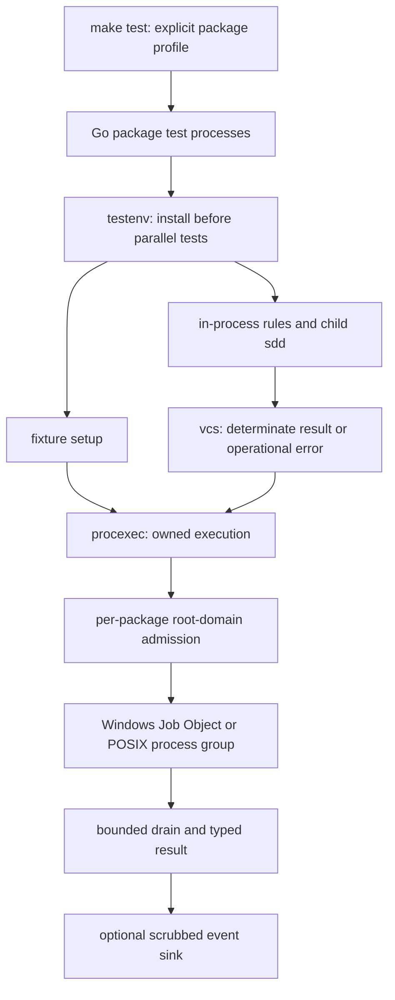
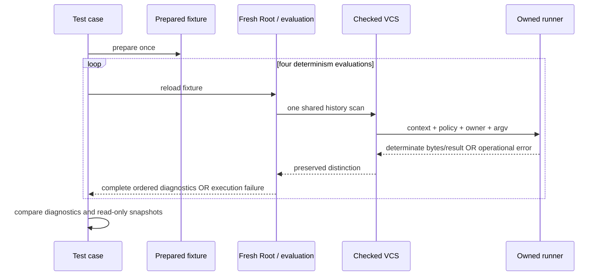

# Test Suite Reliability

## Overview
Implement all five workstreams in `Specs/TestSuiteReliability`: hermetic Git execution, prepare-once determinism with pure-logic tests, single-pass validation/history work, explicit resource budgets, and bounded subprocess ownership/error reporting. This document is the proposed architecture and graph-planning input, not a compiled plan or completed implementation. User approval of the spec and design precedes `sdd compile` through the planning workflow. Graph closure follows D-0022; no component-local proposal is promoted to an accepted ledger entry.

The evidence baseline and uncertainty are preserved in the spec. In particular, 95 observed fsmonitor daemons are not 95 proven test-owned processes. Neither this design nor its future runner may sweep them by name. Existing `Root.repoCache`, `bareOnce`, VCS adapters and frozen regression checks remain the starting point, not hypothetical missing infrastructure.

## Non-Goals
- No change to the SDD graph engine, compact skill roster, decision ledger, artifact storage or reviewer restrictions (D-0007, D-0014, D-0018, D-0023).
- No generic process-orchestration service, network budget broker, new external SCM server, or host configuration editor.
- No blanket production Git-environment isolation, silent deadline-driven mutation retries, cross-validation mutable caches, or frozen expectation regeneration.
- No test-skipping speedup, result-cache benchmark, platform-verification waiver, arbitrary process cleanup, or claim that a package-local channel is an OS-wide semaphore.

## Architecture

### Components
Two small shared components are proposed; their names and APIs below are prospective, not claims that they already exist.

| Component | Ownership and callers | Scope |
|---|---|---|
| `internal/testenv` | Imported by test code and test tooling only | Package-lifetime temporary home/config, deterministic Git environment, fixture-root aliases, explicit child-test environments and test policy installation |
| `internal/procexec` | Shared by VCS read operations, migrated fixture runners and owned helper processes | Context-bound execution, admission policy, platform containment, bounded streams, typed execution failures and optional event sink; platform files and private admission helpers stay here rather than becoming separate public packages |
| Existing `internal/vcs` | Production Git/P4 detection and operation adapters | Preserve genuine negative answers, propagate operational errors, attach context/execution policy, do not import test packages |
| Existing `internal/dlg` | Decision-ledger validation, including ledgers outside the planning repository | Migrate direct Git helpers in `gitutil.go` to owned execution and checked error classification; operational failure must not silently skip ledger history checks |
| Existing `internal/rules` | Validation and in-package example harness | Single ordinary sweep, waiver post-processing, typed evaluation-local family results, prepare-once fixture helpers and fresh roots |
| Existing `tools/regression`, `Makefile` | Complete corpus and full-gate orchestration | Explicit worker/package budgets, invariant checks, structured performance-report collection |

### Data Flow
1. A package `TestMain` creates temporary policy resources, installs a canonical environment once, then invokes `m.Run`. Restoration and removal happen explicitly before `os.Exit`, not in a defer that `os.Exit` would skip. Tests whose subject is Git ambient configuration execute in isolated child-test processes. Existing serial `t.Setenv` tests outside this Git-policy surface, such as provisioning/path resolution, need not be rewritten; normal parallel tests never switch process-wide policy. This covers existing in-process validator code while explicit environments cover child `sdd` invocations. (FR-01, FR-02, FR-03)
2. A fixture prepares files and Git history once. Every determinism iteration calls `LoadRoot` again and evaluates a fresh snapshot. No prepared fixture is shared between unrelated mutable cases. (FR-04, FR-05)
3. Validation performs one ordinary rule sweep. Family scans supply typed, evaluation-local results. Strict/reporting modes apply their existing distinct post-processing and canonical ordering. (FR-07, FR-08, FR-09)
4. Before a root SCM domain starts, its owner acquires an admission slot with the enclosing deadline. The runner establishes OS ownership, starts the command, drains output, classifies results, cleans supported descendants and releases admission only after cleanup. Telemetry distinguishes each interval. (FR-10, FR-11, FR-13, FR-14, FR-17)
5. Operational errors propagate through the adapter and validation caller to the established CLI operational path. They do not enter ordinary finding/waiver logic. (FR-16)

### Interfaces
- Proposed runner input: context, resolved executable/argv, working directory, optional explicit environment, owner/root aliases, admission domain, deadline/cleanup policy, output policy and optional event sink. Production defaults inherit the caller environment; test installation supplies the hermetic environment. A missing event sink is silent. No environment dump is emitted.
- Proposed runner result: process exit information, complete machine result or an explicit incomplete-result error, bounded diagnostic excerpt, queue/run/cleanup durations and cleanup outcome. Typed causes distinguish unavailable executable, cancellation/deadline, access failure, nonzero exit, output overflow, pipe-drain failure and containment failure. An ordinary nonzero Git exit is interpreted by the operation adapter, not universally mapped to absence.
- Existing `Repo` operations already return errors, but `Detect` and registered probes currently cannot distinguish a failed probe from no match. Introduce checked/context-aware detection returning `(Repo, error)` and migrate validation/graph callers whose outcome depends on detection. Do not leave a compatibility wrapper in an authoritative path that erases the error. (FR-16)
- Introduce an error-returning evaluation path for strict and reporting validation, preserving successful diagnostic values. Keep the existing emit-only `Rule.Check` and `Rule.CheckRoot` signatures. Each evaluation owns an operational-failure collector; its checked-detection helper and recording `Repo` decorator record typed operational errors before returning them to rule code, so a rule's existing `continue` cannot erase the failure. Failed detection records the failure and supplies a non-success unavailable adapter, never a determinate `NoRepo`. The evaluator checks the collector after each callback and aborts before the next callback; partial ordinary findings are discarded from the public result and the operational error is returned. Success alone enters waiver/reporting post-processing. Direct execution paths must migrate through the recording helper or explicitly record their failure; instrumentation verifies no bypass. Migrate every caller that can encounter VCS operational failure, including ledger validation, lifecycle gates and graph validation; legacy wrappers may remain only for provably non-operational pure callers. API propagation is part of this scope, not a deferred test-only fix.
- Fixture helpers stay in `internal/rules` test files: `prepareExample` returns an owned directory/snapshot; `evaluatePrepared` loads a new root and returns diagnostics/error. Full-value comparison includes `Correction`, `Implicated` and `WaivedReason` as well as code/severity/path/line/message. No new public fixture framework is needed. (FR-04, FR-05)

## Design Decisions
- **DD-1**: Install hermeticity at the test process boundary, not only in setup helpers.
  Context: FR-01 through FR-03, AC-01. Options: helper-only environment, production-wide override, package-lifetime test policy. Choose test policy installed before parallel work, with explicit child environments and separate child processes for configuration-behavior tests. Canonicalize environment keys case-insensitively on Windows; remove inherited repository-routing/config-injection entries; retain platform launch essentials. Use a temporary home, XDG/config paths, empty template/hooks directories and platform-correct null handling. Explicitly disable fsmonitor, maintenance, prompts, signing and accidental filters; pin fixture identity/time/line-ending/branch settings to the existing frozen-fixture contract. The code under test inherits this same policy without importing test packages. A hostile fake host config is created under test ownership; never inspect or modify the real user's configuration to prove isolation.

- **DD-2**: One bounded runner with small platform adapters and explicit execution policy.
  Context: FR-13 through FR-17, AC-06 through AC-09. Options: scattered command wrappers or one shared owner. Choose `procexec` because setup and VCS reads need the same admission, output and lifecycle guarantees. Resolve executable paths before launch using the intended child search path, retaining Go's executable-path security behavior. Default command lifetime includes admission and execution within 30 seconds; cleanup/drain receives at most 5 additional seconds, clipped to the enclosing deadline. Long-running compiler/test helpers use explicit finite policies. All `Start` successes are paired with `Wait`/platform-equivalent reaping. Do not rely on `CommandContext` alone to clean descendants, and never retry mutations.

- **DD-3**: Windows containment is a Job Object enrolled before user code runs.
  Context: FR-14, AC-06 and the Win32 contract pins in the spec. Options: console process group only, post-start assignment with an escape race, or suspended-create/enroll/resume. Choose suspended-create/enroll/resume with kill-on-job-close and neither breakaway flag enabled. This requires a real Windows launch path retaining the primary thread/process handles; merely setting `CREATE_SUSPENDED` on `exec.Cmd` without owning a resume handle is not an implementation. The adapter may use the existing `golang.org/x/sys/windows` dependency. Failed assignment closes/reaps the suspended child and reports operational failure. Nested-job compatibility is tested on Windows; incompatible hosts fail explicitly, not by disabling containment. Limit inherited handles to intended standard streams and owner protocol handles. Close the last job handle only after final ownership/cleanup accounting.

- **DD-4**: POSIX containment covers owned group-staying descendants, not arbitrary escaping daemons.
  Context: FR-14, AC-06. Options: process-table/name sweeps or a process group established atomically at spawn. Choose a separate owned group, signal only its validated positive PGID through negative-group signalling, retain ownership until cleanup, and reap direct children. A process group is not a sandbox: `setsid`/group-escaping descendants are outside this adapter's supported contract and are prevented in ordinary Git fixtures by disabling background services. Tests of lifecycle use known cooperative helper processes. No broad kill, no signalling PGID zero/one, and no assumption that `kill(pid, 0)` proves reaping. Normal parent success still triggers supported-descendant cleanup. Detectable containment/cleanup failures fail the operation.

- **DD-5**: Budget root command domains and serialize SCM within delegated child domains.
  Context: FR-10 through FR-12, AC-05. Options: CPU-sized pools, network/global broker, or fixed package scheduling plus per-package root-domain admission. Choose two package processes, four parallel cases, four corpus workers and four active SCM root domains per package: at most eight concurrently admitted SCM trees under the full profile. The semaphore is local to the owning package process. An admitted child `sdd`/helper tree keeps its parent's slot until cleanup; descendants inherit a validated test-only domain descriptor and a serial SCM policy, not a fresh four-slot pool. The child never acquires the parent's in-memory semaphore. A nested child transfers the active serial domain while its parent waits; sibling nested calls serialize locally. In-process validation uses the package runner directly. Tests exercise attempted concurrent descendant calls, nesting and failed handoff; unknown/invalid delegation fails rather than inventing an independent budget. Root-domain owner identity and release responsibility are explicit; inherited children cannot release a parent's slot. No production graph frontier/scheduling behavior changes.

- **DD-6**: Preserve ordinary evaluation and reporting semantics while removing repeated work.
  Context: FR-07 through FR-09, AC-04. Options: generic registry dependency framework or typed local reuse. Choose a private ordinary-evaluation function plus strict/reporting post-processing. It runs each root rule once and each artifact rule once per applicable artifact, excluding waiver bookkeeping rules from that ordinary pass. Waiver rules remain registered with Good/Bad examples, but their findings are derived from the single ordinary result. Strict mode retains ordinary findings plus waiver-bookkeeping findings; reporting applies the existing waiver and retired-artifact rules. Family findings such as append-only history are cached in a typed evaluation-local scope and filtered by code, not rescanned per code. Existing canonical sorting remains. An isolated rule-order test passes a local rule list to the evaluator rather than mutating the global registry during parallel tests.

- **DD-7**: Cache scope follows the existing immutable-root contract.
  Context: FR-08, FR-09, AC-04. Options: process-global memoization or evaluation-local family results. Choose evaluation-local results; a fresh evaluation receives fresh family-scan state and callers reload `Root` after external mutation. Retain existing safe detection/parsing caches; do not toggle global memoization in tests. No new long-lived immutable-object cache is required initially. If profiling later justifies one within this scope, repository plus resolved object ID is the key; never HEAD/index/worktree aliases or transient operational errors. Concurrent evaluations must not share mutable family state.
  Existing `internal/vcs/cache.go` also caches errors today. As part of checked-error migration, operational failures are not cached, including failed detection; determinate negatives remain cacheable only within a scope valid for the queried identity/state. A failed checked probe is never stored as `NoRepo`. Existing mutable-index invalidation must remain effective and is covered by before/after lifecycle and reload tests.

- **DD-8**: Prepare once, reload four times, and keep independent construction tests.
  Context: FR-04 through FR-06, AC-02 and AC-03. Options: delete repetitions, reuse loaded root, or reuse only immutable fixture construction. Choose construction reuse within one example case and four independently loaded roots. Compare full ordered diagnostic values. Independently construct selected representative Git and non-Git fixtures to test construction reproducibility, normalizing only enumerated root aliases; preserve deterministic commit identities. Add read-only assertions over fixture bytes, index and HEAD. Extract/test existing pure transformations at their current package seam, retain real adapter integration tests, and select explicitly named `TestPure` tests with a nonzero executed-test inventory. A coverage map associates old assertions with new tests; removals without mapped equivalents fail review/inventory checks.

- **DD-9**: Output policies distinguish machine data from bounded diagnostics.
  Context: FR-15 and FR-17, AC-07 and AC-09. Options: unbounded `CombinedOutput`, stop-reading limits, or bounded writers with cancellation/drain. Choose bounded writers: a default 64 KiB retained diagnostic excerpt per stream with a truncation flag while draining, and an explicit finite machine-output limit per operation (initial 64 MiB, overrideable by a finite caller policy). Machine overflow cancels and returns an incomplete-result operational error, never parsed success. Large valid-output tests cover content well above the diagnostic limit and below the machine limit. `WaitDelay`/platform-equivalent limits inherited-pipe hangs; the total cleanup allowance is shared, not restarted for each resource. Redaction occurs at report serialization, not by deleting fields from semantic comparisons.

- **DD-10**: Operational errors must survive every adapter and validation boundary.
  Context: FR-16, AC-08. Options: wrap every Git error as `ErrNotFound`, or distinguish authoritative predicates from inability to run them. Choose checked detection and error-returning evaluation. Use documented command exit/status or structured object/index queries to establish genuine absence; do not classify arbitrary exit 128 or English stderr as absence. Explicit negative ancestry remains false without operational error. Missing Git during required detection is operational, while successful detection of a non-repository remains the supported plain-tree result. Audit existing `continue`, fallback and `ErrNotFound` branches in append-only/evidence/cache/graph paths and explicitly in `internal/dlg/gitutil.go`, which bypasses `internal/vcs` and currently erases all Git failures. Ledger helpers migrate to checked results and a ledger-evaluation failure collector/error return without losing external-ledger repository resolution. Inventory also names `internal/graph/provider/provider.go`'s `execRunner` and `cmd/sdd/doctor.go`'s direct command seam; validation-critical failures propagate, while purely informational doctor output reports inability rather than asserting absence. The CLI uses its established operational exit 2 pathway and does not waive, demote or cache operational failures. No production successful JSON/text shape changes.
  For rule plumbing, choose the evaluation-scope collector and recording Repo decorator described in Interfaces, rather than changing every registered callback signature. It preserves the registry model while making ignored operation errors visible to the evaluator. Abort at the first completed callback with an operational failure, discard partial public findings, and skip waiver/demotion processing. Error-returning entry points migrate together with their authoritative callers; no intermediate slice may turn a failure back into an empty successful result. Direct-execution and collector-bypass tests are required at the ledger and graph seams too.
  The concrete bypass audit also includes direct detection in `internal/rules/retirement.go`, failed `Clean()` handling in `internal/graph/sync/sync.go`, and `gitCapable`-style early-return branches. Detection-time recording occurs before returning any unavailable adapter, so a capability check cannot erase the failure by avoiding its methods. Until DD-6 removes the nested `bareOnce` waiver sweep, that nested sweep shares the enclosing evaluation's collector and cannot clear or replace its error; the intermediate operational-propagation slice includes a regression test for this nesting.

- **DD-11**: Reports and benchmarks prove work performed, not elapsed cache hits.
  Context: FR-17, NFR-02 through NFR-04, AC-09 and AC-10. A per-process sink writes owner-tagged JSON events to a test-owned location; concurrent writers serialize locally and separate process files are aggregated after completion, never concurrently appended without coordination. Records include starts, root domains, queue/run/cleanup durations, result and cleanup class, output truncation and sanitized category/argv. Distinguish peak admitted root trees from total descendant/process counts. Missing/truncated report data is an incomplete measurement. No environment values or unredacted absolute paths enter planning artifacts. The full gate remains complete; a supplementary pure selection is never accepted as full verification.

## Error Handling
| Case | Required outcome |
|---|---|
| Admission cancelled before launch | No process starts, no slot leak; typed cancellation |
| Start/enrollment failure | Clean any suspended/started owned process and handles; release admission; operational error |
| Deadline, pipe stall or machine-output overflow | Cancel owned tree, bounded drain/reap using remaining cleanup allowance, record cleanup outcome; no partial successful parse |
| Parent exits successfully with children/pipes open | Perform owned-descendant cleanup; fail if bounded cleanup/drain cannot complete |
| Genuine absent blob/index path/revision or negative ancestry | Preserve authoritative existing predicate/result, only after successful checked query |
| Missing executable, permission/corruption or failed probe | Propagate operational cause, never NoRepo/ErrNotFound/empty diagnostics |
| Mutation timeout or ambiguous result | Report failure and preserve evidence; no automatic retry |
| Unsupported platform containment or missing native evidence | Explicit operational/verification blocker, not a skip reported as passing |

The error contract is deliberately end-to-end: bounding `runGit` alone is insufficient while an adapter or rule still turns its failure into absence. Successful frozen-corpus verdicts remain the compatibility oracle. Go's `os/exec` pins and Win32/POSIX pins are captured in the related spec; platform implementation must follow those sources, not the pseudocode of an earlier analysis.

## Testing Strategy
All names below are prospective test contracts. The graph author must bind them to actual test IDs/files before a node is claimable. An absent package or compile error is not hazard-specific red evidence; first introduce a compilable regression test at an existing seam or a baseline harness that exercises the old behavior, then observe its intended failure.

| AC coverage | Prospective test contracts | Observable regression |
|---|---|---|
| AC-01 | `TestHermeticGitPolicy`, `TestIntentionalGitConfig` | Hostile owned config sentinel fires on old setup/validation gap; fixed path suppresses it while explicit-config positive case still works |
| AC-02 | `TestDeterminismPreparationCount`, `TestCompleteDiagnosticComparison`, `TestIndependentFixtureReproducibility`, `TestRuleOrderIndependence`, `TestValidationLeavesFixtureUnchanged` | Old harness prepares four times; code-only comparison misses a changed message; new tests detect both |
| AC-03 | `TestPureSelectionInventory`, `TestSCMBoundaryInventory` | Pure selector executes nonzero named cases without SCM; every moved boundary assertion has an executing full-suite equivalent |
| AC-04 | `TestOrdinaryEvaluationOnce`, `TestAppendOnlyScanOnce`, `TestReloadSeesSCMMutation`, `TestOperationalFailureNotCached` | Counters expose duplicate sweeps and scans; strict/reporting golden comparisons and reload cases reject semantic/cache drift |
| AC-05 | `TestSCMAdmissionContention`, `TestNestedSCMDomain`, `TestCancelledAdmission`, `TestFullGateProfile` | Two synchronized package-like processes plus nested helpers prove peak eight under profile; cancelled waiters start nothing and nested calls do not multiply capacity |
| AC-06 | `TestOwnedProcessLifecycle`, `TestEarlyExitInheritedPipes`, `TestContainmentFailure`, platform-specific native lifecycle cases | Hang/child/parent-exit scenarios terminate within policy; unrelated sentinel survives; process handles and temp files are releasable |
| AC-07 | `TestOutputOverflow`, `TestLargeMachineOutput`, `TestStderrDrain` | Infinite output cannot hang/OOM; valid large data is complete; overflow is never successful parsing |
| AC-08 | `TestVCSOperationalErrors`, `TestValidationOperationalExit`, `TestLedgerOperationalExit`, `TestIgnoredRepoErrorAbortsEvaluation`, `TestAuthoritativeSCMAbsence`, `TestMutationNotRetried` | Faults reach exit 2 rather than clean/fallback/absence, an emit-only callback cannot swallow a recorded failure, partial findings are not reported as success, and valid negative results retain semantics |
| AC-09 | `TestProcessReportAttribution`, `TestReportRedaction`, `TestConcurrentReportAggregation` | Counts/ownership and durations are consistent, seeded sensitive values are absent, concurrent records parse and production output is unchanged |
| AC-10, AC-11 | Fixed workload report, full gate, frozen corpus and platform evidence | Measured uncached targets plus complete compatibility/inventory/structural checks |
| AC-12 | Existing graph tests/report parsers and frozen four-lane review | Observations, not edited graph state or markdown assertions, gate implementation closure |

### Structural Verification
- `go vet ./...` on every implementation phase; `staticcheck ./...` when installed. Missing optional tooling is reported, not called passing.
- `go test -race -count=1 -p=2 -parallel=4 ./internal/procexec ./internal/rules ./internal/vcs ./tools/regression` after the new package exists, on native runners with race support. Expand to additional changed concurrency packages when the call-site inventory identifies them.
- `make test` remains authoritative. `go test -count=1 -p=2 -parallel=4 ./...` separately demonstrates uncached complete Go selection; `make plugins-check` checks generated trees. Regenerate portable output only if canonical plugin content changes.
- `make build-all` covers existing tuples `linux-amd64`, `linux-arm64`, `darwin-amd64`, `darwin-arm64`, `windows-amd64`; it is compile evidence only. Windows Job Object tests must execute on Windows, and POSIX lifecycle tests on native POSIX. No cross-compiled binary is executed as a substitute. This preserves the related toolchain portability obligations without inventing FreeBSD/OpenBSD targets.

### Performance protocol
The fixed baseline and candidate targeted workload is `go test -count=1 -p=2 -parallel=4 ./internal/rules -run '^(TestExamplesBehaveAsDeclared|TestRunIsDeterministic)$'`. The pure selector is additional fast feedback, not this comparative workload. The full workload is `GOFLAGS='-count=1 -p=2 -parallel=4' GOMAXPROCS=4 make test` in the repository's Bash environment; future corpus/admission defaults are four. Record effective flags, inventory, revision and sanitized host descriptor, not just the command string. The profile parser must reject invalid or contradictory overrides rather than let a later flag silently defeat the aggregate bound.

Use reference host `windows-reference-01` as defined in the spec. Populate build caches, disable test-result caching in all samples, collect three baseline and three candidate samples, report every result plus medians, and report cold-build runs separately. Full gate includes its normal build/template checks. A 15-minute external sample bound records censored baseline runs; it never fabricates a baseline median or percentage improvement. Absolute candidate targets remain targeted median below 60 seconds and full median below 300 seconds. Native lifecycle/coverage correctness is not traded for these numbers.

Baseline collection must not reproduce an uncontrolled daemon swarm: use an owned outer supervisor with the same explicit fsmonitor-off safety environment and process containment for baseline and candidate samples, record those controls, and retain separate hostile-config correctness fixtures to prove the original gap. The comparative harness must be identical on both revisions and must not include candidate validation optimizations in the baseline. No existing workstation daemons are stopped to improve the result. Failure to contain a baseline is reported, not retried unboundedly. At least one fixed representative completed workload supplies comparable process-start counts; counts from a censored full run are partial, not a denominator for an improvement claim.

## Migration / Rollout
The following are candidate graph slices, not a hand-authored graph or a promise of exactly one commit per row. The planning skill must inspect the current hazard catalog, split oversized slices, assign exact write sets and executable tests, and compile the graph through `sdd`. Dependencies reflect real seams rather than making the five workstreams falsely independent.

| Candidate node | Source | Main write set / contract | Dependencies | Hazard-discharging tests |
|---|---|---|---|---|
| `git-test-isolation` | FR-01, FR-02, FR-03, AC-01, DD-1 | Test-only environment policy and test-package adoption inventory; no fixture-repeat refactor | none | Hermetic and intentional-config sentinels |
| `owned-execution` | FR-13, FR-14, FR-15, AC-06, AC-07, DD-2, DD-3, DD-4, DD-9 | Runner and native lifecycle/output adapters, with owned helper fixtures | git-test-isolation | Lifecycle, inherited pipes, output, containment tests |
| `operational-propagation` | FR-16, AC-08, DD-10 | Checked VCS detection, recording Repo/evaluation collector, ledger direct-Git helpers, cache error policy and complete CLI/lifecycle/graph caller migration; inventory provider/doctor seams | owned-execution | Fault injection through validator and ledger CLI, ignored-callback-error abort, plus genuine-absence controls |
| `admission-and-telemetry` | FR-10, FR-11, FR-12, FR-17, AC-05, AC-09, DD-5, DD-11 | Budget/profile, nested-domain propagation, all SCM launch-site adoption, event reports and explicit corpus workers/Make flags | owned-execution, operational-propagation | Multiprocess/nested contention, cancellation, report/redaction tests |
| `determinism-fixtures` | FR-04, FR-05, AC-02, DD-8 | Prepare once in `rules_test.go`, fresh-root evaluations, complete comparisons and independent construction/read-only cases | git-test-isolation | Preparation count, diagnostic drift, reproducibility, order tests |
| `single-pass-validation` | FR-07, FR-08, FR-09, AC-04, DD-6, DD-7 | Rules/waiver evaluator and append-only family reuse, no process-global result cache | operational-propagation, determinism-fixtures | Once-per-scope counters and full diagnostic/cache controls |
| `pure-logic-selection` | FR-06, AC-03, DD-8 | Existing pure-function seams, explicit `TestPure` selection, assertion-equivalence inventory | single-pass-validation | No-SCM execution and real-boundary inventory tests |
| `performance-acceptance` | NFR-01, NFR-02, NFR-03, NFR-04, NFR-05, AC-10, AC-11, DD-11 | Fixed baseline/candidate workload reports and full native/portability/structural gates | all implementation nodes | Parsed report and exit observations, never narrated timing evidence |
| `full-review` | AC-12, D-0022 | Dedicated full review gate covering the aggregate implementation diff | all prior nodes | Frozen Aligned four-lane review artifact with matching diff digest |

`owned-execution` may split into common, Windows and POSIX nodes; operational propagation may split along adapter/evaluator/caller boundaries only if intermediate commits remain bisectable and cannot report false success. No row is GREEN merely because its supporting package compiles. Planning assigns actual hazard labels from the binary and maps named tests to those labels; labels in prose are not a schema substitute.

For dogfooding, approve the source documents first, then use the planning workflow to propose and compile nodes with `justifies`/source links, exact artifact declarations, dependencies and test gates. Claim through `sdd next --claim`; record red observations for hazard-discharging tests before green, sync mechanical results, and close only through the derived graph predicate and a frozen four-lane review (D-0022). Do not edit the committed graph or rendered views. Lifecycle bookkeeping remains at the D-0024 boundaries; authoring this design does not authorize committing or publishing.

Roll back an implementation regression by reverting its complete native-SCM slice with associated compatibility tests, then reverify affected graph nodes; do not widen timeouts, skip platform tests or regenerate expectations to make the gate green. Cache and environment changes must be removable without persistent host configuration changes. Any unsupported containment or missing native test runner blocks the affected implementation/review gate, not the entire act of authoring these documents.

### Remaining questions
- **Non-blocking — tuning:** The initial profile, limits and performance commands are explicit. A faster profile can be proposed after measurement; no unresolved answer is needed to implement this design.
- **Non-blocking — platform capability:** Native Windows/POSIX evidence is an implementation gate with defined operational failure behavior, not an assumption that cross-compilation proves lifecycle correctness. If a required runner is unavailable, its graph node remains unverified.
- **Non-blocking — adoption breadth:** The execution node must inventory all Git launch paths and map them to ownership/admission policy. The inventory is concrete implementation work, not permission to omit inconvenient callers or silently change production graph scheduling.
