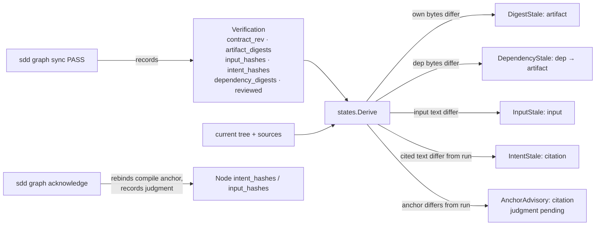

# VerificationFreshness — Staleness Keyed on What a Proof Consumed

## Overview
`STALE` means "the old evidence no longer qualifies as current proof", never
"delivery failed" or "the earlier PASS was wrong". Today the graph reaches
that verdict from three signals, and one of them is not about content at
all. Artifact digests (own bytes) and citation and input fingerprints are
content identity. The third, sequence staleness, is ordering: `states.Derive`
carries the highest observation sequence among a node's ancestors forward,
and any consumer whose own pass is older derives STALE. A dependency re-run
against identical bytes therefore invalidates every consumer. That is the
churn the freshness analysis documents, and it doubles verification for no
evidence gain.

This design replaces the ordering proxy with content identity for
dependencies, records on each observation the anchors the run actually saw,
gives the operator a supported way to acknowledge a judged change without a
re-run, and makes every stale verdict name its cause. It builds on the proof
boundaries this branch already introduced: `contract_rev` on nodes and
observations, the reviewed set on review passes, the publication fence in
`sync`, and lineage separate from proof (`ReviewDrivenAmendment:DD-3`,
`DD-9`, `DD-11`; `GitRevisionLineage:DD-2`).

The identity a passing observation binds to becomes:

```
proof identity =
    node contract revision
  + gate definition (tests / command / lanes)
  + own artifact digests
  + declared input digests, as the run saw them
  + citation fingerprints, as the run saw them
  + each direct dependency's artifact digests, as the run saw them
  + (review nodes) the reviewed set

run anchor = commit id, worktree, isolation     — provenance, never identity
```

## Non-Goals
- **No finer-than-file hashing.** Whole-file digests plus explicit section
  inputs remain the boundary. Symbol or AST hashing is refused as a
  shortcut: imports, init side effects, build tags, and generated inputs
  evade it.
- **No automatic rebinding to changed requirement text.** A citation whose
  text changed is still a judgment; this design removes the mechanical
  obstacle after the judgment, not the judgment.
- **No inference of transitive or build inputs.** A build or runtime input
  that matters to a proof is declared as an input, where it is fingerprinted.
  There is no hidden inventory.
- **No mark-fresh verb.** Nothing here can produce GREEN without a passing
  observation at the current identity.
- **No change to red-before-green.** A revised or newly declared
  hazard-discharging test still needs an observed RED at the current
  revision (`ReviewDrivenAmendment:DD-9`).
- **No change to v1 markdown plans.**

## Architecture

### Components



- **Observation snapshot** (`model.Verification`, tool-owned additions):
  - `dependency_digests map[depID]map[artifact]digest` — every direct
    dependency's artifact digests when the pass was recorded.
  - `input_hashes map[inputKey]digest` and `intent_hashes map[citation]hash`
    — the fingerprints the run saw, distinct from the node's compile-time
    anchors of the same names.
  Recorded by `sync` for pass and fail alike; a fail's snapshot is
  informational.
- **Derivation** (`states.Derive`):
  - `DependencyStale []string` replaces `SeqStale`. For each direct dep,
    compare the recorded digests with the dep's current artifact digests
    (and, when a dep is itself STALE by its own bytes, that propagates the
    same way). A dep re-synced with identical bytes changes nothing.
  - `IntentStale` and `InputStale` compare the observation's snapshot with
    the current fingerprints. GREEN is possible after a judged change as soon
    as a fresh pass records the new snapshot.
  - `AnchorAdvisory []string` is new and non-stale: citations or inputs whose
    node-level compile anchor differs from the observation snapshot. It says
    "text changed since the anchor; a judgment is owed", and `graph next`
    and `show` surface it, but it does not withhold GREEN.
  - Sequence numbers remain for ordering, red-before-green, and the
    amendment register; they no longer derive staleness.
- **Acknowledge** (`sdd graph acknowledge --plan P --node N
  [--citation ID | --input KEY] --expect-digest D [--by W]`): rebinds the
  node's compile-time anchor for one citation or input to the current text,
  appending an `acknowledgements` record (node, key, old hash, new hash,
  identity, seq). Allowed on verified nodes. It changes anchors only; it
  never writes an observation, so it cannot green anything. `repair-intent`
  and `set-inputs` refuse verified nodes and now point at it; `rehash`
  recomputes anchors without that guard and remains the bulk form for
  unverified nodes.
- **Narrowing** (`set-inputs` on a verified node): permitted when the
  replacement input is a section of an already-declared whole-file input
  and the section's current digest equals the digest the observation
  snapshot recorded for that file's section. Provable from the snapshot;
  no re-run.
- **Reporting**: `show` prints each stale axis with the changed item and the
  remedy; `status --json` carries `reasons` per node: `digest`, `dependency`,
  `input`, `intent`, `revision`, `review`, `isolation`, each with its items,
  plus `advisories`.

### Data Flow
1. `sync` folds the report, snapshots the identity above from the tree and
   the source set it resolved against, and publishes under the existing
   contract fence (`ReviewDrivenAmendment:DD-11`).
2. A dependency is re-synced. Its consumers' `dependency_digests` are
   compared with the dependency's current bytes. Identical: nothing. Changed:
   `DependencyStale` names the dep and the changed artifact.
3. A requirement's text changes. Consumers derive `IntentStale` until a new
   pass records the new fingerprint. The compile anchor still differs, so the
   `AnchorAdvisory` stays until `acknowledge` records the judgment.
4. A declared whole-file input drifts in a region the proof did not exercise.
   The operator narrows the input to the exercised section; the digest match
   against the snapshot proves the narrowing is faithful; the node stays GREEN.

### Interfaces
| Command | Change |
|---|---|
| `sdd graph sync` | records `dependency_digests` (always, from the same tree its own artifacts are digested from) and, when the plan's sources resolve from the planning root, the run's `input_hashes` / `intent_hashes`; no flag change. Sync now loads the plan's citation sources for the snapshot, the same load `compile` and `next` perform |
| `sdd graph acknowledge --plan P --node N (--citation ID \| --input KEY) --expect-digest D [--by W]` | new; rebinds one compile anchor and records the judgment; refuses on digest mismatch, unknown key, or a citation that no longer resolves |
| `sdd graph set-inputs` | new eligibility: narrowing a declared file to a section on a verified node when the section digest matches the snapshot |
| `sdd graph show` / `status --json` | per-axis reasons with items and remedies; `advisories` listed separately |
| `sdd graph repair-intent`, `rehash` | unchanged for unverified nodes; on verified nodes they point at `acknowledge` |

Wire additions are tool-owned and refused in proposals: `dependency_digests`,
observation-level `input_hashes` and `intent_hashes`, `acknowledgements`.
Absent fields on older observations decode as "not recorded".

## Design Decisions

- **DD-1**: Dependency staleness is content identity, not observation order.
  Refines `SddGraph:DD-6` (digest anchoring stays) and supersedes the
  "ancestor re-verified with higher seq" transition in SddGraph § Node
  States. Scope: dependency identity is the dependency's artifact bytes. A
  contract-only change on a dependency is covered separately: review nodes
  bind to reviewed contract revisions (`ReviewDrivenAmendment:DD-9`), and a
  work node consuming a changed contract with identical bytes is, by
  construction, unaffected until the bytes change — the handoff's
  "consumed contract" aspect is therefore the review node's concern, not
  `DependencyStale`'s.
  Context: `SeqStale` fires on any newer ancestor observation, including a
  re-run against identical bytes; the freshness analysis's `seq_stale` cases
  are all this. Options considered: (a) keep ordering and tune when it
  fires; (b) record each direct dependency's artifact digests on the
  consumer's observation and compare bytes. Decision: (b). Rationale: the
  question a consumer needs answered is "did the implementation I exercised
  change", and bytes answer it; order never did. Sequence numbers stay for
  ordering and red-before-green.

- **DD-2**: An observation records the anchors the run saw.
  Context: intent and input staleness compare the node's compile-time
  anchors with current text, so a clean re-verify after a judged change
  cannot reach GREEN until a repair verb rebinds the anchor, and the repair
  verbs refuse verified nodes. Options considered: (a) let a pass rebind the
  node's anchors; (b) snapshot the fingerprints on the observation and derive
  staleness from the snapshot, leaving the anchors as a separate advisory.
  Decision: (b). Rationale: evidence is bound to what it ran against, which is
  the freshness analysis's central ask, while the compile anchor keeps its
  meaning as "the text this node was written for". Rebinding anchors from a
  pass would let a changed requirement slip through on tests written for the
  old one.

- **DD-3**: Judgment is recorded by `acknowledge`, and it cannot green.
  Context: after the operator judges a requirement change cosmetic, the tool
  had no supported path to say so on a verified node. Options considered:
  (a) allow `rehash` on verified nodes; (b) a dedicated verb that rebinds one
  anchor, records old and new hash plus identity, and is fenced like an
  amendment. Decision: (b). Rationale: the record of who judged what is the
  difference between an acknowledgement and a mark-fresh button; and because
  the verb writes no observation, GREEN still needs a pass at the current
  identity.

- **DD-4**: Whole-file inputs stay; narrowing is provable.
  Context: a whole-file input drifted in a region the proof never exercised.
  Options considered: (a) hash sections or symbols implicitly; (b) keep files
  as the baseline and let `set-inputs` narrow a declared file to a section on
  a verified node when the section's current digest equals the snapshot's.
  Decision: (b). Rationale: the boundary stays explicit and declared; the
  narrowing is checked against recorded evidence, not asserted.

- **DD-5**: Every stale verdict names the changed item and the remedy, and
  advisories are not staleness.
  Context: an opaque STALE routes the driver to a re-run whether or not one
  is needed. Options considered: (a) one flag; (b) per-axis reasons with
  items in `show` and `status --json`, and a separate advisory list for
  anchor drift. Decision: (b). Rationale: the remedies differ — re-run,
  narrow an input, acknowledge a judgment, rework — and only the reason
  tells them apart.

- **DD-6**: Transitive and build inputs are declared, never inferred.
  Context: an omitted input yields false-fresh evidence. Options
  considered: (a) discover inputs from the build; (b) declare them as inputs
  and fingerprint them like any other. Decision: (b). Rationale: discovery is
  language- and build-specific and silently incomplete; a declared input is
  visible, reviewable, and fingerprinted. The plan reviewer's scope lens
  asks whether a node's inputs cover what its gate reads.

## Error Handling
| Condition | Detection | Response |
|---|---|---|
| Dependency's current artifact missing or unreadable | digester returns "" | `DependencyStale` naming the dep and artifact |
| Observation predates dependency digests | field absent | dependency axis reports "not recorded"; sequence semantics apply to that observation only, until re-synced |
| Observation predates anchor snapshot | fields absent | intent/input axes fall back to the node's compile anchors (today's behavior) for that observation |
| `acknowledge` on unknown citation or input key | key lookup | refuse, naming the node's keys |
| `acknowledge` where the citation no longer resolves | citation index | refuse; an anchor cannot point at nothing |
| `acknowledge` digest mismatch | `--expect-digest` | refuse; re-read and re-judge |
| Narrowing whose section digest differs from the snapshot | digest compare | refuse; the run did not see those bytes, re-run instead |
| Proposal carries any of the new tool-owned fields | strict decoder | refuse (existing posture) |

## Testing Strategy
Acceptance criteria, each with a positive and a negative control, in
`internal/graph/states`, `internal/graph/sync`, and `internal/graph/ops`:

| Criterion | Positive control | Negative control |
|---|---|---|
| Identical-input rerun | dep re-synced with identical bytes; consumer stays GREEN, no `DependencyStale` | dep's artifact bytes change; consumer `DependencyStale` names dep and artifact |
| Ordering no longer stales | ancestor observation with a higher seq and identical bytes leaves the consumer GREEN | (as above) |
| Scheduling-only dep | dep with no artifacts re-synced; consumer unaffected | — |
| Contract change | dep `contract_rev` advances; consumer review (reviewed set) stales; consumer work node unaffected unless bytes changed | dep contract unchanged, bytes changed: consumer `DependencyStale` |
| Snapshot binds intent | requirement text changes, node re-verified cleanly → GREEN with an advisory | no re-verify → `IntentStale` |
| Snapshot binds inputs | declared input changes, node re-verified → GREEN with advisory | no re-verify → `InputStale` |
| Acknowledge cannot green | `acknowledge` on a STALE node leaves it STALE; advisory cleared | `acknowledge` with a stale expect digest refuses |
| Acknowledge records judgment | `acknowledgements` gains one record with old/new hash and identity | unknown key refused |
| Narrowing is provable | section digest equals snapshot → `set-inputs` succeeds on a verified node, node GREEN | section digest differs → refused |
| Fail snapshots | a RED records its snapshot and derives RED, unchanged | — |
| Legacy observations | no dependency digests → sequence semantics for that observation only | mixed graph: re-synced nodes use digests, others keep sequence |
| Reporting | `status --json` `reasons` lists each axis with items | advisories never set the state to STALE |
| Fence intact | sync's publication fence still refuses a contract change during evaluation | unrelated concurrent write survives |

Migration fixtures: this repo's two completed graphs derive identically
before and after, since their observations carry no dependency digests.

### Structural Verification
Per `shared/language-verification.md` for Go: `go build`, `go vet`,
`go test -race ./internal/graph/...` (the snapshot is taken inside the same
CAS attempt the fence guards), `staticcheck` when installed; strict decoding
of every new field; `sdd template graph-proposal --schema` unchanged since
nothing new is proposal-visible.

## Migration / Rollout
1. Ordinary commits on `sdd-design`, not a graph plan. Tests are the gate.
2. Land DD-1 and DD-2 together: `sync` records the snapshot, `Derive`
   consumes it, `SeqStale` removed from `NodeState` and its readers
   (`show`, `status`, the implement skill's reaction protocol).
3. Land DD-3 (`acknowledge`) with its guard classification (mutating) and
   flag-table entry; point `repair-intent` and `set-inputs` refusals at it.
4. Land DD-4 narrowing and DD-5 reporting.
5. Docs: the implement skill's reaction protocol gains the
   `DEPENDENCY-STALE` and advisory rows and the acknowledge step;
   `shared/frontmatter-schema.md` records the observation fields;
   `skills/sdd-cli` maps the verb; portable trees regenerate.
6. No version bump on this branch.

## Open Questions
- **Should `DependencyStale` propagate transitively through a dep that is
  itself STALE by dependency?** Decided yes, as built: a dep whose own
  dependency changed ripples upward, so the cascade the sequence proxy
  provided is kept while identity stays content-based. **non-blocking** —
  recorded here for the record.
- **Should a fail observation's snapshot be compared at all?** Current
  answer: no, a RED is a RED. **non-blocking** — it affects reporting only.
- **Should `acknowledge` accept several keys at once?** Current answer:
  one per call, one record each. **non-blocking** — a batch form is additive.
