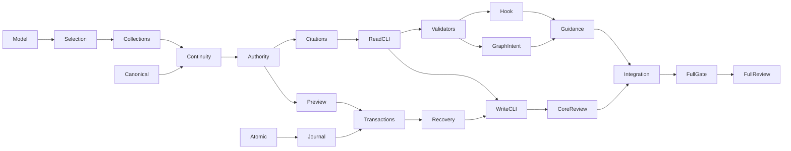

# Fork-Aware Decision Ledgers

## Overview
Build the complete L-scope fork-aware decision feature before TestSuiteReliability: explicit config selection, planning-root storage, qualified identity and source continuity, effective authority, exact-approved mutations/recovery, and every required reader/workflow. The user confirmed the full feature and hazard triage. The compiled graph is the implementation source of truth; this README is identity/context plus generated views, never an alternate task list.

## Non-Goals
No actual downstream adoption, repository/module migration, inherited-ledger editing, new persistent repo-root selectors/support files, remote fetch/authentication, semantic auto-reconciliation, scope remapping, multi-parent inheritance, or change to graph completion/reviewer isolation. No implementation of the deferred TestSuiteReliability initiative and no publishing. Legacy diagnostics and frozen expectations remain the compatibility oracle.

## Architecture
Typed decision models, canonical entry encoding and the byte-oriented atomic store start independently. The model feeds config selection; source loading/continuity joins selection with canonical bases and feeds parent-first authority/citation scope. Exact-change previews join that authority model with journaled publication/recovery. CLI, validation, graph-intent and hook consumers then converge into portable guidance and end-to-end acceptance. Review gates freeze the authority core and the complete feature; the full repository gate remains required.

## Key Decisions
- D-0025 records approved config-selected, logically repository-owned authority with internal/external planning-root storage; it supersedes the former physical-location restriction. D-0018 still gates every real ledger/authority write with exact-text approval.
- User confirmed L/full scope and the six workstream hazard groups. Each implementation node below uses applicable hazards from that confirmed vocabulary; test shapes follow `sdd graph hazards`. Pure review/command gates perform no implementation and are shown separately in graph readback.
- D-0022 requires actual red/green reports, clean revision anchors, and frozen full four-lane review before closure. D-0024 confines lifecycle commits to boundaries; local plan/task commits are authorized, publishing is not.
- Private helpers may land before public activation, but no intermediate release may advertise fork support while a required consumer can silently use a single-file legacy path. The core review and final consumer agreement tests guard that integration boundary.
- Named tests are prospective contracts and must be introduced at a compilable seam; an absent package or build error is not hazard-specific red evidence. CLI cases use real subprocesses; concurrency cases fail with a no-op guard; replay cases compare independent same-seed traces; derived-state cases use independent expected sets; prose cases exercise commands and referenced artifacts.

## Dependencies
Approved related spec/design and accepted D-0025. Existing Go toolchain, local Git and native Windows/POSIX verification runners; no external SCM service. The feature does not depend on TestSuiteReliability. Existing whole-root stale-waiver findings in Plans/SddGraph are outside this implementation and must not be hidden; report any actual command refusal they cause.

<!-- graph-view:begin — generated section, do not edit -->

## Graph View

<!-- GENERATED VIEW — source of truth: ForkAwareDecisionLedgers-Graph.json. Regenerate with `sdd compile --plan ForkAwareDecisionLedgers`. Edits here are overwritten. -->

| Phase | Nodes | Doc |
|---|---|---|
| 1: 01-foundations | 6 | `01-foundations.md` |
| 2: 02-authority | 14 | `02-authority.md` |
| 3: 03-consumers | 15 | `03-consumers.md` |
| 4: 04-integration | 9 | `04-integration.md` |

44 node(s) total. The committed graph (`ForkAwareDecisionLedgers-Graph.json`) is the source of
truth; these documents are projections.

<!-- graph-view:end -->

## Plan Completion Evidence
Pending — not complete.

## Open Questions
- Numeric diagnostic allocation — **non-blocking** — Use unused codes from the live registry while preserving the specified severity and exit contract.
- Native verification availability — **non-blocking** — Missing platform evidence leaves the relevant graph gate unverified; it does not authorize a platform waiver or alter the feature contract.
