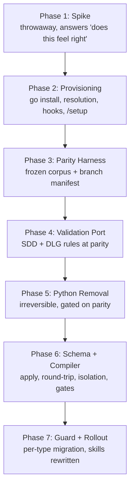

# SDD Toolchain

## Overview
Implements `Specs/SDD-Toolchain`: one cross-platform Go binary, `sdd`, that owns
every mechanical operation on SDD artifacts — validation, artifact construction,
identifier and linkage management, status gates, and the plugin's Claude Code
hooks — replacing the Python validators and shell hooks.

The plan is ordered around one principle: **learn before committing, and prove
before deleting.** Phase 1 is a throwaway spike that answers the only question
capable of invalidating the design, before any production code is written. Phases
3 through 5 build the parity apparatus, port the rules, and only then delete
Python. Phase 6 builds the compiler the spike validated, and Phase 7 makes it the
only writer, one artifact type at a time.

Two sequencing constraints are load-bearing rather than stylistic. The compiler
cannot precede Python's removal (FR-33), because a normalizer rewriting artifact
bytes would invalidate the byte-level differential comparison the parity gates
depend on. And the frozen corpus must predate the first ported rule (FR-30),
because a corpus written after the port would be shaped to match it.

## Non-Goals
Carried forward from `Specs/SDD-Toolchain` § Non-Goals: no semantic or
model-judgment checks in any deterministic subcommand; no authoring, rewriting, or
evaluating of prose; no conversion of artifact bodies to YAML, JSON, or HTML; no
external issue tracker (D-0010 stands); no execution of recorded evidence
commands; no general Markdown formatter; no artifact schema redesign beyond the
task-identifier grammar; no new SCM completion adapters; no building, downloading,
compiling, or self-updating by the plugin (D-0015); no prebuilt binaries in the
payload.

Decided during planning:

- **No production code in Phase 1.** The spike is throwaway by construction. If
  its code proves useful it is rewritten in Phase 6 against the real schema, not
  promoted. Promoting spike code would smuggle unreviewed decisions into the
  production compiler.
- **No parallel work across Phases 3 to 5.** These could overlap in principle;
  they are kept serial because the parity argument depends on a strict ordering
  that concurrent work would blur.
- **No `windows/arm64` target.** Excluded from the NFR-03 portability matrix;
  adding it later is a build-matrix change with no requirement impact.
- **No port of `bump-version.py` into `sdd`.** Considered and declined: it would
  require `sdd` to exist in order to cut an `sdd` release. Python stays as
  maintainer-only release tooling.
- **No dashboard integration.** The `sdd-dashboard` companion plugin continues
  reading frontmatter directly; giving it a structured `apply` payload form is
  deferred (a non-blocking open question in the spec).

## Architecture

Two layers inside one binary. **Layer 1** (Phases 3–5) is a behavior-preserving
port: `sdd validate` and `sdd decide validate` reproduce the Python validators
except for a closed list of six named deltas. **Layer 2** (Phases 6–7) is new
capability: schema-as-data drives the parser, `apply`, generated templates, and
help text, and a `PreToolUse` hook makes the compiler the only writer of anything
another document can reference.

Phase 2 sits between the spike and the parity work because it is fully specified,
depends on neither library selection nor the parity gate, and produces the
shippable skeleton every later phase installs into.

## Key Decisions

- **The spike comes first** (Phase 1). The provisioning vertical was originally
  slated first to de-risk distribution; once D-0015 reduced distribution to
  `go install` plus a file copy, that risk evaporated and the ordering moved to
  put the falsifiable hypothesis first.
- **`go install` is the only provisioning path** (D-0015). No prebuilt binaries,
  no building by the plugin. Admission is by a `minSddVersion` floor rather than
  exact version equality, so a wording-only plugin release cannot break a working
  installation.
- **The model authors content; the tool commits it.** Prose is opaque payload;
  structure — headings, frontmatter, identifiers, references, status — is
  tool-owned. This converts silent structural drift caught later by a validator
  into loud construction-time refusal in the same turn.
- **Identifiers in a payload are assertions, not declarations** (FR-45). Verified
  against the artifact's current set rather than stripped, because re-deriving
  which payload item is which would silently re-bind live cross-document
  citations.
- **Atomicity is not isolation** (FR-48). Every mutating subcommand carries a
  read-time digest precondition, because `/implement` launches concurrent
  implementer agents and temp-file-plus-rename permits silent lost updates.
- **Normalization never happens as a side effect** (FR-46, FR-47). Completed and
  frozen artifacts are refused by `apply`; canonicalization is an explicit
  one-time per-type migration that must produce an identical validation
  diagnostic set before and after.
- **Four accepted ledger entries were superseded** rather than contradicted:
  D-0012 (validation moves to Go, severing the fork-sync channel), D-0013
  (SessionStart hook into the binary), D-0014 (reviewer guard into the binary,
  gaining the Write/Edit and `sdd`-subcommand denials), D-0015 (provisioning and
  version floor).

## Dependencies

- A Go toolchain and network access on each **user's** machine at provisioning
  time, meeting the floor declared in `go.mod`, used by the user's own
  `go install` and never invoked by the plugin.
- A Go module path equal to the repository URL
  (`github.com/danweinerdev/claude-sdd-planner`) and a publicly resolvable
  `v<version>` tag per release.
- A YAML implementation and a CommonMark parser exposing an AST with source
  positions. **Selection and version pinning is task 1.2** and discharges the
  obligation the spec's Requirements preamble places on the design;
  `Designs/Go-Validator` is superseded and is not a live source.
- Git, for the SCM-specific integration tests and runtime identity checks.
- GNU Make or a compatible `make`.
- Python on **maintainer** machines only, for `bump-version.py` and the generated
  version source.
- `current-test-coverage.csv` beside `Specs/SDD-Toolchain`, the normative parity
  manifest for Phase 3.

## Plan Completion Evidence

Pending — not complete.

## Open Questions
- What is the minimum Go version? — **non-blocking** — `go.mod` must declare one and the user's own `go install` enforces it with Go's native error; the value follows from the libraries selected in task 1.2, and no requirement depends on which number it is.
- Does `apply` need a structured payload form for machine callers such as `sdd-dashboard`? — **non-blocking** — Markdown-only keeps one parse path for v1, and adding a second input form later is additive and changes no requirement or task in this plan.
- Should `windows/arm64` join the portability matrix? — **non-blocking** — it is a build-matrix entry with no behavioral requirement impact, addable at any point without reworking a phase.
