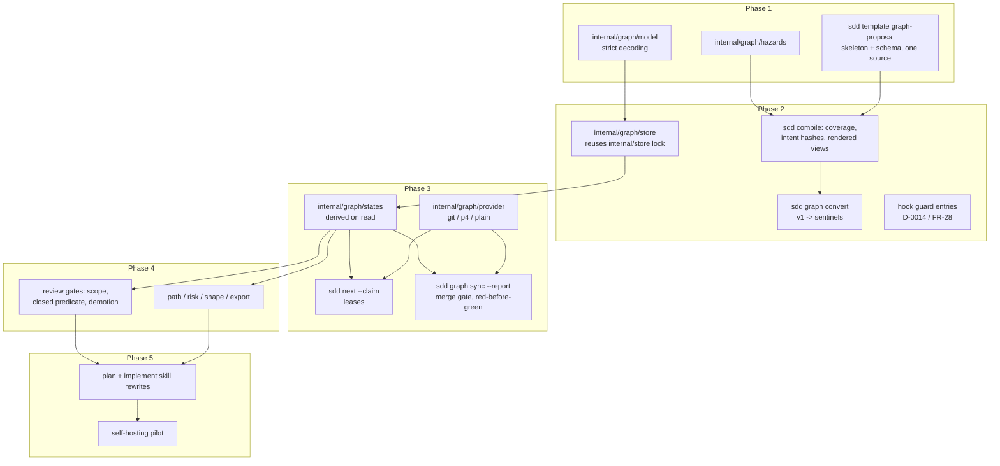

# SddGraph Implementation

## Overview

Implements `Designs/SddGraph`: the plan-as-graph, observation-gated execution
model. A plan compiles from JSON payloads into a committed dependency graph of
test-gated nodes; node state (BLOCKED / READY / RED / GREEN / STALE) is derived
on read from structure plus recorded observations; the only path to GREEN is a
mechanical artifact synced through the `sdd` binary (D-0022); review weight
attaches to feature gates whose full validation cycle *truly closes* their
dependency closure (DD-9). Plan and phase markdown become rendered views of
the graph (DD-1, DD-2).

The five phases mirror the design's own rollout section: each is
independently shippable, and the mechanism protecting each honesty property
lands in the same phase as the property itself (e.g., red-before-green ships
with sync-only completion in phase 3, per DD-5).

## Non-Goals

Carried forward from `Designs/SddGraph` § Non-Goals, plus planning-time
boundaries:

- **Not a source-control system.** Observations store digests, anchors, and
  file lists — never diffs.
- **No parallel verification for Perforce.** The p4 provider ships at
  capacity 1 (single client, single pending CL) per DD-8; shelve-windows and
  narrow clients are out of scope.
- **No new gate plugins.** The gate vocabulary is closed: `tests`,
  `command`, `review` (DD-9).
- **The prose intent layer is untouched.** Specs and designs continue
  through `sdd apply` (DD-1); no work in this plan modifies the FR-17
  Markdown-proposal compiler beyond guard-surface entries.
- **No plan/phase markdown compiler.** The FR-36 plan/phase leg is
  superseded (recorded in `Specs/SDD-Toolchain` FR-36's amendment); building
  it is a scope violation.
- **No artifact directory re-layout.** Spec/design naming stays as-is
  (design OQ-1); rendered views keep `README.md` + numbered phase docs.
- **No browser/UI companion.** Analytics are CLI subcommands with `--json`;
  a live dashboard is future work no requirement demands.
- **No autonomous frontier dispatch policy.** `next --claim` serves one node
  to the caller; multi-agent orchestration policy lives in skills, not the
  binary (`shared/autonomy.md` boundaries hold).

## Architecture

New code lands under `internal/graph/` (model, hazards, store, compile,
states, algorithms, sync, claims, provider) with CLI surfaces in `cmd/sdd/`
(`graph.go` verb tree; `next.go` extended). `internal/store`'s lock/atomic
primitives, `internal/vcs`'s adapters, `internal/schema`'s
template-coverage-test pattern, and `internal/hook`'s guard are reused, not
duplicated.

## Key Decisions

- **Phase order follows the design's rollout (DD-1..DD-16)** — notably
  red-before-green enforcement lands in phase 3 *with* sync-only completion,
  not after it (DD-5), and guard entries land in the same revision as each
  new verb (D-0014, FR-44 discipline).
- **`internal/graph/` is a sibling package family, not an extension of
  `internal/compile`** — the markdown-artifact compiler and the graph
  compiler share the store lock and schema-gate patterns but no payload
  code; conflating them would couple the FR-17 surface this plan must not
  touch.
- **Report formats for v1 sync: JUnit XML and `go test -json`.** This repo
  is the self-hosting target, so the Go-native format is required; JUnit
  covers pytest/ctest/gradle emitters generically. pytest-JSON is deferred
  until a consumer exists (necessity rule).
- **Lease TTL default 30 minutes**, key `graphLeaseTtlMinutes` in
  `planning-config.json` (resolves design OQ-2 — any value satisfies
  correctness; renewal is implicit on claim-holder store activity per
  DD-10).
- **Self-hosting pilot (task 5.4): this plan itself.** Once phase 3 lands,
  `graph convert` this plan and execute the remaining phase-5 work under
  `next`/`sync` — the design's own acceptance test.

## Dependencies

- Go toolchain + `staticcheck` (structural verification per
  `shared/language-verification.md`).
- Existing `make test` gates (regression corpus, template gate, portable
  drift/leak) stay green throughout — every phase's acceptance includes it.
- `sdd` v2.3.6+ installed for dogfooding validation runs.
- No external services, vendors, or unanswered stakeholder questions — no
  gated scope.

## Plan Completion Evidence

- Verified: 2026-09-01
- Repository: `.`
- VCS: `git`
- Revision / checkpoint: `7c55ea5966011f33cbd889e785f2385620f17ab3`
- Identity recheck: `git rev-parse HEAD` at 2026-09-01 00:00 matched `7c55ea5966011f33cbd889e785f2385620f17ab3`

| Command | Working directory | Result | Observable evidence |
|---|---|---|---|
| `make test` | `.` | PASS (`exit 0`) | `full gate green at the plan-close head (v2.8.0): template gate with the graph-proposal pair, portable drift and leak gates, the frozen regression corpus, and the entire go suite covering all five phases' deliverables — model and strict decoding, hazards vocabulary, proposal staging and compile with rendered views, convert, guards, derived states, claims and providers, sync with the merge gate, split/set-tests/gc with branch pruning, review gates with the closed predicate, analytics, fuzz corpora, the rewritten skills' regenerated trees, AC-coverage scoping, and v1-graph validation coexistence; every phase closed on a persisted frozen Aligned four-lane review and evidence-gated task identities` |

| Tool / inspection | Context | Result | Observable evidence |
|---|---|---|---|
| `self-hosting acceptance (design § Testing Strategy)` | `the plan converted itself and walked its own remaining work with the binary it built` | PASS | `SddGraph-Graph.json is committed as the living integration fixture: 31 nodes, GREEN=30 closed=30/31, five phase gates greened from the five real frozen review artifacts, two pilot nodes walked claim-red-green-merge-integrate with red_seq armed before every green, and only the terminal gate honestly open awaiting a plan-level review artifact; the pilot's nine-entry finding list is recorded in task 5.4's evidence with every material entry filed and fixed as tasks 5.5/5.6` |

### Completed phase identities

- `1`: `edee5d595b069bb5a76505c9fc611bfac2df1efd`; review: `Plans/SddGraph/reviews/04-sddgraph-code-review-edee5d5.md`
- `2`: `39a31750362225d3ce885477f68621a70f470eac`; review: `Plans/SddGraph/reviews/05-sddgraph-code-review-39a3175.md`
- `3`: `55f24cf20c1bb2bb1911a0cf1cc38a84e31359e8`; review: `Plans/SddGraph/reviews/06-sddgraph-code-review-55f24cf.md`
- `4`: `8ba800581a7ab1a127de5294f051d32e9b46eef3`; review: `Plans/SddGraph/reviews/07-sddgraph-code-review-8ba8005.md`
- `5`: `2ba187c1d778593babcf509de6fb1f2fc9467086`; review: `Plans/SddGraph/reviews/08-sddgraph-code-review-2ba187c.md`
## Graph View

<!-- GENERATED VIEW — source of truth: SddGraph-Graph.json. Regenerate with `sdd compile --plan SddGraph`. Edits here are overwritten. -->

| Phase | Nodes | Doc |
|---|---|---|
| 1: v2-1-payload-schema | 4 | `01-v2-1-payload-schema.md` |
| 2: v2-2-store-compiler-convert | 7 | `02-v2-2-store-compiler-convert.md` |
| 3: v2-3-execution-loop | 7 | `03-v2-3-execution-loop.md` |
| 4: v2-4-review-gates-analytics | 4 | `04-v2-4-review-gates-analytics.md` |
| 5: v2-5-skills-self-hosting | 9 | `05-v2-5-skills-self-hosting.md` |

31 node(s) total. The committed graph (`SddGraph-Graph.json`) is the source of
truth; these documents are projections.

<!-- graph-view:end -->
