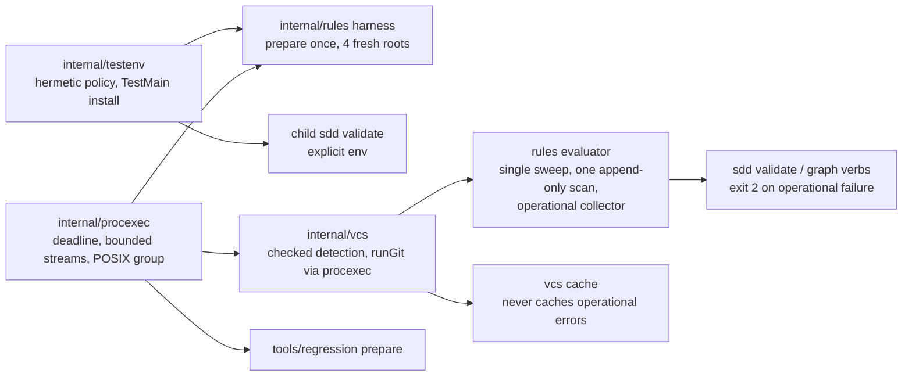

# Test Suite Reliability

<!-- /validate format contract:
- Store this document as UTF-8 with LF line endings and keep the YAML
  frontmatter as a mapping between standalone `---` delimiters.
- Keep `title`, `type`, `status`, `created`, `updated`, `tags`, and `related`;
  dates use `YYYY-MM-DD` and status is one of `draft`, `approved`, `active`,
  `complete`, or `archived`.
- Keep every H2 heading supplied by this template with exactly the shown text.
- Keep `tags`, `related`, `phases`, and every `depends_on` value as YAML lists.
  Related values are nonempty planning-root-relative artifact paths that
  resolve; do not use absolute paths, backslashes, `.` segments, or `..`.
- Every phase mapping requires nonempty `id`, `title`, `status`, and `doc`.
  Phase IDs are unique; status uses the phase status vocabulary; `doc` is
  relative to this README and resolves to a `type: phase` document whose
  `plan`, `title`, `phase`, and `status` match this plan and entry. Every phase
  document is listed exactly once by the README in its physical plan directory.
  Dependencies reference phase IDs in this plan and contain no unknown IDs,
  self-dependencies, or cycles.
- An approved, active, or complete plan must cite every FR-NN, NFR-NN, and
  AC-NN from every related spec in phase task verification/detail or phase
  Acceptance Criteria. Directly related designs collectively cite every
  FR-NN and NFR-NN from those specs. Requirement citations must resolve through
  the `related` graph; live artifacts do not cite superseded `pd-<hex>`
  ids without naming the successor.
- A complete plan has only complete phases and populated completion evidence.
-->

## Overview
Dogfoods the reframed graph execution loop on this repository's own Go test suite. The plan builds the Linux-verifiable slice of `Designs/TestSuiteReliability`: a hermetic Git policy installed at the test-process boundary (workstream A), prepare-once determinism with complete diagnostic comparison and a pure-logic selection (B), single-pass validation with one append-only history scan per evaluation (C), a bounded `internal/procexec` runner with POSIX process-group containment, and end-to-end operational-error propagation so an unrunnable git exits 2 instead of reading as a clean tree (the POSIX parts of E).

Every node is one red-to-green cycle with named tests; hazard-discharging tests must be observed red first. Bugs found in the `sdd` binary while executing are fixed as ordinary commits on the branch, outside this graph, and noted in the blocked node's evidence.

## Non-Goals
- Workstream D, the concurrency and process budget (`FR-10`, `FR-11`, `FR-12`, `DD-5`), and the FR-17 telemetry sink (`DD-11`): deferred to a follow-on plan together with the budget's peak-admission report (`AC-05`, `AC-09`).
- Windows Job Object containment (`FR-14` Windows half, `DD-3`) and the `windows-reference-01` performance protocol (`NFR-02`, `NFR-03`, `NFR-04`, `AC-10`): require a Windows host; deferred by design, not skipped.
- Carried forward from the spec: no removal of the full `make test` gate, required Good/Bad examples, frozen corpus checks, template checks, or portable drift/leak checks; no regeneration of frozen expectations; no workstation-wide configuration mutation, daemon cleanup, external service, or live SCM server; no blanket hermetic environment on production commands; no change to the graph scheduler, compiler, state derivation, or review protocol.
- No SHA-256 Git support, no AST-level hashing, and no new public fixture framework: fixture helpers stay in `internal/rules` test files.
- No version bump on this branch; unofficial marker strings only.

## Architecture

Three independent roots start the work in parallel: `test-git-policy` (A), `single-pass-evaluation` (C) and `bounded-runner` (E). Checked detection depends on the runner because `runGit` migrates onto it; the propagation nodes depend on both the checked adapter and the single-pass evaluator because the failure collector is per-evaluation. Two full review gates close the fixture slice and the execution slice; `full-gate` runs `go vet` plus `make test` as the integration acceptance, and `review-final` is the terminal gate.

## Key Decisions
Recorded in `TestSuiteReliability-Decisions.json`. The design's `DD-1` through `DD-11` were copied in verbatim by compile (`pd-7f39c654` through `pd-44444375`); planning-session decisions are appended by `sdd decide add` after approval and cited here:

- Source of truth is the design, related directly, so spec acceptance criteria are covered transitively and the deferred Windows/budget criteria do not refuse compile (pd-4c883a6f).
- Owned execution is the `procexec` runner with POSIX containment (`DD-2`, `DD-4`); the Windows adapter waits for a Windows host (pd-52a6f11c).
- All seven `vcs.Detect` call sites migrate to checked detection across two nodes (`DD-10`); no intermediate slice erases a failure.
- Tool bugs surfaced while executing are inline commits outside the graph (interview assumption, not a recorded decision).
- Hazard triage per node as compiled: `user-entrypoint` on the child-process tests, `deterministic-replay` on complete diagnostic comparison, `order-sensitive` on rule-order independence, `derives-state` on the corpus-backed evaluator equivalence, `concurrent-access` on owned-process lifecycle; every other node is an explicit empty list.

## Dependencies
- `Designs/TestSuiteReliability` (approved 2026-09-13) and, through it, `Specs/TestSuiteReliability` (approved 2026-09-13), `Specs/SDD-Toolchain`, `Designs/SddGraph`.
- Go toolchain and a local `git` executable; the suite stays offline. `staticcheck` when installed.
- The `sdd` binary built from this branch (`2.10.0-sdd-redesign-4` or later) on PATH for child-process tests and the `post-rewrite` capture hook.
- Assumptions: this host is Linux, so POSIX lifecycle tests run natively and Windows evidence is out of scope; the `internal/dlg` package the earlier design draft named no longer exists on this branch.

## Graph View

<!-- GENERATED VIEW — source of truth: TestSuiteReliability-Graph.json. Regenerate with `sdd compile --plan TestSuiteReliability`. Edits here are overwritten. -->

| Phase | Nodes | Doc |
|---|---|---|
| 1: 01-hermetic-git | 2 | `01-hermetic-git.md` |
| 2: 02-determinism | 3 | `02-determinism.md` |
| 3: 03-single-pass | 2 | `03-single-pass.md` |
| 4: 04-owned-execution | 3 | `04-owned-execution.md` |
| 5: 05-propagation | 4 | `05-propagation.md` |
| 6: 06-acceptance | 4 | `06-acceptance.md` |

18 node(s) total. The committed graph (`TestSuiteReliability-Graph.json`) is the source of
truth; these documents are projections.

<!-- graph-view:end -->

## Plan Completion Evidence

<!-- Keep the exact `Pending — not complete.` line until completion. Evidence
uses the exact labels `Verified`, `Repository`, `VCS`, `Revision / checkpoint`,
and `Identity recheck`, each exactly once visibly as `- <label>: <value>`.
`Verified` is `YYYY-MM-DD`; `Repository` is the exact resolved target root,
recorded home-anchored (`~/...`) — never a literal `/home/<user>` prefix, and
no credentials or user-identifying paths anywhere in evidence
(shared/frontmatter-schema.md § Sensitive Data);
`VCS` identifies a validated SCM adapter; record the tested native SCM
 revision/checkpoint. Git adapter: plan `Revision / checkpoint` is a full
 40-hex native Git commit and may be a validated integration merge. The
 non-merge rule applies only to atomic task implementation evidence; commit
 implementation before recording evidence, then record lifecycle/evidence
 bookkeeping in the phase- or plan-close commit — never per task (`shared/autonomy.md` § SCM boundary cadence).
 Dirty Git, no-SCM, and unsupported SCM adapters remain non-complete. The exact table columns are `Command | Working directory | Result | Observable evidence`
or `Tool / inspection | Context | Result | Observable evidence`. Command
results use `PASS (exit 0)` — or `PASS (exit N, expected)` for a deliberate
expected-failure run; tool/inspection results use `PASS`. `Identity
recheck` names the tool, an ISO date/time through minutes, and a
matched/matching identity. Follow shared/completion-evidence.md for identity and
durability rules. A complete plan uses `### Completed phase identities` with one
`- <phase id>: <phase checkpoint>; review: <final review path>` line per phase.
Record required independent plan rows; do not add child-evidence rollup
sections. -->
Pending — not complete.

<!-- Optional — include only when questions are open; a plan cannot be
     approved/active/complete while a blocking question remains. Every retained
     question goes in an `## Open Questions` section and uses the exact form
     `- {{QUESTION}} — **non-blocking** — {{WHY_THE_PLAN_HOLDS_REGARDLESS}}`. -->
