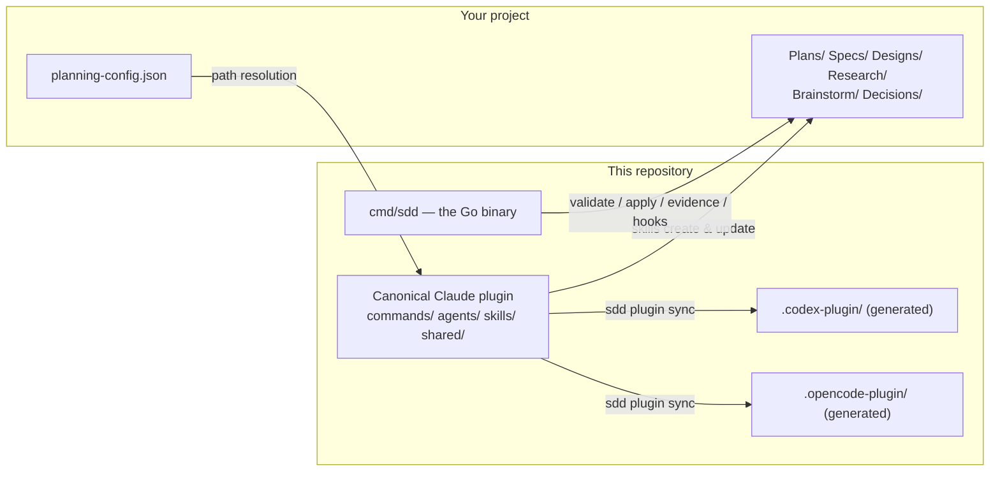
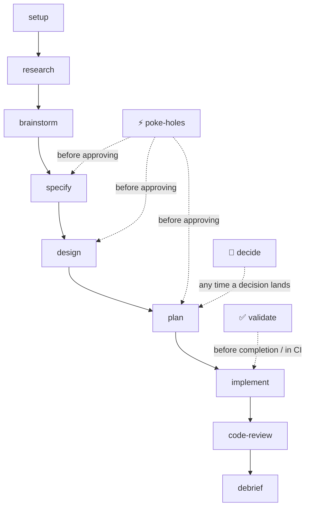

# SDD Planner

Spec-driven development for AI coding agents — a full planning lifecycle (research → brainstorm → specify → design → plan → implement → code-review → debrief) built on YAML-frontmatter Markdown artifacts, intent-isolated review agents, and a deterministic Go validator.

One repository, three harnesses:

| Harness | Install from | Form |
|---|---|---|
| **Claude Code** | repo root (`--plugin-dir` or a marketplace) | 12 slash commands (`/sdd-planner:*`) + 8 subagents + hooks |
| **Codex** | [`.codex-plugin/`](.codex-plugin/) | 14 `sdd-*` skills, selected by description |
| **OpenCode** | [`.opencode-plugin/`](.opencode-plugin/) | same skills via `.agents` skill discovery |

The Codex/OpenCode trees are **generated** from the canonical Claude tree by `sdd plugin sync` and released in lockstep — same lifecycle, same conventions, same validator. See [the portable README](portable-overrides/README.md) for details on those runtimes.

## How It Works

Skills guide the planning lifecycle and write Markdown artifacts whose YAML frontmatter is the machine-readable layer. The `sdd` binary enforces the contracts deterministically — artifact structure, status transitions, completion evidence, decision-ledger consistency — so "done" is a verdict, not a vibe.



## Quick Start

### 1. Install the `sdd` binary (all harnesses)

The skills and hooks drive one cross-platform Go binary. The plugin does not ship or build it — install it once per machine:

```bash
go install github.com/danweinerdev/claude-sdd-planner/v2/cmd/sdd@latest
```

Go and network access are needed at install time only. Setup verifies the binary against the plugin's `minSddVersion` before touching anything and stops with the exact command if it's missing or too old.

### 2. Load the plugin

**Claude Code:**

```bash
claude --plugin-dir /path/to/claude-sdd-planner
> /sdd-planner:setup        # generates planning-config.json, bootstraps directories
> /sdd-planner:specify      # ...and off you go
```

**OpenCode:** point a skills discovery path at the generated tree — e.g. `ln -s /path/to/claude-sdd-planner/.opencode-plugin ~/.agents` — then ask naturally: *"set up spec-driven planning in this repository"*.

**Codex:** install `.codex-plugin/` via a marketplace that carries it, start a new thread, and ask the same way.

### Git worktrees

Run setup in each worktree; it auto-detects worktrees and inherits `planningRoot` from siblings:

```bash
> /sdd-planner:setup /path/to/worktree --planning-root /path/to/planning-repo   # first worktree
> /sdd-planner:setup /path/to/another-worktree                                  # inherited
```

## Graph sources and historical retirement

Graph nodes distinguish **justifies** (requirement IDs), **inputs** (read-only context),
and **artifacts** (implementation write sets). An input can reference any whole file or
a uniquely selected Markdown section, including PRDs outside the planning directory:

```json
{
  "root": "repository",
  "path": "docs/PRDs/Feature.md",
  "section": {"heading_path": ["Storage", "Durability"]}
}
```

`repository` resolves against the plan's configured target repository; `planning` uses
the planning root. Markdown inputs need no SDD frontmatter. A heading-path suffix must
select exactly one section (including its nested subsections); missing or ambiguous
matches refuse rather than falling back. Compile and split fingerprint the selected
content, and edits outside that selection do not stale it. Missing inputs refuse claims.

`sdd graph set-inputs --plan Feature --node storage --file inputs.json --dry-run`
previews a JSON input array for an untouched node; remove `--dry-run` to apply.
`sdd graph audit --plan Feature --json` reports source coverage, input resolution,
source staleness, test identity sharing and structural findings using the compiler's
own checks. FR/NFR/DD coverage is reported separately from mandatory AC coverage.

Historical retirement is different: the old file can leave the worktree while an ID
retains a verifiable location in Git. For example (substitute actual plan/IDs/paths):

```bash
sdd graph retire --plan Feature --id task-1-1 \
  --source-rev HEAD --source-path .plans/Plans/Feature/01-Old.md \
  --source-id 1.1 --replaced-by storage --dry-run
```

The tool resolves `HEAD` to an immutable commit, checks the original ID is declared in
that historical file, and records the source plus replacement IDs. Remove `--dry-run`
to record it. Existing retired IDs can gain provenance, but recorded provenance cannot
be rewritten. The Git repository containing the plan supplies the history, even if the
plan targets a different implementation repository. These are historical records, not
live inputs or completion evidence. A missing Git object is reported as unverifiable;
the tool neither silently blesses it nor fetches history or creates retention refs.

### Linear Git history and revision lineage

Rebase parallel graph-node branches onto the latest primary branch, then
fast-forward it; do not create merge commits. `sdd doctor` installs or restores
the Git `post-rewrite` capture hook while preserving an existing user hook.
`sdd doctor --check` diagnoses it without writing. These repository hooks work
with all runtimes, independently of Claude Code's plugin hooks.

The hook prints a Git-private mapping file. For already-recorded commits, use
`sdd graph remap-revisions --plan Feature --map <file> --dry-run`, then apply
with the printed `--expect-digest`. This records old→new lineage without changing
the revision that was actually tested. Reverify rebased code before completion.
See [the Git integration workflow](shared/vcs-detection.md) for restrictions,
worktree lifetime, and the full command sequence.

## Commands

Claude Code names shown; in Codex/OpenCode the same skills are `sdd-research`, `sdd-plan`, etc., invoked by natural language.

| Command | Purpose | Output |
|---------|---------|--------|
| `/sdd-planner:setup` | Set up a repo for planning | `planning-config.json`, directories, launcher |
| `/sdd-planner:research` | Investigate a topic | `Research/<topic>.md` |
| `/sdd-planner:brainstorm` | Explore options (Idea 0 is always "do nothing") | `Brainstorm/<topic>.md` |
| `/sdd-planner:specify` | Write requirements | `Specs/<feature>/README.md` |
| `/sdd-planner:design` | Technical architecture | `Designs/<component>/README.md` |
| `/sdd-planner:plan` | Decompose work into an executable plan graph: structured interview → node payload → compile → silhouette read-back (re-run to extend; v1 plans keep the old protocol until converted) | `Plans/<Name>/` + `<Name>-Graph.json` |
| `/sdd-planner:implement` | Walk the plan graph: claim → red → green → sync → merge, observation-gated (v1 plans keep the wave protocol) | Code + observations + rendered views |
| `/sdd-planner:code-review` | Four-lane intent-isolated review | Unified report |
| `/sdd-planner:debrief` | After-action notes | `Plans/<Name>/notes/<phase>.md` |
| `/sdd-planner:poke-holes` | Adversarial critical analysis | Inline findings |
| `/sdd-planner:decide` | Record / look up a plan's decisions | `Plans/<Name>/<Name>-Decisions.json` |
| `/sdd-planner:validate` | Deterministic + semantic validation (read-only) | Findings report |



## Plan Hierarchy & Statuses

```
Plan (README.md)        draft → approved → active → complete → archived
 └── Phase (01-*.md)    planned → in-progress → complete | blocked | deferred
      └── Task           planned → in-progress → complete | blocked | deferred   (phase frontmatter)
           └── Subtask   - [ ] checklists in the phase body
```

Three contracts make the hierarchy trustworthy:

- **Evidence-gated completion** — nothing flips to `complete` without retrospective evidence: exact commands, native-SCM revision identity, a focused diff review, observable results (`shared/completion-evidence.md`). Each plan task lands as one clean, independently bisectable commit; phase completion requires a persisted, frozen, four-lane `Aligned` review.
- **Sourced necessity** — every task carries a `justifies` field naming the requirement, decision, or concrete failure that demands it, or it is cut. Plans and designs carry `## Non-Goals`.
- **Decision authority** — each plan owns a flat, append-only `Plans/<Name>/<Name>-Decisions.json`; `sdd decide add` writes an entry only after the user approves the exact statement shown in full. Intent-isolated quality/blind lanes receive no decision context.

`sdd validate` enforces the mechanically checkable parts of all three.

**Upgrading older planning roots:** validation now requires `justifies` on every task (SDD063/SDD076/SDD077) and `## Non-Goals` in designs and plans; pre-existing artifacts report new errors until the missing demand or section is recorded (a task with no stateable demand should be retired, not annotated).

## Agents & Code Review

| Agent | Model | Sees | Purpose |
|-------|-------|------|---------|
| `researcher` | Sonnet | everything | Context from artifacts, codebase, web |
| `plan-reviewer` | Sonnet | everything | Plan/design completeness, feasibility, scope |
| `spec-reviewer` | Haiku | everything | Spec testability, completeness, ambiguity |
| `code-implementer` | Opus | everything | Implements plan tasks in the target codebase |
| `drift-detector` | Sonnet | diff + plan | Missing work, scope creep, approach drift |
| `quality-scanner` | Sonnet | diff + code | Intent-blind correctness/safety/maintainability |
| `spec-compliance` | Sonnet | diff + specs/designs | Requirements coverage, contract violations |
| `blind-spot-finder` | Sonnet | diff only | Adversarial fresh eyes |

`/code-review` dispatches the last four **in parallel from the primary context**, each seeing only its lane's inputs — intent isolation is the product. The orchestrator reads only paths and frontmatter, never bodies or the diff; synthesis highlights agreements, disagreements, and blind-spot-only findings. A failed built-in dispatch is a loud stop, never a silent single-pass fallback. In the portable trees the same four lanes run as rendered role prompts under stable identifiers (`review_plan_drift`, `review_quality`, `review_spec_compliance`, `review_blind_spots`), with honestly-labeled serial fallback when independent contexts aren't available.

### Bring your own review lanes

The built-in four are a floor. Drop a read-only `.claude/agents/<name>-reviewer.md` in the reviewed repo (or `~/.claude/agents/`):

```yaml
---
name: sql-reviewer
description: "Reviews SQL migrations for lock contention and irreversible DDL."
tools: [Read, Grep, Glob, Bash]
reviewLane: true                              # required opt-in marker
appliesTo: ["**/*.sql", "**/migrations/**"]   # optional path gate
lane: code                                    # optional: code|spec|plan|diff-only input bundle
required: false                               # optional: true forces BLOCKED if the lane doesn't run
---
```

Project lanes are additive, best-effort, never silent (a declared lane that doesn't run degrades the verdict), and trust-gated when the repo isn't your own. Full convention: `shared/review-lanes.md`; template: `shared/templates/custom-reviewer.md`.

### MCP servers

Agents without a `tools:` allowlist (`researcher`, `code-implementer`, `quality-scanner`, `plan-reviewer`, `spec-reviewer`) inherit your session's MCP servers — a docs server like `context7` and any knowledge-base MCP (Linear, Jira, Notion) improve them immediately. The three intent-isolated lanes have no MCP access on purpose. Read-only agents are additionally guarded mechanically: the `sdd hook pretooluse` PreToolUse hook allowlists read-only `git`/`p4`/`sdd` commands for them and denies write- or network-shaped Bash; it fails open for everything else.

## Configuration

`planningRoot` in `planning-config.json` is just a path — pick what suits the repo:

| Value | Effect |
|---|---|
| `"."` (or omitted) | Artifacts at the repo root |
| `"Planning"` / `".plans"` | Artifacts in a subdirectory next to the code |
| `"/abs/path/planning-repo"` | External planning directory, shareable across repos |

Plans can target code in other repositories:

```json
{
  "planningRoot": ".",
  "repositories": { "my-app": { "github": "org/my-app" } },
  "planMapping": { "MyPlan": { "repo": "my-app" } },
  "planRepository": "my-app"
}
```

Local absolute paths go in gitignored `planning-config.local.json`:

```json
{ "repositories": { "my-app": { "path": "/home/user/Code/my-app" } } }
```

## Repository Layout

```
claude-sdd-planner/
├── .claude-plugin/plugin.json    # Canonical manifest — single source of version + minSddVersion
├── commands/<name>/SKILL.md      # 12 lifecycle skills (+ SKILL.portable.md variants where harnesses differ)
├── skills/                       # Model-loaded reference skills (7 language specs, decision-log, sdd-cli)
├── agents/                       # 8 agent definitions (also the source of the portable role prompts)
├── hooks/sdd-hook.{sh,ps1}       # Locate the binary; hooks.json is generated by `sdd provision`
├── shared/                       # Conventions + templates — the normative documents
├── cmd/sdd/ + internal/          # The Go binary: validator, artifact writes, hooks, plugin sync
├── tools/                        # Fixture generator + frozen regression corpus
├── .codex-plugin/                # GENERATED Codex tree — do not hand-edit
├── .opencode-plugin/             # GENERATED OpenCode tree — do not hand-edit
├── portable-overrides/           # Portable-only sources (the portable README)
└── Makefile                      # build / test / plugins / bump-*
```

## Development

```bash
make build          # compile sdd into build/<os>-<arch>-debug/
make test           # Go suite + regression corpus + template gate + portable drift/leak/citation gates
make plugins        # regenerate .codex-plugin/ and .opencode-plugin/
```

The generated trees are committed and drift-gated: edit the canonical tree, run `make plugins`, and `make test` fails if you forget. Contributor/agent rules live in [`AGENTS.md`](AGENTS.md) and [`CLAUDE.md`](CLAUDE.md).

## Versioning

Semver in `.claude-plugin/plugin.json` — the single source; the binary's version and both portable manifests regenerate from it. Harnesses cache plugins by version, so **bump before releasing**: `make bump-patch|bump-minor|bump-major` (test-gated; commits and tags `vX.Y.Z`), `python3 bump-version.py set X.Y.Z` for explicit jumps, `set-floor` to advance `minSddVersion` deliberately.

## Requirements

- One of: [Claude Code](https://docs.anthropic.com/en/docs/claude-code), Codex, or OpenCode
- The `sdd` binary (Go toolchain at install time only)

## License

MIT — see [LICENSE](LICENSE).
